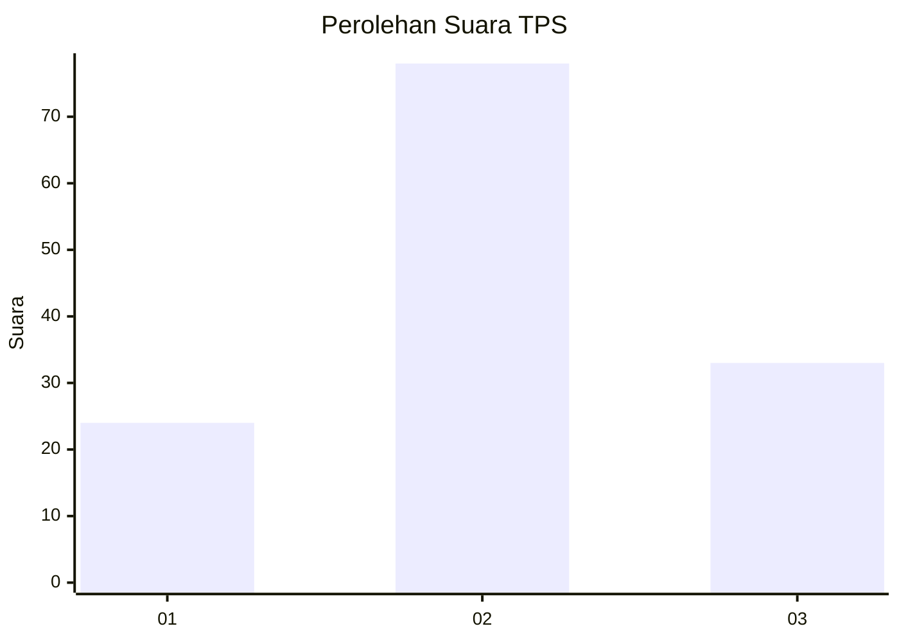
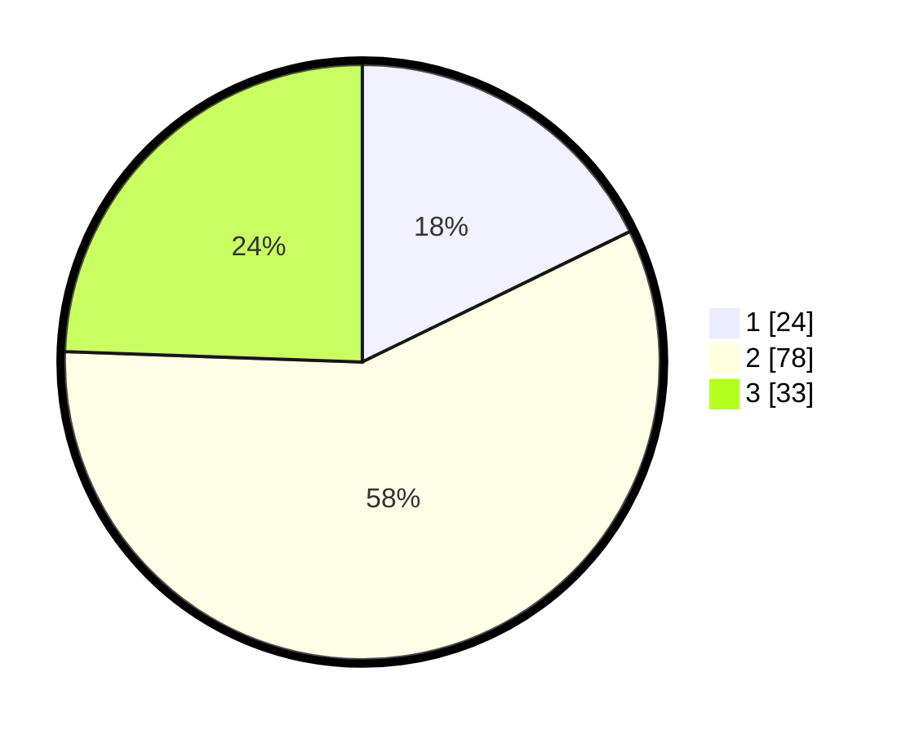

# Hasil

## Grafik

## Tabel

| No. | Nama Paslon    | Suara | Suara (raw) | Persentase |
|:--- |:-------------- | -----:| -----------:| ----------:|
| 1   | ANIES MUHAIMIN | 24    | [24][p-1]   | 17,78      |
| 2   | PRABOWO GIBRAN | 78    | [78][p-2]   | 57,78      |
| 3   | GANJAR MAHFUD  | 33    | [33][p-3]   | 24,44      |

[p-1]: https://github.com/gigit-pemilu/pemilu-2024-33-jawa-tengah/blob/main/pilpres/hitung-suara/sub/33-jawa-tengah/sub/03-purbalingga/sub/16-pengadegan/sub/2001-panunggalan/sub/003-tps/sub/paslon-1.txt
[p-2]: https://github.com/gigit-pemilu/pemilu-2024-33-jawa-tengah/blob/main/pilpres/hitung-suara/sub/33-jawa-tengah/sub/03-purbalingga/sub/16-pengadegan/sub/2001-panunggalan/sub/003-tps/sub/paslon-2.txt
[p-3]: https://github.com/gigit-pemilu/pemilu-2024-33-jawa-tengah/blob/main/pilpres/hitung-suara/sub/33-jawa-tengah/sub/03-purbalingga/sub/16-pengadegan/sub/2001-panunggalan/sub/003-tps/sub/paslon-3.txt

## Foto C Plano

https://sirekap-obj-formc.kpu.go.id/24f7/pemilu/ppwp/33/03/16/20/01/3303162001003-20240214-232504--6757d801-b94a-490d-9eeb-04d2ecef9839.jpg

https://sirekap-obj-formc.kpu.go.id/24f7/pemilu/ppwp/33/03/16/20/01/3303162001003-20240214-233611--4c2d6d7d-90eb-4518-bbcd-8d350cd9e79a.jpg

https://sirekap-obj-formc.kpu.go.id/24f7/pemilu/ppwp/33/03/16/20/01/3303162001003-20240214-233841--cae96a00-e1e9-414c-9571-cdd3e7b537b7.jpg

## Metadata

| Key        | Value               |
| ---------- | ------------------- |
| Time Stamp | 2024-02-15 12:00:28 |

