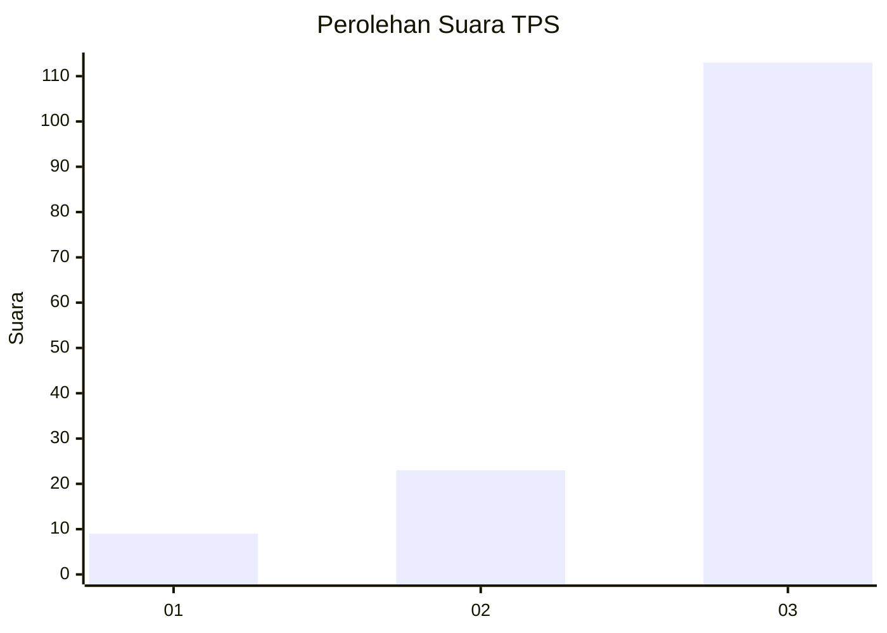
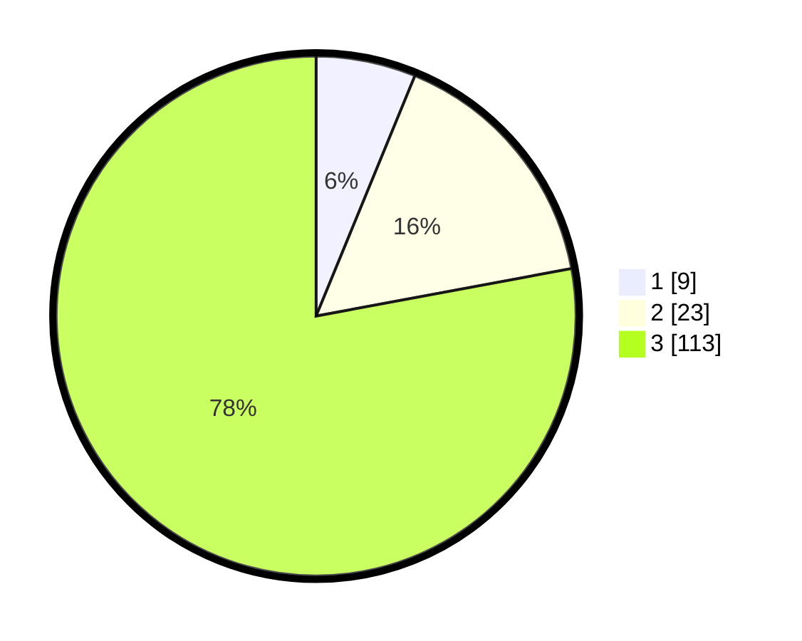

# Hasil

## Grafik

## Tabel

| No. | Nama Paslon    | Suara | Suara (raw) | Persentase |
|:--- |:-------------- | -----:| -----------:| ----------:|
| 1   | ANIES MUHAIMIN | 9     | [9][p-1]    | 6,21       |
| 2   | PRABOWO GIBRAN | 23    | [23][p-2]   | 15,86      |
| 3   | GANJAR MAHFUD  | 113   | [113][p-3]  | 77,93      |

[p-1]: https://github.com/gigit-pemilu/pemilu-2024/blob/main/pilpres/hitung-suara/sub/33-jawa-tengah/sub/03-purbalingga/sub/16-pengadegan/sub/2003-pasunggingan/sub/004-tps/sub/paslon-1.txt
[p-2]: https://github.com/gigit-pemilu/pemilu-2024/blob/main/pilpres/hitung-suara/sub/33-jawa-tengah/sub/03-purbalingga/sub/16-pengadegan/sub/2003-pasunggingan/sub/004-tps/sub/paslon-2.txt
[p-3]: https://github.com/gigit-pemilu/pemilu-2024/blob/main/pilpres/hitung-suara/sub/33-jawa-tengah/sub/03-purbalingga/sub/16-pengadegan/sub/2003-pasunggingan/sub/004-tps/sub/paslon-3.txt

## Foto C Plano

https://sirekap-obj-formc.kpu.go.id/a26e/pemilu/ppwp/33/03/16/20/03/3303162003004-20240215-040401--65ede557-893f-4a55-9173-48ee57eef4b5.jpg

https://sirekap-obj-formc.kpu.go.id/a26e/pemilu/ppwp/33/03/16/20/03/3303162003004-20240214-224646--faac67c3-a4fe-4b2c-b7ab-200d2a7d6950.jpg

https://sirekap-obj-formc.kpu.go.id/a26e/pemilu/ppwp/33/03/16/20/03/3303162003004-20240214-224733--1b8ec8e3-186b-450e-97ab-8838939bb925.jpg

## Metadata

| Key        | Value               |
| ---------- | ------------------- |
| Time Stamp | 2024-02-15 12:00:28 |

