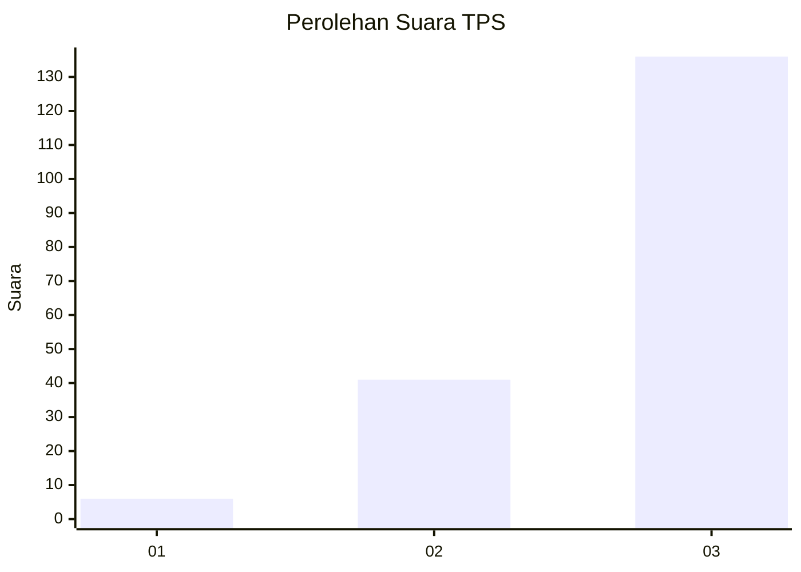
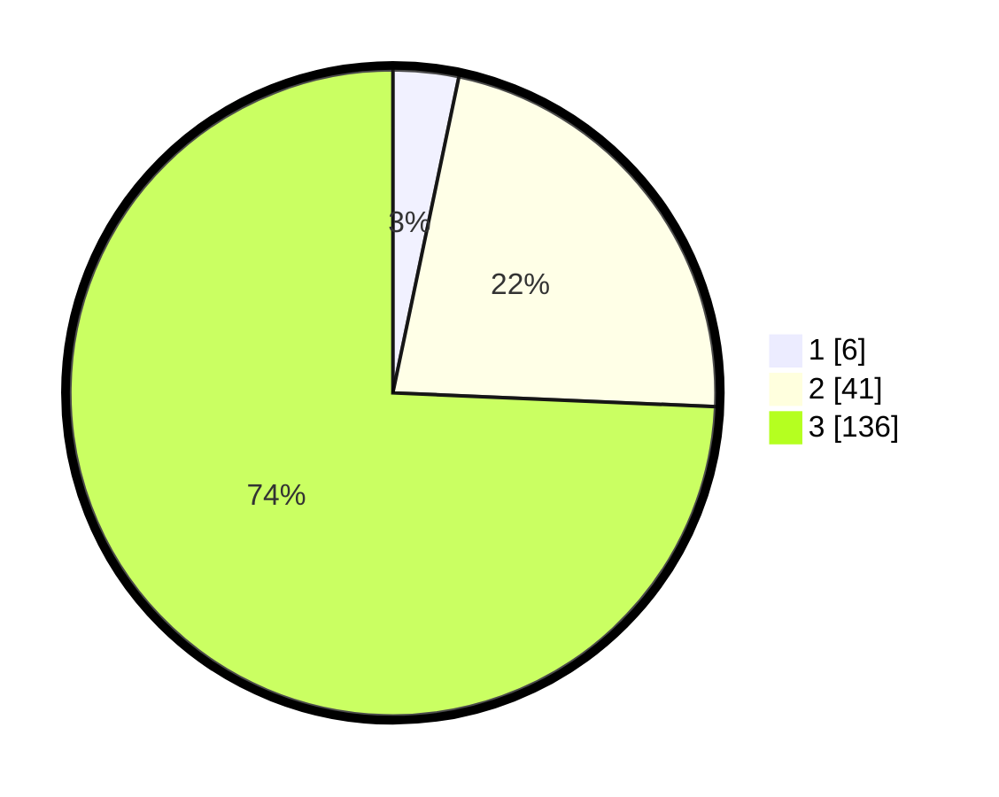

# Hasil

## Grafik

## Tabel

| No. | Nama Paslon    | Suara | Suara (raw) | Persentase |
|:--- |:-------------- | -----:| -----------:| ----------:|
| 1   | ANIES MUHAIMIN | 6     | [6][p-1]    | 3,28       |
| 2   | PRABOWO GIBRAN | 41    | [41][p-2]   | 22,40      |
| 3   | GANJAR MAHFUD  | 136   | [136][p-3]  | 74,32      |

[p-1]: https://github.com/gigit-pemilu/pemilu-2024/blob/main/pilpres/hitung-suara/sub/33-jawa-tengah/sub/03-purbalingga/sub/16-pengadegan/sub/2003-pasunggingan/sub/009-tps/sub/paslon-1.txt
[p-2]: https://github.com/gigit-pemilu/pemilu-2024/blob/main/pilpres/hitung-suara/sub/33-jawa-tengah/sub/03-purbalingga/sub/16-pengadegan/sub/2003-pasunggingan/sub/009-tps/sub/paslon-2.txt
[p-3]: https://github.com/gigit-pemilu/pemilu-2024/blob/main/pilpres/hitung-suara/sub/33-jawa-tengah/sub/03-purbalingga/sub/16-pengadegan/sub/2003-pasunggingan/sub/009-tps/sub/paslon-3.txt

## Foto C Plano

https://sirekap-obj-formc.kpu.go.id/9988/pemilu/ppwp/33/03/16/20/03/3303162003009-20240214-225959--d18df129-0a50-4a1e-a0c8-21c4d64a1991.jpg

https://sirekap-obj-formc.kpu.go.id/9988/pemilu/ppwp/33/03/16/20/03/3303162003009-20240214-230120--8d83f1e1-b345-4b1a-ba80-fbb79107fc4e.jpg

https://sirekap-obj-formc.kpu.go.id/9988/pemilu/ppwp/33/03/16/20/03/3303162003009-20240214-230212--212e160c-3820-4c2a-bbf4-5ef29fce98cf.jpg

## Metadata

| Key        | Value               |
| ---------- | ------------------- |
| Time Stamp | 2024-02-15 20:30:46 |

