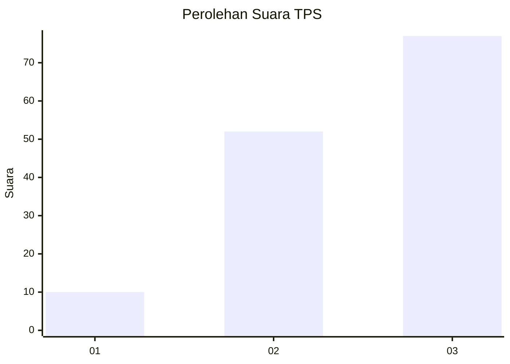
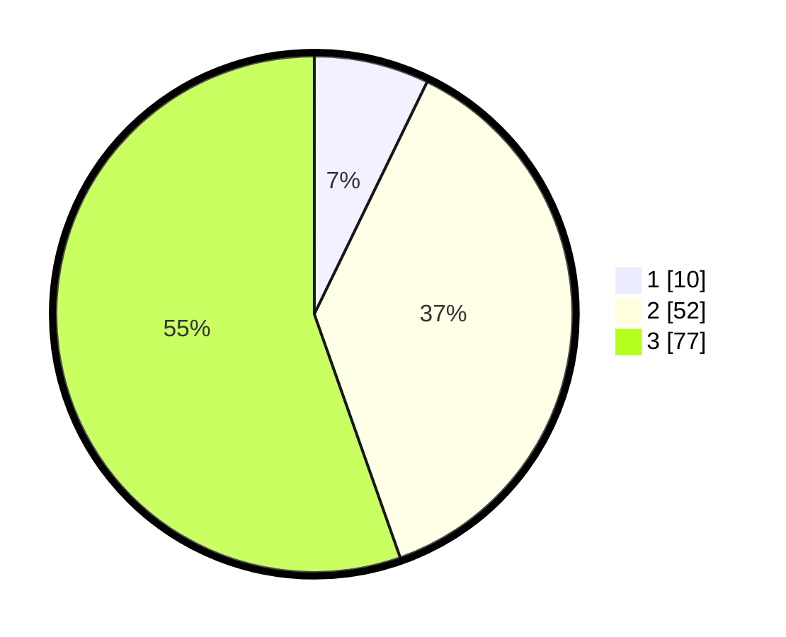

# Hasil

## Grafik

## Tabel

| No. | Nama Paslon    | Suara | Suara (raw) | Persentase |
|:--- |:-------------- | -----:| -----------:| ----------:|
| 1   | ANIES MUHAIMIN | 10    | [10][p-1]   | 7,19       |
| 2   | PRABOWO GIBRAN | 52    | [52][p-2]   | 37,41      |
| 3   | GANJAR MAHFUD  | 77    | [77][p-3]   | 55,40      |

[p-1]: https://github.com/gigit-pemilu/pemilu-2024-33-jawa-tengah/blob/main/pilpres/hitung-suara/sub/33-jawa-tengah/sub/03-purbalingga/sub/16-pengadegan/sub/2007-tumanggal/sub/009-tps/sub/paslon-1.txt
[p-2]: https://github.com/gigit-pemilu/pemilu-2024-33-jawa-tengah/blob/main/pilpres/hitung-suara/sub/33-jawa-tengah/sub/03-purbalingga/sub/16-pengadegan/sub/2007-tumanggal/sub/009-tps/sub/paslon-2.txt
[p-3]: https://github.com/gigit-pemilu/pemilu-2024-33-jawa-tengah/blob/main/pilpres/hitung-suara/sub/33-jawa-tengah/sub/03-purbalingga/sub/16-pengadegan/sub/2007-tumanggal/sub/009-tps/sub/paslon-3.txt

## Foto C Plano

https://sirekap-obj-formc.kpu.go.id/bdeb/pemilu/ppwp/33/03/16/20/07/3303162007009-20240214-141259--b3edffbc-3404-4b1f-b1d9-1b6292e4711a.jpg

https://sirekap-obj-formc.kpu.go.id/bdeb/pemilu/ppwp/33/03/16/20/07/3303162007009-20240214-192249--367835cf-d649-4b46-868e-191b9cbde638.jpg

https://sirekap-obj-formc.kpu.go.id/bdeb/pemilu/ppwp/33/03/16/20/07/3303162007009-20240214-141836--1c80fe92-6462-46a2-b03a-9469fbd84f11.jpg

## Metadata

| Key        | Value               |
| ---------- | ------------------- |
| Time Stamp | 2024-02-14 21:46:01 |

