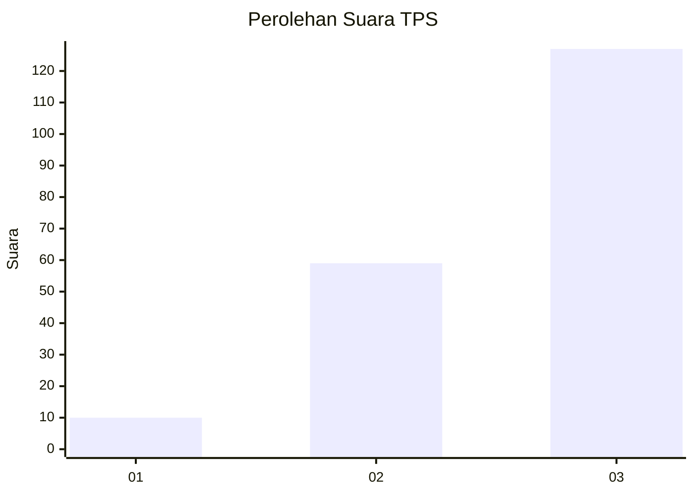
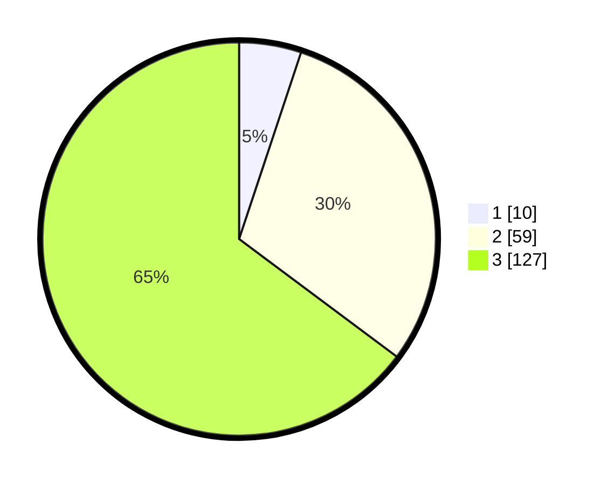

# Hasil

## Grafik

## Tabel

| No. | Nama Paslon    | Suara | Suara (raw) | Persentase |
|:--- |:-------------- | -----:| -----------:| ----------:|
| 1   | ANIES MUHAIMIN | 10    | [10][p-1]   | 5,10       |
| 2   | PRABOWO GIBRAN | 59    | [59][p-2]   | 30,10      |
| 3   | GANJAR MAHFUD  | 127   | [127][p-3]  | 64,80      |

[p-1]: https://github.com/gigit-pemilu/pemilu-2024-33-jawa-tengah/blob/main/pilpres/hitung-suara/sub/33-jawa-tengah/sub/03-purbalingga/sub/17-karangjambu/sub/2001-purbasari/sub/004-tps/sub/paslon-1.txt
[p-2]: https://github.com/gigit-pemilu/pemilu-2024-33-jawa-tengah/blob/main/pilpres/hitung-suara/sub/33-jawa-tengah/sub/03-purbalingga/sub/17-karangjambu/sub/2001-purbasari/sub/004-tps/sub/paslon-2.txt
[p-3]: https://github.com/gigit-pemilu/pemilu-2024-33-jawa-tengah/blob/main/pilpres/hitung-suara/sub/33-jawa-tengah/sub/03-purbalingga/sub/17-karangjambu/sub/2001-purbasari/sub/004-tps/sub/paslon-3.txt

## Foto C Plano

https://sirekap-obj-formc.kpu.go.id/0805/pemilu/ppwp/33/03/17/20/01/3303172001004-20240216-150724--8956da7e-285d-46a3-bc34-69e7857c9adf.jpg

https://sirekap-obj-formc.kpu.go.id/0805/pemilu/ppwp/33/03/17/20/01/3303172001004-20240216-150552--7cace19c-5e8c-4d67-841c-576cbcbc2b47.jpg

## Metadata

| Key        | Value               |
| ---------- | ------------------- |
| Time Stamp | 2024-02-24 22:31:28 |

