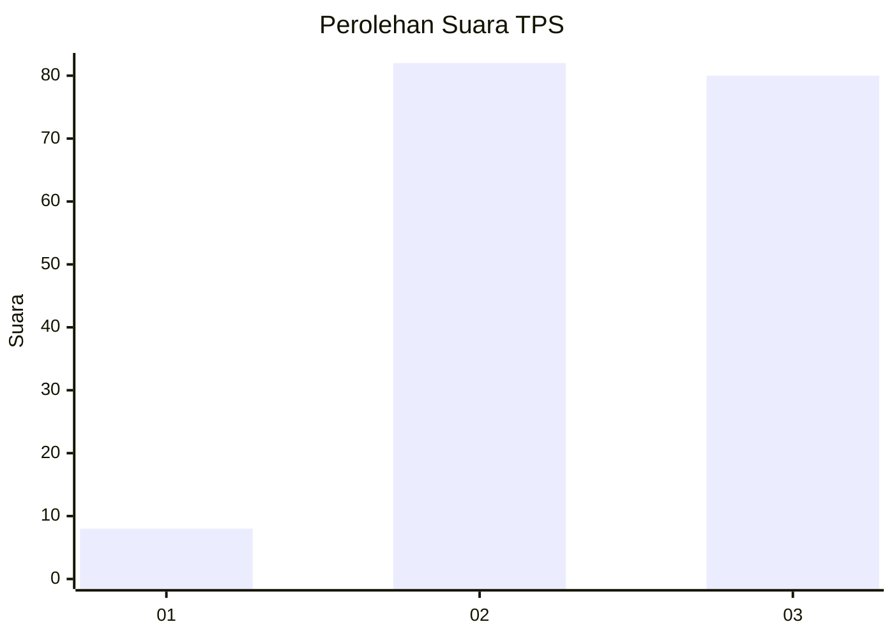
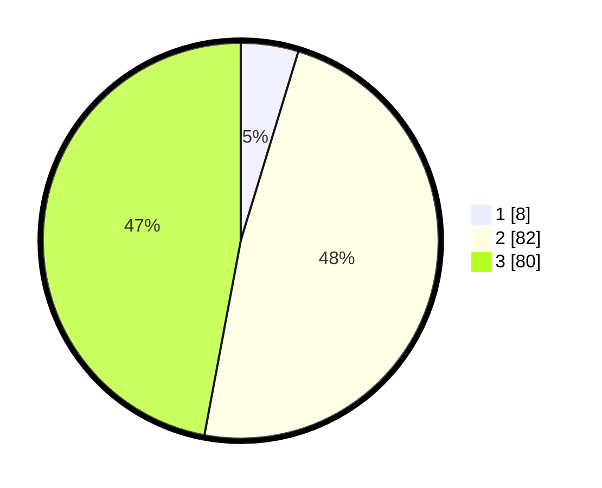

# Hasil

## Grafik

## Tabel

| No. | Nama Paslon    | Suara | Suara (raw) | Persentase |
|:--- |:-------------- | -----:| -----------:| ----------:|
| 1   | ANIES MUHAIMIN | 8     | [8][p-1]    | 4,71       |
| 2   | PRABOWO GIBRAN | 82    | [82][p-2]   | 48,24      |
| 3   | GANJAR MAHFUD  | 80    | [80][p-3]   | 47,06      |

[p-1]: https://github.com/gigit-pemilu/pemilu-2024/blob/main/pilpres/hitung-suara/sub/33-jawa-tengah/sub/03-purbalingga/sub/17-karangjambu/sub/2002-sirandu/sub/010-tps/sub/paslon-1.txt
[p-2]: https://github.com/gigit-pemilu/pemilu-2024/blob/main/pilpres/hitung-suara/sub/33-jawa-tengah/sub/03-purbalingga/sub/17-karangjambu/sub/2002-sirandu/sub/010-tps/sub/paslon-2.txt
[p-3]: https://github.com/gigit-pemilu/pemilu-2024/blob/main/pilpres/hitung-suara/sub/33-jawa-tengah/sub/03-purbalingga/sub/17-karangjambu/sub/2002-sirandu/sub/010-tps/sub/paslon-3.txt

## Foto C Plano

https://sirekap-obj-formc.kpu.go.id/1696/pemilu/ppwp/33/03/17/20/02/3303172002010-20240214-214026--5aba4cb0-2219-4b14-8940-48d82c015989.jpg

https://sirekap-obj-formc.kpu.go.id/1696/pemilu/ppwp/33/03/17/20/02/3303172002010-20240215-012853--94c66be6-b671-4615-8e0a-ec877389814a.jpg

https://sirekap-obj-formc.kpu.go.id/1696/pemilu/ppwp/33/03/17/20/02/3303172002010-20240214-214422--a1561f5a-1fc6-42d7-9953-94738d0eeb41.jpg

## Metadata

| Key        | Value               |
| ---------- | ------------------- |
| Time Stamp | 2024-02-16 16:25:10 |

