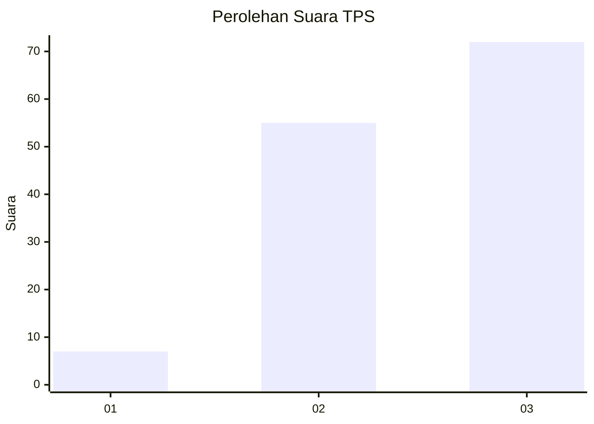
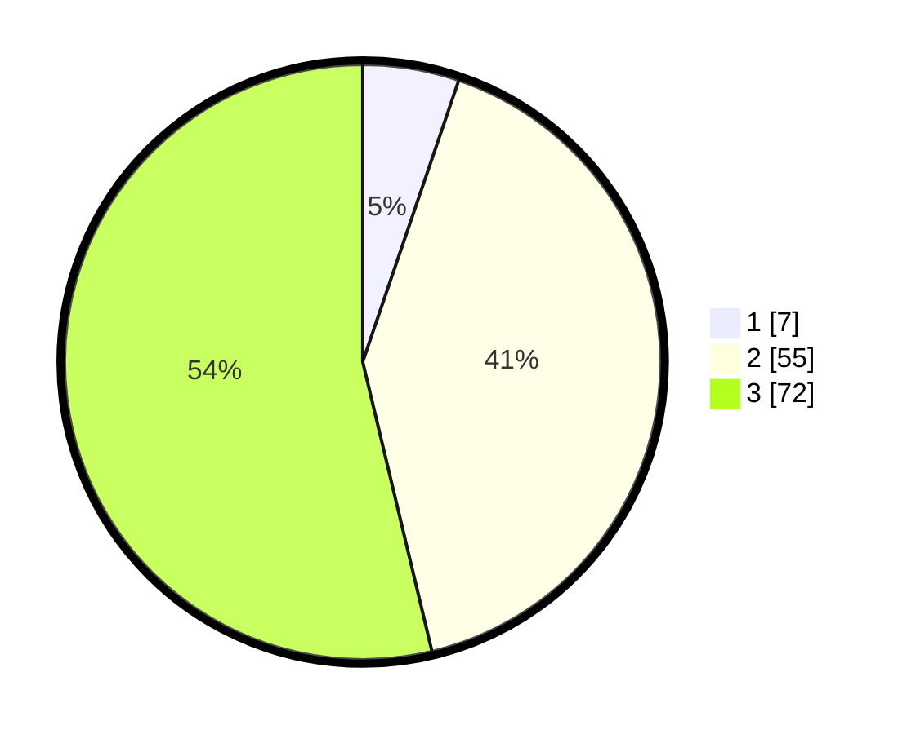

# Hasil

## Grafik

## Tabel

| No. | Nama Paslon    | Suara | Suara (raw) | Persentase |
|:--- |:-------------- | -----:| -----------:| ----------:|
| 1   | ANIES MUHAIMIN | 7     | [7][p-1]    | 5,22       |
| 2   | PRABOWO GIBRAN | 55    | [55][p-2]   | 41,04      |
| 3   | GANJAR MAHFUD  | 72    | [72][p-3]   | 53,73      |

[p-1]: https://github.com/gigit-pemilu/pemilu-2024/blob/main/pilpres/hitung-suara/sub/33-jawa-tengah/sub/03-purbalingga/sub/17-karangjambu/sub/2003-karangjambu/sub/007-tps/sub/paslon-1.txt
[p-2]: https://github.com/gigit-pemilu/pemilu-2024/blob/main/pilpres/hitung-suara/sub/33-jawa-tengah/sub/03-purbalingga/sub/17-karangjambu/sub/2003-karangjambu/sub/007-tps/sub/paslon-2.txt
[p-3]: https://github.com/gigit-pemilu/pemilu-2024/blob/main/pilpres/hitung-suara/sub/33-jawa-tengah/sub/03-purbalingga/sub/17-karangjambu/sub/2003-karangjambu/sub/007-tps/sub/paslon-3.txt

## Foto C Plano

https://sirekap-obj-formc.kpu.go.id/d2dc/pemilu/ppwp/33/03/17/20/03/3303172003007-20240214-215316--e878a098-e85b-4c92-8039-8560415398ed.jpg

https://sirekap-obj-formc.kpu.go.id/d2dc/pemilu/ppwp/33/03/17/20/03/3303172003007-20240214-215150--0bced925-6612-46c5-bdf7-3e3832dd9b4a.jpg

https://sirekap-obj-formc.kpu.go.id/d2dc/pemilu/ppwp/33/03/17/20/03/3303172003007-20240214-215413--1a1232c9-46ad-442a-be88-b9786533e12f.jpg

## Metadata

| Key        | Value               |
| ---------- | ------------------- |
| Time Stamp | 2024-02-15 22:40:13 |

