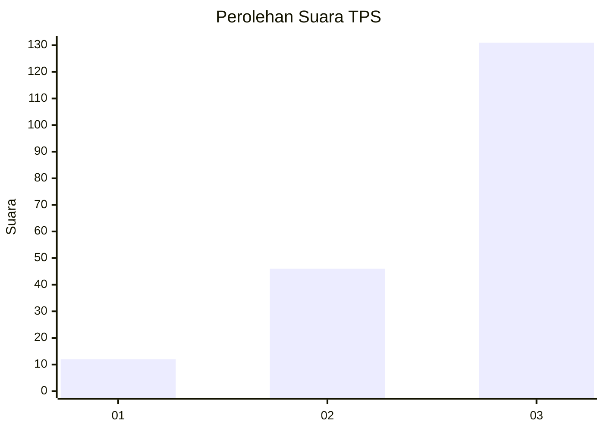
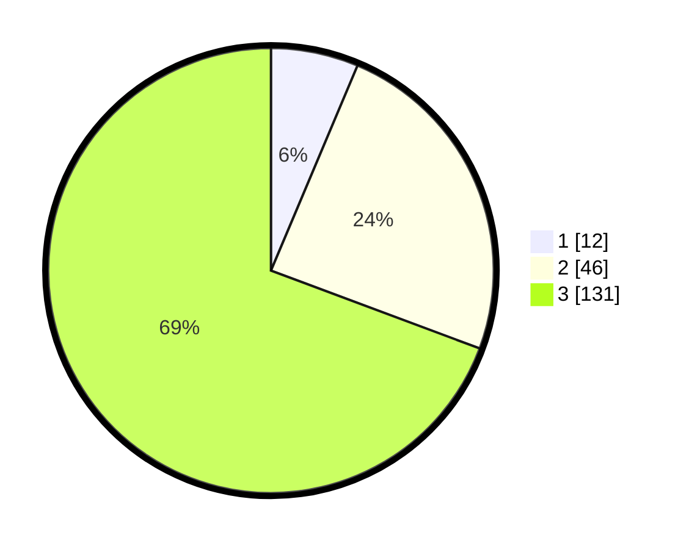

# Hasil

## Grafik

## Tabel

| No. | Nama Paslon    | Suara | Suara (raw) | Persentase |
|:--- |:-------------- | -----:| -----------:| ----------:|
| 1   | ANIES MUHAIMIN | 12    | [12][p-1]   | 6,35       |
| 2   | PRABOWO GIBRAN | 46    | [46][p-2]   | 24,34      |
| 3   | GANJAR MAHFUD  | 131   | [131][p-3]  | 69,31      |

[p-1]: https://github.com/gigit-pemilu/pemilu-2024-33-jawa-tengah/blob/main/pilpres/hitung-suara/sub/33-jawa-tengah/sub/03-purbalingga/sub/17-karangjambu/sub/2003-karangjambu/sub/008-tps/sub/paslon-1.txt
[p-2]: https://github.com/gigit-pemilu/pemilu-2024-33-jawa-tengah/blob/main/pilpres/hitung-suara/sub/33-jawa-tengah/sub/03-purbalingga/sub/17-karangjambu/sub/2003-karangjambu/sub/008-tps/sub/paslon-2.txt
[p-3]: https://github.com/gigit-pemilu/pemilu-2024-33-jawa-tengah/blob/main/pilpres/hitung-suara/sub/33-jawa-tengah/sub/03-purbalingga/sub/17-karangjambu/sub/2003-karangjambu/sub/008-tps/sub/paslon-3.txt

## Foto C Plano

https://sirekap-obj-formc.kpu.go.id/f3ab/pemilu/ppwp/33/03/17/20/03/3303172003008-20240214-193153--8220610d-3860-41be-a3af-32f74869e7dc.jpg

https://sirekap-obj-formc.kpu.go.id/f3ab/pemilu/ppwp/33/03/17/20/03/3303172003008-20240214-193209--c2413e5e-76b8-4a83-a087-b3708533ac15.jpg

https://sirekap-obj-formc.kpu.go.id/f3ab/pemilu/ppwp/33/03/17/20/03/3303172003008-20240214-193230--138c189f-9c2c-4760-972e-999d1ca742a4.jpg

## Metadata

| Key        | Value               |
| ---------- | ------------------- |
| Time Stamp | 2024-02-15 15:00:29 |

