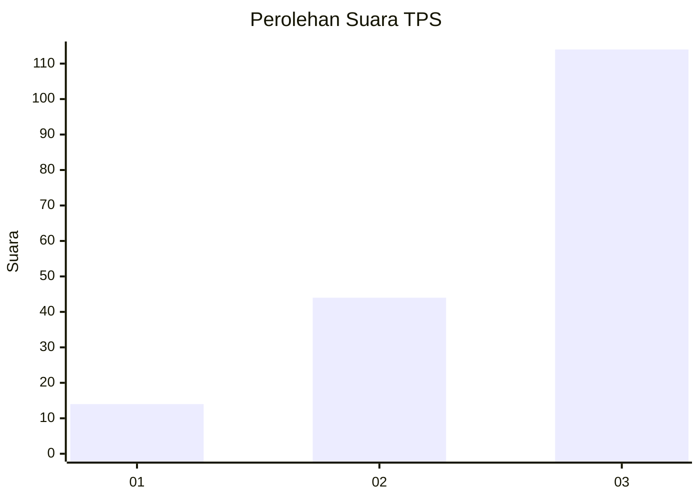
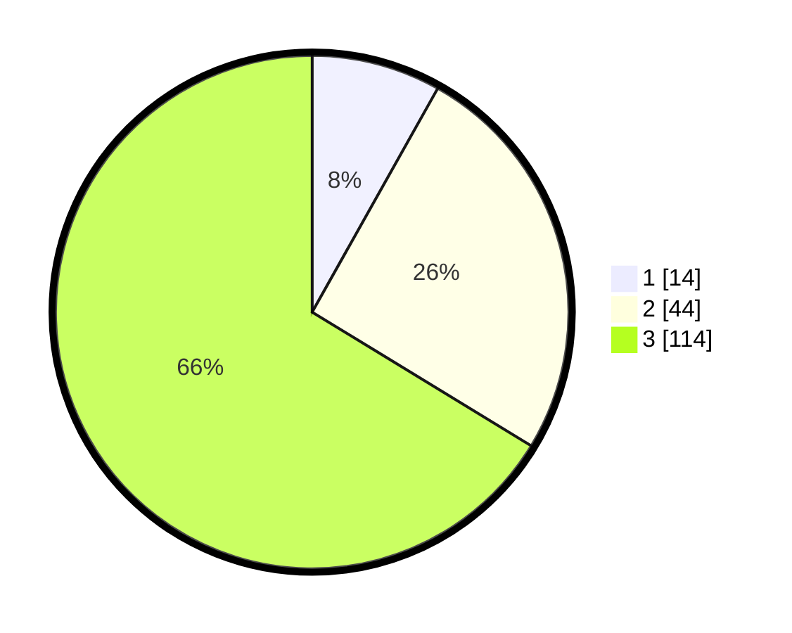

# Hasil

## Grafik

## Tabel

| No. | Nama Paslon    | Suara | Suara (raw) | Persentase |
|:--- |:-------------- | -----:| -----------:| ----------:|
| 1   | ANIES MUHAIMIN | 14    | [14][p-1]   | 8,14       |
| 2   | PRABOWO GIBRAN | 44    | [44][p-2]   | 25,58      |
| 3   | GANJAR MAHFUD  | 114   | [114][p-3]  | 66,28      |

[p-1]: https://github.com/gigit-pemilu/pemilu-2024-33-jawa-tengah/blob/main/pilpres/hitung-suara/sub/33-jawa-tengah/sub/03-purbalingga/sub/17-karangjambu/sub/2004-sanguwatang/sub/010-tps/sub/paslon-1.txt
[p-2]: https://github.com/gigit-pemilu/pemilu-2024-33-jawa-tengah/blob/main/pilpres/hitung-suara/sub/33-jawa-tengah/sub/03-purbalingga/sub/17-karangjambu/sub/2004-sanguwatang/sub/010-tps/sub/paslon-2.txt
[p-3]: https://github.com/gigit-pemilu/pemilu-2024-33-jawa-tengah/blob/main/pilpres/hitung-suara/sub/33-jawa-tengah/sub/03-purbalingga/sub/17-karangjambu/sub/2004-sanguwatang/sub/010-tps/sub/paslon-3.txt

## Foto C Plano

https://sirekap-obj-formc.kpu.go.id/7e57/pemilu/ppwp/33/03/17/20/04/3303172004010-20240214-210550--8fcfae49-3158-4702-8ade-cc53a9a4ceb5.jpg

https://sirekap-obj-formc.kpu.go.id/7e57/pemilu/ppwp/33/03/17/20/04/3303172004010-20240214-210907--5fa816fd-ecb6-4d34-b09e-a8950d0279df.jpg

https://sirekap-obj-formc.kpu.go.id/7e57/pemilu/ppwp/33/03/17/20/04/3303172004010-20240214-211020--3eadb049-e6cd-4669-9689-a73751559da1.jpg

## Metadata

| Key        | Value               |
| ---------- | ------------------- |
| Time Stamp | 2024-02-15 12:00:28 |

