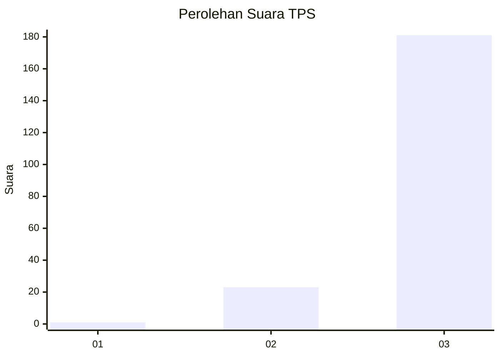
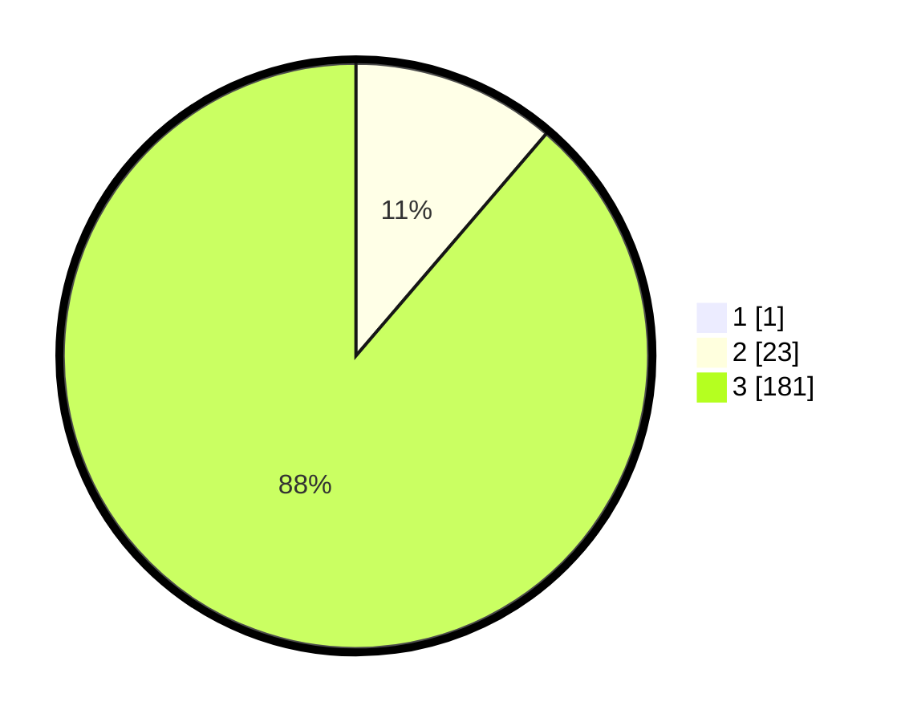

# Hasil

## Grafik

## Tabel

| No. | Nama Paslon    | Suara | Suara (raw) | Persentase |
|:--- |:-------------- | -----:| -----------:| ----------:|
| 1   | ANIES MUHAIMIN | 1     | [1][p-1]    | 0,49       |
| 2   | PRABOWO GIBRAN | 23    | [23][p-2]   | 11,22      |
| 3   | GANJAR MAHFUD  | 181   | [181][p-3]  | 88,29      |

[p-1]: https://github.com/gigit-pemilu/pemilu-2024-33-jawa-tengah/blob/main/pilpres/hitung-suara/sub/33-jawa-tengah/sub/03-purbalingga/sub/17-karangjambu/sub/2006-danasari/sub/001-tps/sub/paslon-1.txt
[p-2]: https://github.com/gigit-pemilu/pemilu-2024-33-jawa-tengah/blob/main/pilpres/hitung-suara/sub/33-jawa-tengah/sub/03-purbalingga/sub/17-karangjambu/sub/2006-danasari/sub/001-tps/sub/paslon-2.txt
[p-3]: https://github.com/gigit-pemilu/pemilu-2024-33-jawa-tengah/blob/main/pilpres/hitung-suara/sub/33-jawa-tengah/sub/03-purbalingga/sub/17-karangjambu/sub/2006-danasari/sub/001-tps/sub/paslon-3.txt

## Foto C Plano

https://sirekap-obj-formc.kpu.go.id/5fe4/pemilu/ppwp/33/03/17/20/06/3303172006001-20240214-192836--bd9cdc62-33d2-4519-bd8f-abeed8861488.jpg

https://sirekap-obj-formc.kpu.go.id/5fe4/pemilu/ppwp/33/03/17/20/06/3303172006001-20240214-193013--2690b535-9762-404c-9be0-39da6fdcda6f.jpg

https://sirekap-obj-formc.kpu.go.id/5fe4/pemilu/ppwp/33/03/17/20/06/3303172006001-20240214-193145--3e0a929a-aadf-4043-8bcd-1a5dbb25f328.jpg

## Metadata

| Key        | Value               |
| ---------- | ------------------- |
| Time Stamp | 2024-02-15 12:00:28 |

