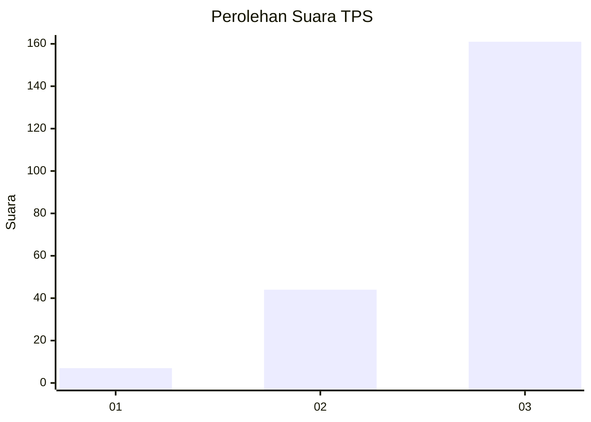
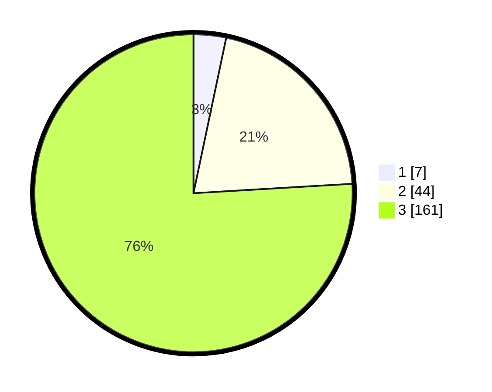

# Hasil

## Grafik

## Tabel

| No. | Nama Paslon    | Suara | Suara (raw) | Persentase |
|:--- |:-------------- | -----:| -----------:| ----------:|
| 1   | ANIES MUHAIMIN | 7     | [7][p-1]    | 3,30       |
| 2   | PRABOWO GIBRAN | 44    | [44][p-2]   | 20,75      |
| 3   | GANJAR MAHFUD  | 161   | [161][p-3]  | 75,94      |

[p-1]: https://github.com/gigit-pemilu/pemilu-2024/blob/main/pilpres/hitung-suara/sub/33-jawa-tengah/sub/03-purbalingga/sub/17-karangjambu/sub/2006-danasari/sub/004-tps/sub/paslon-1.txt
[p-2]: https://github.com/gigit-pemilu/pemilu-2024/blob/main/pilpres/hitung-suara/sub/33-jawa-tengah/sub/03-purbalingga/sub/17-karangjambu/sub/2006-danasari/sub/004-tps/sub/paslon-2.txt
[p-3]: https://github.com/gigit-pemilu/pemilu-2024/blob/main/pilpres/hitung-suara/sub/33-jawa-tengah/sub/03-purbalingga/sub/17-karangjambu/sub/2006-danasari/sub/004-tps/sub/paslon-3.txt

## Foto C Plano

https://sirekap-obj-formc.kpu.go.id/8302/pemilu/ppwp/33/03/17/20/06/3303172006004-20240217-194954--64ddf646-5fef-4bd9-a39d-d4b1f7b48b89.jpg

https://sirekap-obj-formc.kpu.go.id/8302/pemilu/ppwp/33/03/17/20/06/3303172006004-20240216-152234--24cf1b39-83bf-490c-aa67-8103d55ca704.jpg

https://sirekap-obj-formc.kpu.go.id/8302/pemilu/ppwp/33/03/17/20/06/3303172006004-20240216-151230--12f17d38-1e18-4718-9561-f7b301d7d418.jpg

## Metadata

| Key        | Value               |
| ---------- | ------------------- |
| Time Stamp | 2024-02-19 06:16:00 |

