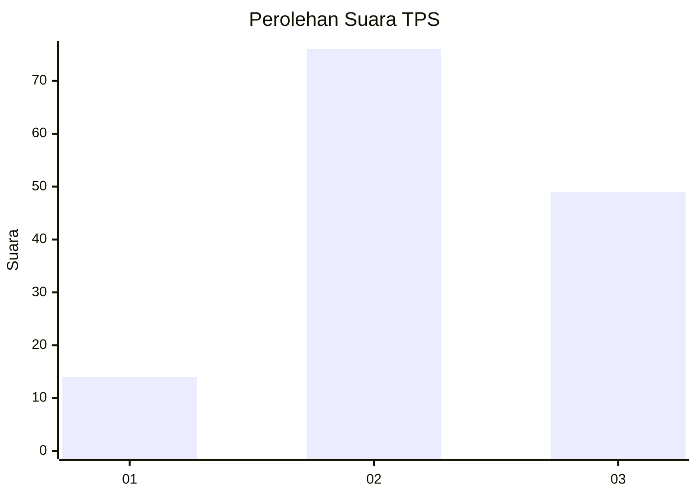
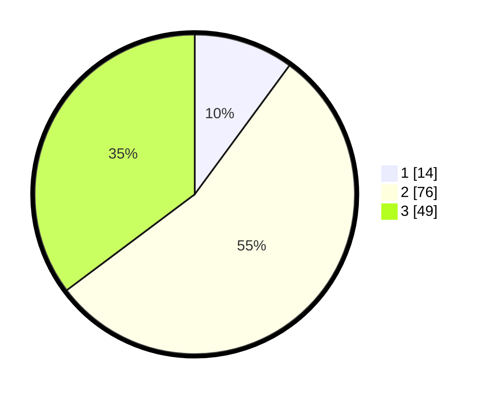

# Hasil

## Grafik

## Tabel

| No. | Nama Paslon    | Suara | Suara (raw) | Persentase |
|:--- |:-------------- | -----:| -----------:| ----------:|
| 1   | ANIES MUHAIMIN | 14    | [14][p-1]   | 10,07      |
| 2   | PRABOWO GIBRAN | 76    | [76][p-2]   | 54,68      |
| 3   | GANJAR MAHFUD  | 49    | [49][p-3]   | 35,25      |

[p-1]: https://github.com/gigit-pemilu/pemilu-2024-33-jawa-tengah/blob/main/pilpres/hitung-suara/sub/33-jawa-tengah/sub/03-purbalingga/sub/18-kertanegara/sub/2001-krangean/sub/006-tps/sub/paslon-1.txt
[p-2]: https://github.com/gigit-pemilu/pemilu-2024-33-jawa-tengah/blob/main/pilpres/hitung-suara/sub/33-jawa-tengah/sub/03-purbalingga/sub/18-kertanegara/sub/2001-krangean/sub/006-tps/sub/paslon-2.txt
[p-3]: https://github.com/gigit-pemilu/pemilu-2024-33-jawa-tengah/blob/main/pilpres/hitung-suara/sub/33-jawa-tengah/sub/03-purbalingga/sub/18-kertanegara/sub/2001-krangean/sub/006-tps/sub/paslon-3.txt

## Foto C Plano

https://sirekap-obj-formc.kpu.go.id/1011/pemilu/ppwp/33/03/18/20/01/3303182001006-20240214-235037--970840ca-51a6-436c-8f37-b61710783970.jpg

https://sirekap-obj-formc.kpu.go.id/1011/pemilu/ppwp/33/03/18/20/01/3303182001006-20240214-235201--6481c57e-2df6-4c12-ae9b-38253fe029fa.jpg

https://sirekap-obj-formc.kpu.go.id/1011/pemilu/ppwp/33/03/18/20/01/3303182001006-20240215-201904--cf766aed-c52f-4564-b209-b83650e7849b.jpg

## Metadata

| Key        | Value               |
| ---------- | ------------------- |
| Time Stamp | 2024-02-15 20:30:46 |

