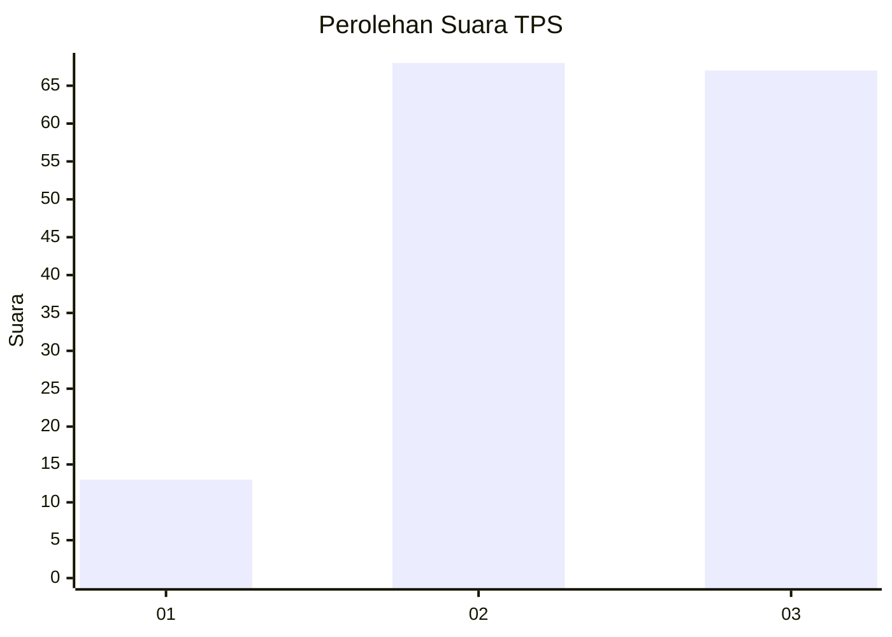
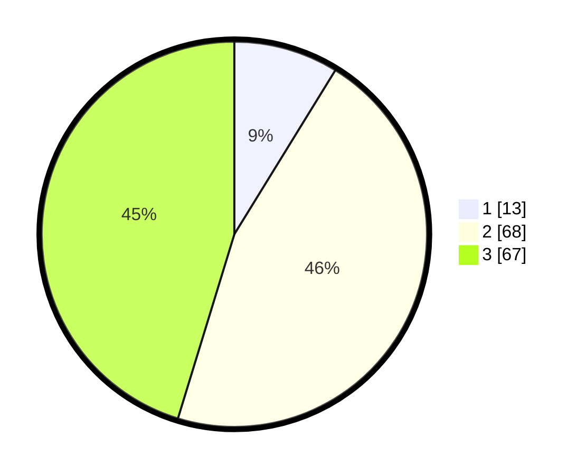

# Hasil

## Grafik

## Tabel

| No. | Nama Paslon    | Suara | Suara (raw) | Persentase |
|:--- |:-------------- | -----:| -----------:| ----------:|
| 1   | ANIES MUHAIMIN | 13    | [13][p-1]   | 8,78       |
| 2   | PRABOWO GIBRAN | 68    | [68][p-2]   | 45,95      |
| 3   | GANJAR MAHFUD  | 67    | [67][p-3]   | 45,27      |

[p-1]: https://github.com/gigit-pemilu/pemilu-2024-33-jawa-tengah/blob/main/pilpres/hitung-suara/sub/33-jawa-tengah/sub/03-purbalingga/sub/18-kertanegara/sub/2001-krangean/sub/008-tps/sub/paslon-1.txt
[p-2]: https://github.com/gigit-pemilu/pemilu-2024-33-jawa-tengah/blob/main/pilpres/hitung-suara/sub/33-jawa-tengah/sub/03-purbalingga/sub/18-kertanegara/sub/2001-krangean/sub/008-tps/sub/paslon-2.txt
[p-3]: https://github.com/gigit-pemilu/pemilu-2024-33-jawa-tengah/blob/main/pilpres/hitung-suara/sub/33-jawa-tengah/sub/03-purbalingga/sub/18-kertanegara/sub/2001-krangean/sub/008-tps/sub/paslon-3.txt

## Foto C Plano

https://sirekap-obj-formc.kpu.go.id/1d15/pemilu/ppwp/33/03/18/20/01/3303182001008-20240214-192228--50dca442-3463-4a37-87f1-f2bcae3bc4cf.jpg

https://sirekap-obj-formc.kpu.go.id/1d15/pemilu/ppwp/33/03/18/20/01/3303182001008-20240214-192703--82d9c0dc-76f9-43ee-8eef-504bf309b33b.jpg

## Metadata

| Key        | Value               |
| ---------- | ------------------- |
| Time Stamp | 2024-02-15 19:00:26 |

