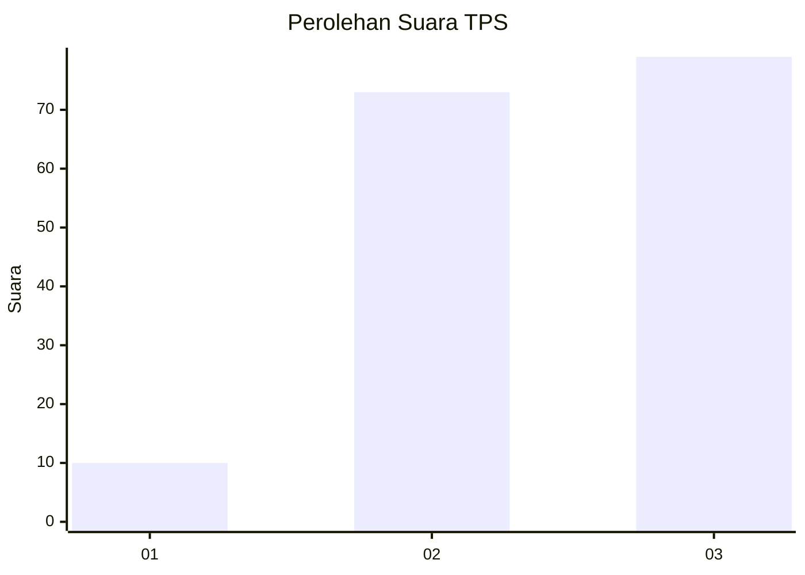
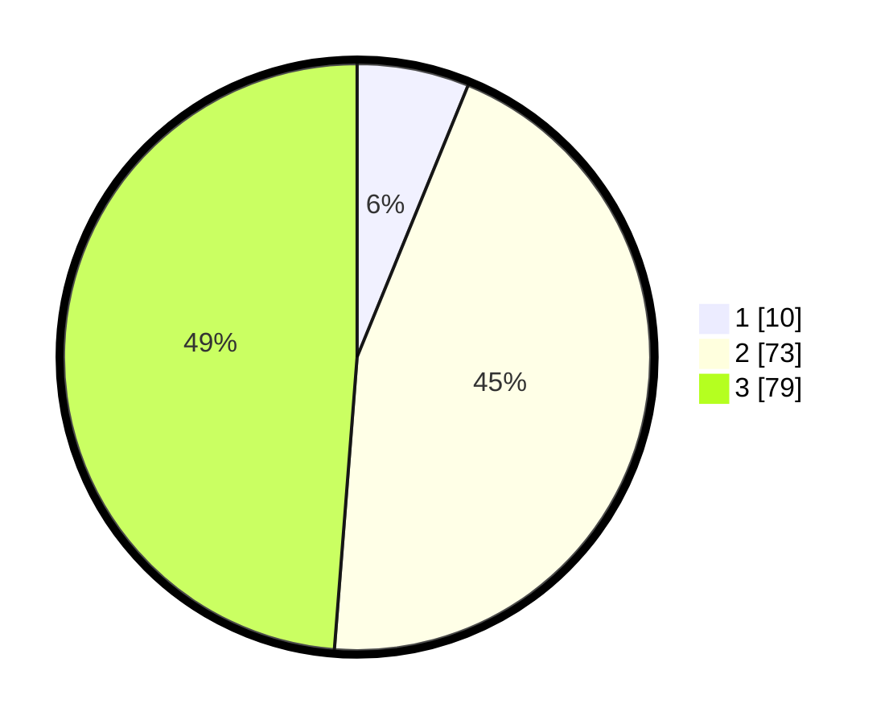

# Hasil

## Grafik

## Tabel

| No. | Nama Paslon    | Suara | Suara (raw) | Persentase |
|:--- |:-------------- | -----:| -----------:| ----------:|
| 1   | ANIES MUHAIMIN | 10    | [10][p-1]   | 6,17       |
| 2   | PRABOWO GIBRAN | 73    | [73][p-2]   | 45,06      |
| 3   | GANJAR MAHFUD  | 79    | [79][p-3]   | 48,77      |

[p-1]: https://github.com/gigit-pemilu/pemilu-2024-33-jawa-tengah/blob/main/pilpres/hitung-suara/sub/33-jawa-tengah/sub/03-purbalingga/sub/18-kertanegara/sub/2001-krangean/sub/011-tps/sub/paslon-1.txt
[p-2]: https://github.com/gigit-pemilu/pemilu-2024-33-jawa-tengah/blob/main/pilpres/hitung-suara/sub/33-jawa-tengah/sub/03-purbalingga/sub/18-kertanegara/sub/2001-krangean/sub/011-tps/sub/paslon-2.txt
[p-3]: https://github.com/gigit-pemilu/pemilu-2024-33-jawa-tengah/blob/main/pilpres/hitung-suara/sub/33-jawa-tengah/sub/03-purbalingga/sub/18-kertanegara/sub/2001-krangean/sub/011-tps/sub/paslon-3.txt

## Foto C Plano

https://sirekap-obj-formc.kpu.go.id/ec2e/pemilu/ppwp/33/03/18/20/01/3303182001011-20240215-031452--4b161b07-d7c8-46ad-a815-afddcbd31e3d.jpg

https://sirekap-obj-formc.kpu.go.id/ec2e/pemilu/ppwp/33/03/18/20/01/3303182001011-20240215-031719--4435c119-f46c-4f10-88b6-6eb94d05d2ec.jpg

https://sirekap-obj-formc.kpu.go.id/ec2e/pemilu/ppwp/33/03/18/20/01/3303182001011-20240215-032020--ab6acbd0-bb31-41f0-90f1-2d6c144bff30.jpg

## Metadata

| Key        | Value               |
| ---------- | ------------------- |
| Time Stamp | 2024-02-15 12:00:28 |

