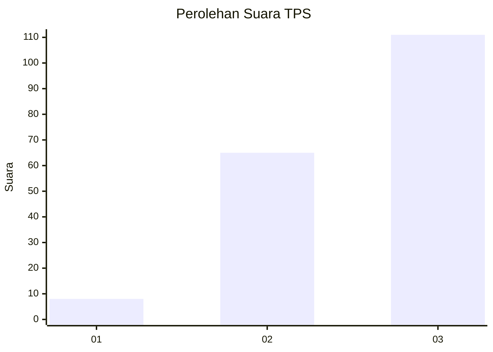
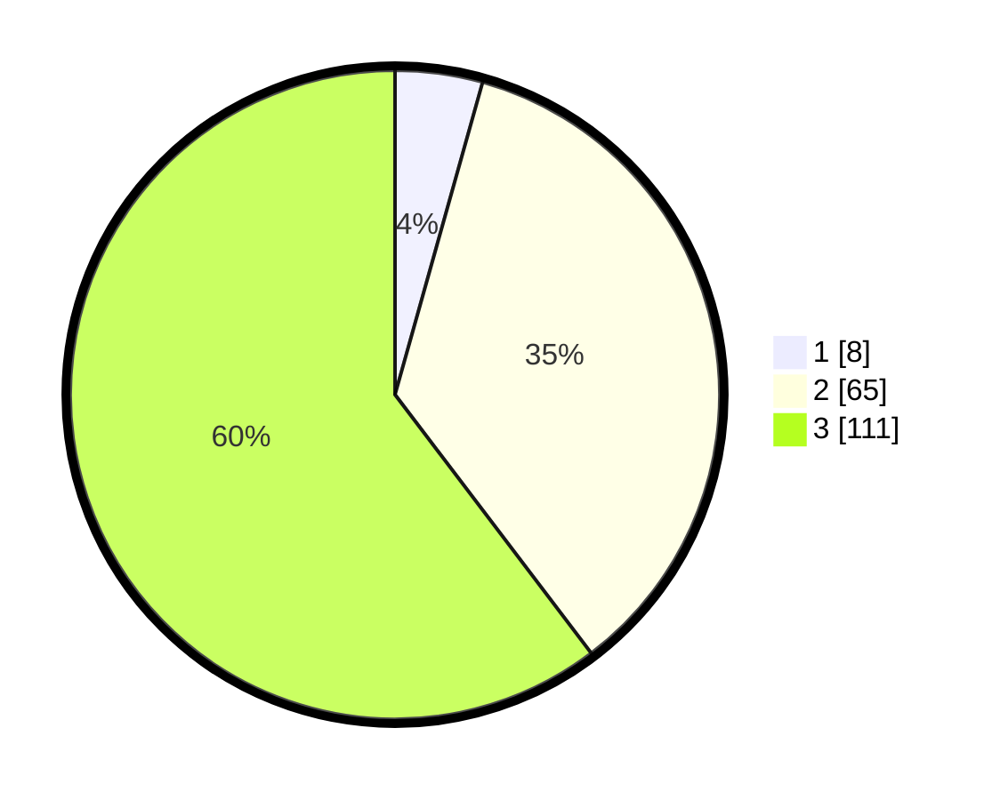

# Hasil

## Grafik

## Tabel

| No. | Nama Paslon    | Suara | Suara (raw) | Persentase |
|:--- |:-------------- | -----:| -----------:| ----------:|
| 1   | ANIES MUHAIMIN | 8     | [8][p-1]    | 4,35       |
| 2   | PRABOWO GIBRAN | 65    | [65][p-2]   | 35,33      |
| 3   | GANJAR MAHFUD  | 111   | [111][p-3]  | 60,33      |

[p-1]: https://github.com/gigit-pemilu/pemilu-2024/blob/main/pilpres/hitung-suara/sub/33-jawa-tengah/sub/03-purbalingga/sub/18-kertanegara/sub/2003-langkap/sub/008-tps/sub/paslon-1.txt
[p-2]: https://github.com/gigit-pemilu/pemilu-2024/blob/main/pilpres/hitung-suara/sub/33-jawa-tengah/sub/03-purbalingga/sub/18-kertanegara/sub/2003-langkap/sub/008-tps/sub/paslon-2.txt
[p-3]: https://github.com/gigit-pemilu/pemilu-2024/blob/main/pilpres/hitung-suara/sub/33-jawa-tengah/sub/03-purbalingga/sub/18-kertanegara/sub/2003-langkap/sub/008-tps/sub/paslon-3.txt

## Foto C Plano

https://sirekap-obj-formc.kpu.go.id/b3cb/pemilu/ppwp/33/03/18/20/03/3303182003008-20240215-022826--32713b95-256d-4e7f-9d94-afc29fef228e.jpg

https://sirekap-obj-formc.kpu.go.id/b3cb/pemilu/ppwp/33/03/18/20/03/3303182003008-20240215-022540--678e362f-5076-4f4a-969d-eacaa0c4cbd0.jpg

https://sirekap-obj-formc.kpu.go.id/b3cb/pemilu/ppwp/33/03/18/20/03/3303182003008-20240215-022505--4f15014e-a731-43c2-9373-2becbb5526de.jpg

## Metadata

| Key        | Value               |
| ---------- | ------------------- |
| Time Stamp | 2024-02-15 15:00:29 |

