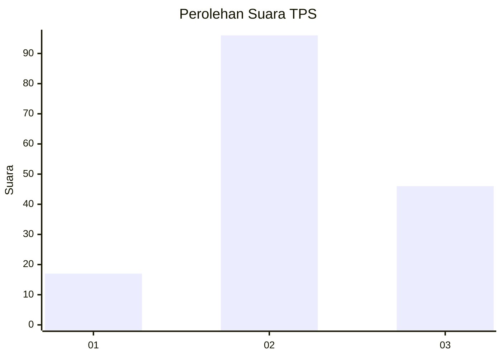
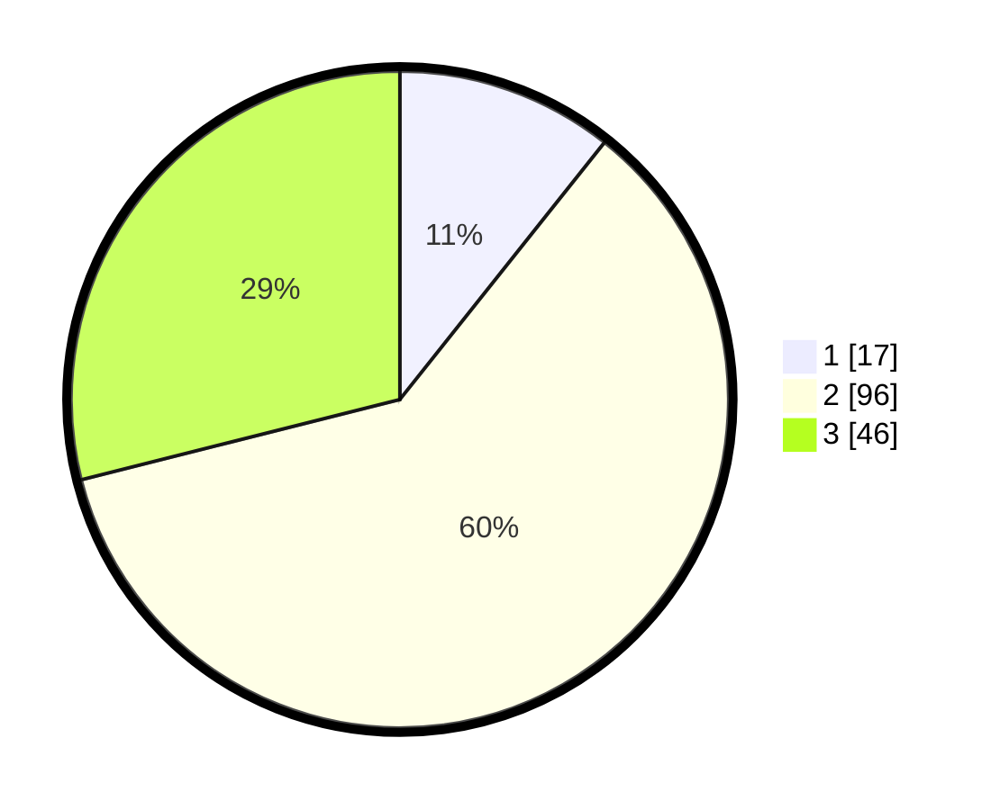

# Hasil

## Grafik

## Tabel

| No. | Nama Paslon    | Suara | Suara (raw) | Persentase |
|:--- |:-------------- | -----:| -----------:| ----------:|
| 1   | ANIES MUHAIMIN | 17    | [17][p-1]   | 10,69      |
| 2   | PRABOWO GIBRAN | 96    | [96][p-2]   | 60,38      |
| 3   | GANJAR MAHFUD  | 46    | [46][p-3]   | 28,93      |

[p-1]: https://github.com/gigit-pemilu/pemilu-2024/blob/main/pilpres/hitung-suara/sub/33-jawa-tengah/sub/04-banjarnegara/sub/01-susukan/sub/2001-berta/sub/001-tps/sub/paslon-1.txt
[p-2]: https://github.com/gigit-pemilu/pemilu-2024/blob/main/pilpres/hitung-suara/sub/33-jawa-tengah/sub/04-banjarnegara/sub/01-susukan/sub/2001-berta/sub/001-tps/sub/paslon-2.txt
[p-3]: https://github.com/gigit-pemilu/pemilu-2024/blob/main/pilpres/hitung-suara/sub/33-jawa-tengah/sub/04-banjarnegara/sub/01-susukan/sub/2001-berta/sub/001-tps/sub/paslon-3.txt

## Foto C Plano

https://sirekap-obj-formc.kpu.go.id/e37b/pemilu/ppwp/33/04/01/20/01/3304012001001-20240215-001825--7a9aafc7-9814-4f23-9f56-56c7e36501f2.jpg

https://sirekap-obj-formc.kpu.go.id/e37b/pemilu/ppwp/33/04/01/20/01/3304012001001-20240215-001822--3ea9f227-cead-486d-a57c-1eef381f8250.jpg

https://sirekap-obj-formc.kpu.go.id/e37b/pemilu/ppwp/33/04/01/20/01/3304012001001-20240215-001808--7a14c148-c4d2-4928-bfe4-66a82b6b8dad.jpg

## Metadata

| Key        | Value               |
| ---------- | ------------------- |
| Time Stamp | 2024-02-15 12:00:28 |

