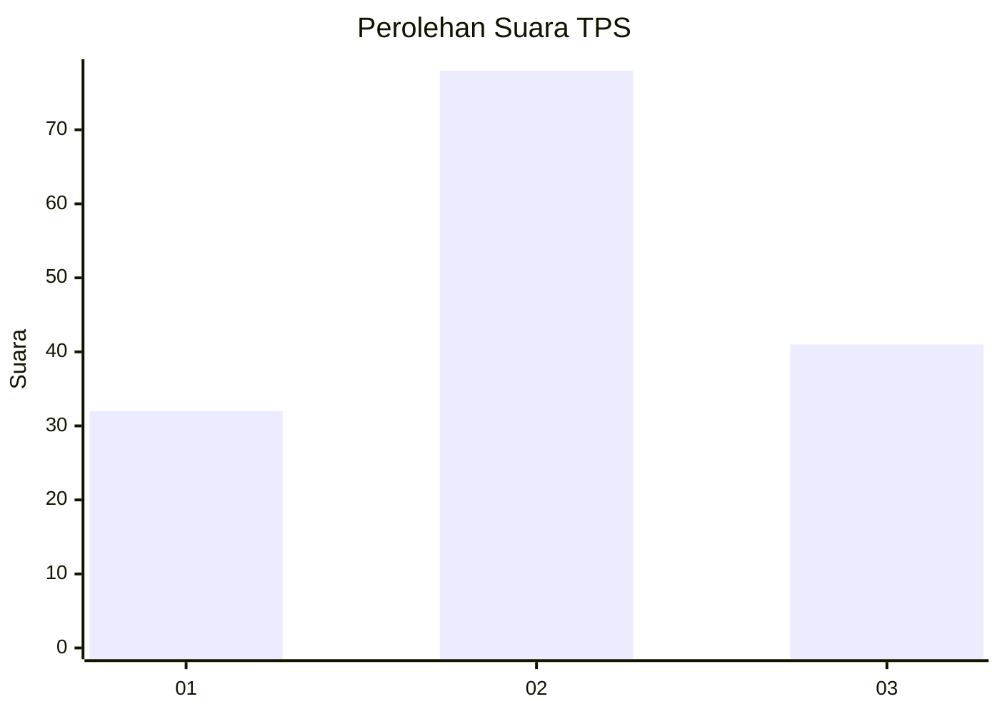
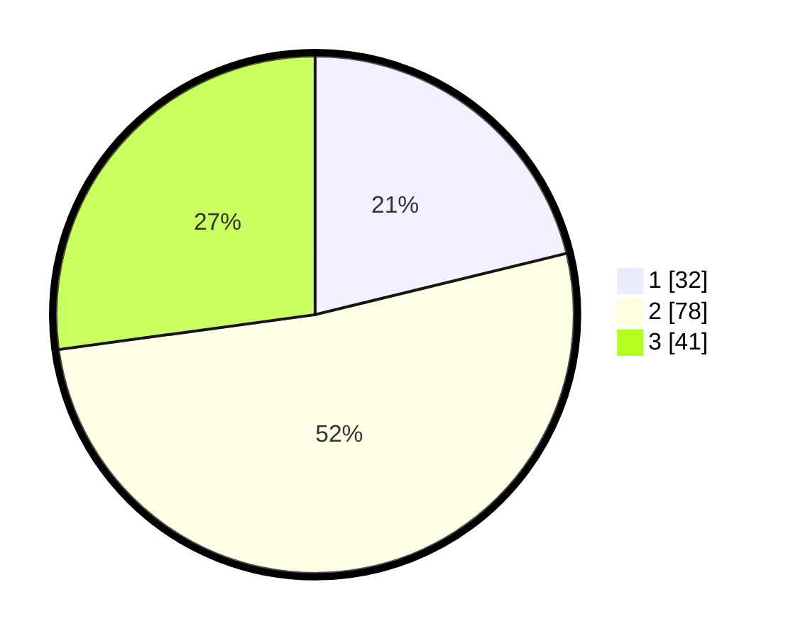

# Hasil

## Grafik

## Tabel

| No. | Nama Paslon    | Suara | Suara (raw) | Persentase |
|:--- |:-------------- | -----:| -----------:| ----------:|
| 1   | ANIES MUHAIMIN | 32    | [32][p-1]   | 21,19      |
| 2   | PRABOWO GIBRAN | 78    | [78][p-2]   | 51,66      |
| 3   | GANJAR MAHFUD  | 41    | [41][p-3]   | 27,15      |

[p-1]: https://github.com/gigit-pemilu/pemilu-2024/blob/main/pilpres/hitung-suara/sub/33-jawa-tengah/sub/04-banjarnegara/sub/01-susukan/sub/2001-berta/sub/002-tps/sub/paslon-1.txt
[p-2]: https://github.com/gigit-pemilu/pemilu-2024/blob/main/pilpres/hitung-suara/sub/33-jawa-tengah/sub/04-banjarnegara/sub/01-susukan/sub/2001-berta/sub/002-tps/sub/paslon-2.txt
[p-3]: https://github.com/gigit-pemilu/pemilu-2024/blob/main/pilpres/hitung-suara/sub/33-jawa-tengah/sub/04-banjarnegara/sub/01-susukan/sub/2001-berta/sub/002-tps/sub/paslon-3.txt

## Foto C Plano

https://sirekap-obj-formc.kpu.go.id/878a/pemilu/ppwp/33/04/01/20/01/3304012001002-20240214-155653--841c741e-c724-4567-84d7-30e2b39dddd4.jpg

https://sirekap-obj-formc.kpu.go.id/878a/pemilu/ppwp/33/04/01/20/01/3304012001002-20240214-155827--54b825e4-80ba-4f9d-952b-b0076cb2d60b.jpg

https://sirekap-obj-formc.kpu.go.id/878a/pemilu/ppwp/33/04/01/20/01/3304012001002-20240214-160128--09383242-b105-4363-9223-5931008ebef4.jpg

## Metadata

| Key        | Value               |
| ---------- | ------------------- |
| Time Stamp | 2024-02-14 21:46:01 |

