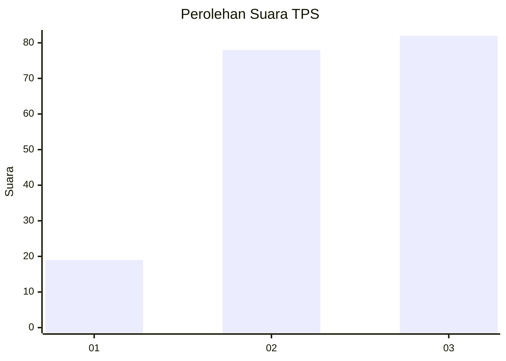
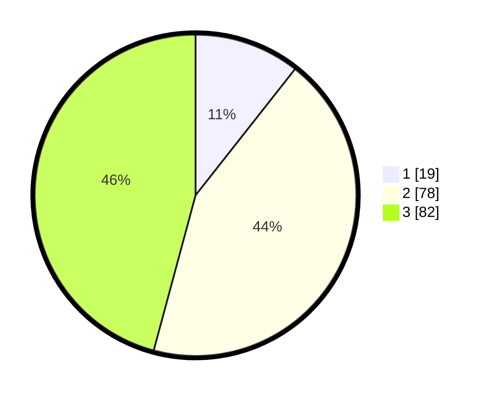

# Hasil

## Grafik

## Tabel

| No. | Nama Paslon    | Suara | Suara (raw) | Persentase |
|:--- |:-------------- | -----:| -----------:| ----------:|
| 1   | ANIES MUHAIMIN | 19    | [19][p-1]   | 10,61      |
| 2   | PRABOWO GIBRAN | 78    | [78][p-2]   | 43,58      |
| 3   | GANJAR MAHFUD  | 82    | [82][p-3]   | 45,81      |

[p-1]: https://github.com/gigit-pemilu/pemilu-2024-33-jawa-tengah/blob/main/pilpres/hitung-suara/sub/33-jawa-tengah/sub/04-banjarnegara/sub/01-susukan/sub/2001-berta/sub/003-tps/sub/paslon-1.txt
[p-2]: https://github.com/gigit-pemilu/pemilu-2024-33-jawa-tengah/blob/main/pilpres/hitung-suara/sub/33-jawa-tengah/sub/04-banjarnegara/sub/01-susukan/sub/2001-berta/sub/003-tps/sub/paslon-2.txt
[p-3]: https://github.com/gigit-pemilu/pemilu-2024-33-jawa-tengah/blob/main/pilpres/hitung-suara/sub/33-jawa-tengah/sub/04-banjarnegara/sub/01-susukan/sub/2001-berta/sub/003-tps/sub/paslon-3.txt

## Foto C Plano

https://sirekap-obj-formc.kpu.go.id/8028/pemilu/ppwp/33/04/01/20/01/3304012001003-20240215-022746--84a0d7f6-ada5-416e-9bfc-435367f52ba7.jpg

https://sirekap-obj-formc.kpu.go.id/8028/pemilu/ppwp/33/04/01/20/01/3304012001003-20240215-023039--7bcdb14f-f558-4c5b-869a-800648587dc8.jpg

https://sirekap-obj-formc.kpu.go.id/8028/pemilu/ppwp/33/04/01/20/01/3304012001003-20240215-023140--bd0e6749-7c70-45a7-bdf4-7b788749d63d.jpg

## Metadata

| Key        | Value               |
| ---------- | ------------------- |
| Time Stamp | 2024-02-15 09:00:24 |

