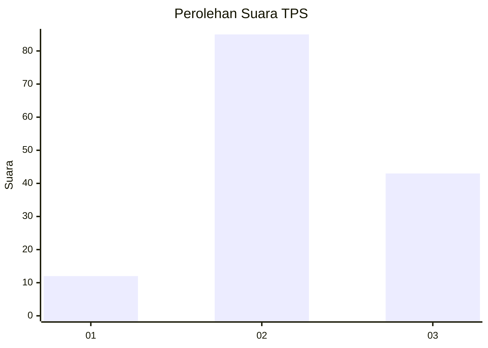
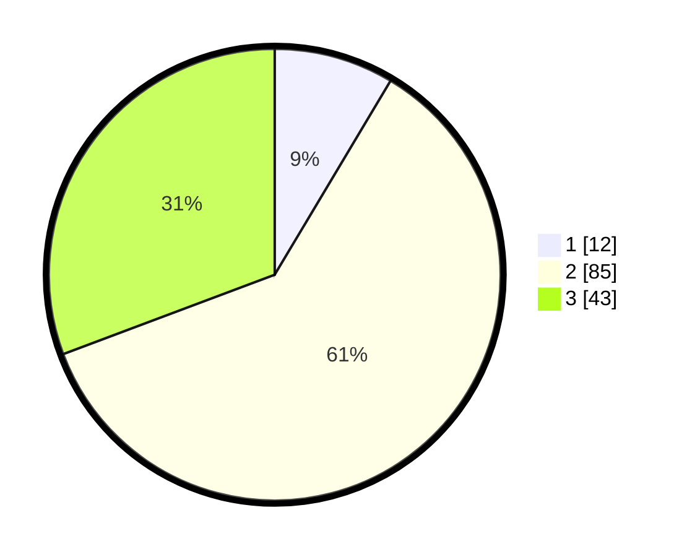

# Hasil

## Grafik

## Tabel

| No. | Nama Paslon    | Suara | Suara (raw) | Persentase |
|:--- |:-------------- | -----:| -----------:| ----------:|
| 1   | ANIES MUHAIMIN | 12    | [12][p-1]   | 8,57       |
| 2   | PRABOWO GIBRAN | 85    | [85][p-2]   | 60,71      |
| 3   | GANJAR MAHFUD  | 43    | [43][p-3]   | 30,71      |

[p-1]: https://github.com/gigit-pemilu/pemilu-2024-33-jawa-tengah/blob/main/pilpres/hitung-suara/sub/33-jawa-tengah/sub/04-banjarnegara/sub/01-susukan/sub/2003-gumelem-wetan/sub/008-tps/sub/paslon-1.txt
[p-2]: https://github.com/gigit-pemilu/pemilu-2024-33-jawa-tengah/blob/main/pilpres/hitung-suara/sub/33-jawa-tengah/sub/04-banjarnegara/sub/01-susukan/sub/2003-gumelem-wetan/sub/008-tps/sub/paslon-2.txt
[p-3]: https://github.com/gigit-pemilu/pemilu-2024-33-jawa-tengah/blob/main/pilpres/hitung-suara/sub/33-jawa-tengah/sub/04-banjarnegara/sub/01-susukan/sub/2003-gumelem-wetan/sub/008-tps/sub/paslon-3.txt

## Foto C Plano

https://sirekap-obj-formc.kpu.go.id/ba43/pemilu/ppwp/33/04/01/20/03/3304012003008-20240214-224640--d86aee61-8cf1-4769-91a9-8679288751d5.jpg

https://sirekap-obj-formc.kpu.go.id/ba43/pemilu/ppwp/33/04/01/20/03/3304012003008-20240214-224721--ae50fa34-28ce-4ed1-863b-fd45a685cbd6.jpg

https://sirekap-obj-formc.kpu.go.id/ba43/pemilu/ppwp/33/04/01/20/03/3304012003008-20240214-224805--c354dd26-ce53-434f-8624-601243a67356.jpg

## Metadata

| Key        | Value               |
| ---------- | ------------------- |
| Time Stamp | 2024-02-15 12:00:28 |

