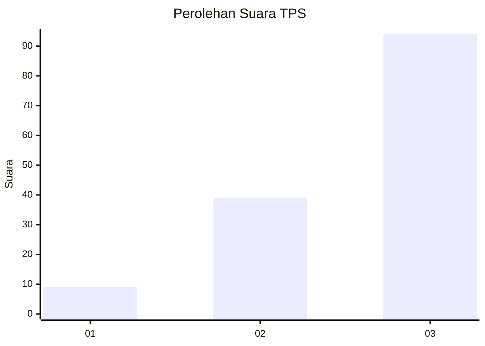
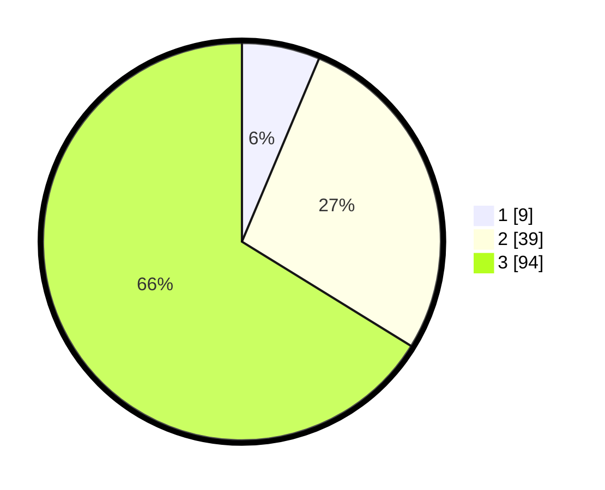

# Hasil

## Grafik

## Tabel

| No. | Nama Paslon    | Suara | Suara (raw) | Persentase |
|:--- |:-------------- | -----:| -----------:| ----------:|
| 1   | ANIES MUHAIMIN | 9     | [9][p-1]    | 6,34       |
| 2   | PRABOWO GIBRAN | 39    | [39][p-2]   | 27,46      |
| 3   | GANJAR MAHFUD  | 94    | [94][p-3]   | 66,20      |

[p-1]: https://github.com/gigit-pemilu/pemilu-2024/blob/main/pilpres/hitung-suara/sub/33-jawa-tengah/sub/04-banjarnegara/sub/01-susukan/sub/2004-gumelem-kulon/sub/023-tps/sub/paslon-1.txt
[p-2]: https://github.com/gigit-pemilu/pemilu-2024/blob/main/pilpres/hitung-suara/sub/33-jawa-tengah/sub/04-banjarnegara/sub/01-susukan/sub/2004-gumelem-kulon/sub/023-tps/sub/paslon-2.txt
[p-3]: https://github.com/gigit-pemilu/pemilu-2024/blob/main/pilpres/hitung-suara/sub/33-jawa-tengah/sub/04-banjarnegara/sub/01-susukan/sub/2004-gumelem-kulon/sub/023-tps/sub/paslon-3.txt

## Foto C Plano

https://sirekap-obj-formc.kpu.go.id/6d77/pemilu/ppwp/33/04/01/20/04/3304012004023-20240215-011046--6782363a-c3b6-4d90-9c82-a4a771d925ff.jpg

https://sirekap-obj-formc.kpu.go.id/6d77/pemilu/ppwp/33/04/01/20/04/3304012004023-20240215-011239--4dae1896-90de-452d-b4dd-66d3df39382c.jpg

https://sirekap-obj-formc.kpu.go.id/6d77/pemilu/ppwp/33/04/01/20/04/3304012004023-20240215-011519--482deb3e-e978-4a13-92c4-183e9de8d310.jpg

## Metadata

| Key        | Value               |
| ---------- | ------------------- |
| Time Stamp | 2024-02-15 09:00:24 |

