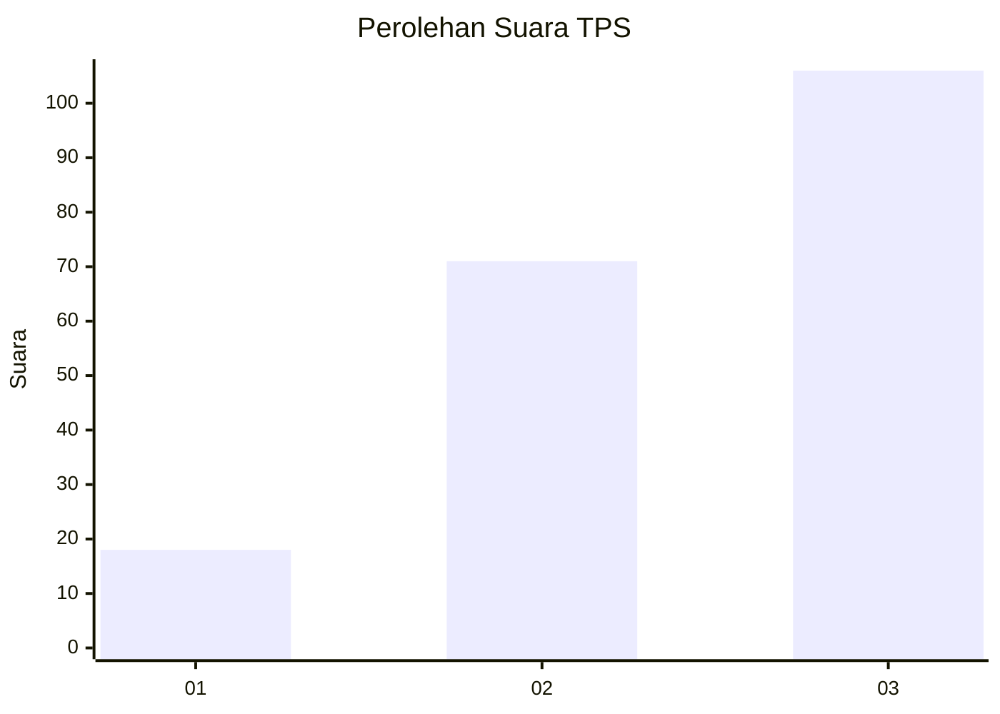
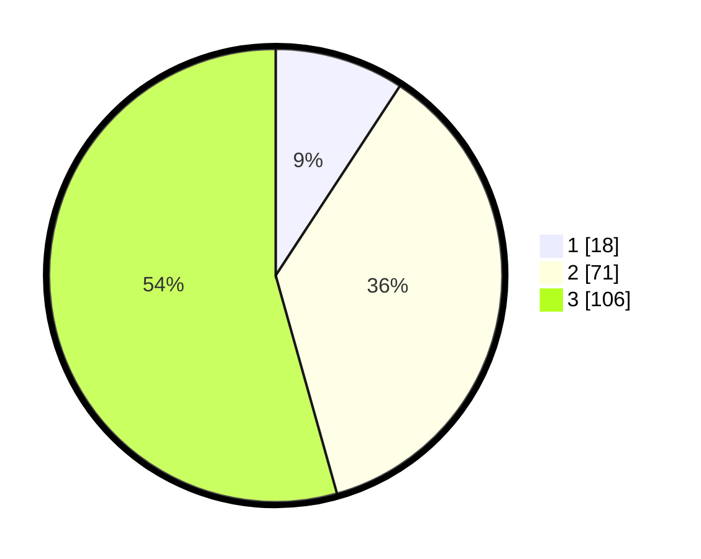

# Hasil

## Grafik

## Tabel

| No. | Nama Paslon    | Suara | Suara (raw) | Persentase |
|:--- |:-------------- | -----:| -----------:| ----------:|
| 1   | ANIES MUHAIMIN | 18    | [18][p-1]   | 9,23       |
| 2   | PRABOWO GIBRAN | 71    | [71][p-2]   | 36,41      |
| 3   | GANJAR MAHFUD  | 106   | [106][p-3]  | 54,36      |

[p-1]: https://github.com/gigit-pemilu/pemilu-2024/blob/main/pilpres/hitung-suara/sub/33-jawa-tengah/sub/04-banjarnegara/sub/02-purworeja-klampok/sub/2003-kecitran/sub/017-tps/sub/paslon-1.txt
[p-2]: https://github.com/gigit-pemilu/pemilu-2024/blob/main/pilpres/hitung-suara/sub/33-jawa-tengah/sub/04-banjarnegara/sub/02-purworeja-klampok/sub/2003-kecitran/sub/017-tps/sub/paslon-2.txt
[p-3]: https://github.com/gigit-pemilu/pemilu-2024/blob/main/pilpres/hitung-suara/sub/33-jawa-tengah/sub/04-banjarnegara/sub/02-purworeja-klampok/sub/2003-kecitran/sub/017-tps/sub/paslon-3.txt

## Foto C Plano

https://sirekap-obj-formc.kpu.go.id/67a1/pemilu/ppwp/33/04/02/20/03/3304022003017-20240214-190351--ba3ca06b-1762-4dc3-bc11-126bb97bcac2.jpg

https://sirekap-obj-formc.kpu.go.id/67a1/pemilu/ppwp/33/04/02/20/03/3304022003017-20240214-190410--67c8e658-94f8-4293-b1b9-656eae8f8b73.jpg

https://sirekap-obj-formc.kpu.go.id/67a1/pemilu/ppwp/33/04/02/20/03/3304022003017-20240214-195026--faa709dd-cecb-48e8-88b3-c488c0221e88.jpg

## Metadata

| Key        | Value               |
| ---------- | ------------------- |
| Time Stamp | 2024-02-14 21:46:01 |

