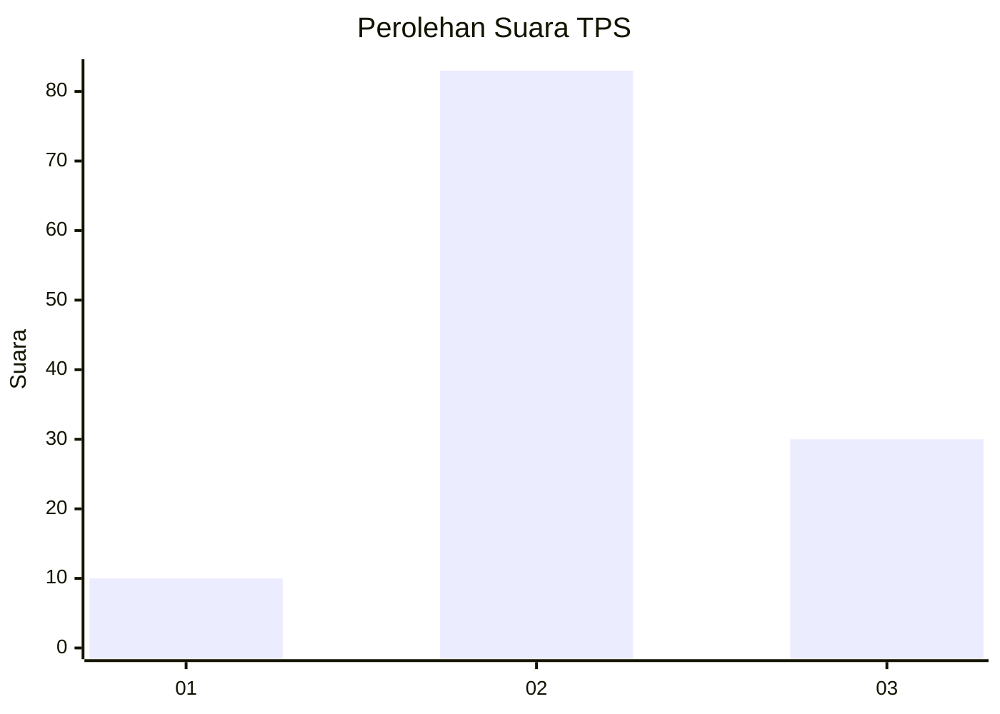
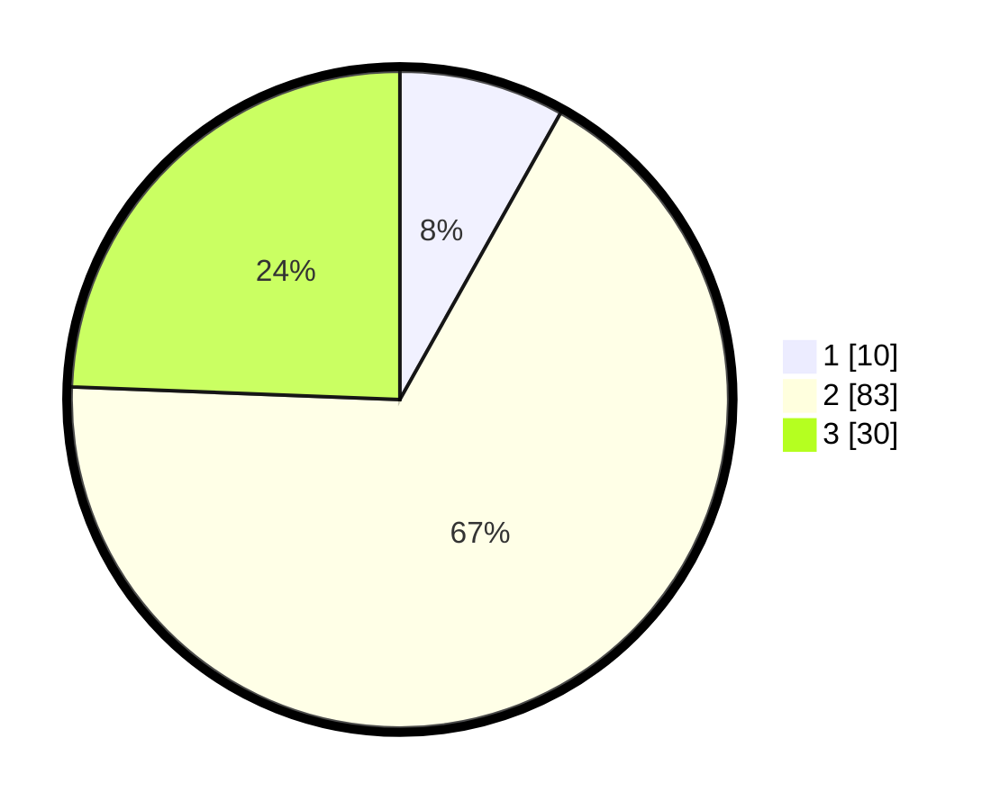

# Hasil

## Grafik

## Tabel

| No. | Nama Paslon    | Suara | Suara (raw) | Persentase |
|:--- |:-------------- | -----:| -----------:| ----------:|
| 1   | ANIES MUHAIMIN | 10    | [10][p-1]   | 8,13       |
| 2   | PRABOWO GIBRAN | 83    | [83][p-2]   | 67,48      |
| 3   | GANJAR MAHFUD  | 30    | [30][p-3]   | 24,39      |

[p-1]: https://github.com/gigit-pemilu/pemilu-2024-33-jawa-tengah/blob/main/pilpres/hitung-suara/sub/33-jawa-tengah/sub/04-banjarnegara/sub/03-mandiraja/sub/2001-jalatunda/sub/009-tps/sub/paslon-1.txt
[p-2]: https://github.com/gigit-pemilu/pemilu-2024-33-jawa-tengah/blob/main/pilpres/hitung-suara/sub/33-jawa-tengah/sub/04-banjarnegara/sub/03-mandiraja/sub/2001-jalatunda/sub/009-tps/sub/paslon-2.txt
[p-3]: https://github.com/gigit-pemilu/pemilu-2024-33-jawa-tengah/blob/main/pilpres/hitung-suara/sub/33-jawa-tengah/sub/04-banjarnegara/sub/03-mandiraja/sub/2001-jalatunda/sub/009-tps/sub/paslon-3.txt

## Foto C Plano

https://sirekap-obj-formc.kpu.go.id/51bb/pemilu/ppwp/33/04/03/20/01/3304032001009-20240214-141007--6c00f54f-15ae-42bb-9911-6523e9ddfbeb.jpg

https://sirekap-obj-formc.kpu.go.id/51bb/pemilu/ppwp/33/04/03/20/01/3304032001009-20240214-215246--3ac4f2d1-5a35-43e0-b49c-fbd6ea45ff76.jpg

https://sirekap-obj-formc.kpu.go.id/51bb/pemilu/ppwp/33/04/03/20/01/3304032001009-20240214-141846--9cac2c28-9968-4c77-861e-f4034442a7b3.jpg

## Metadata

| Key        | Value               |
| ---------- | ------------------- |
| Time Stamp | 2024-02-15 15:00:29 |

