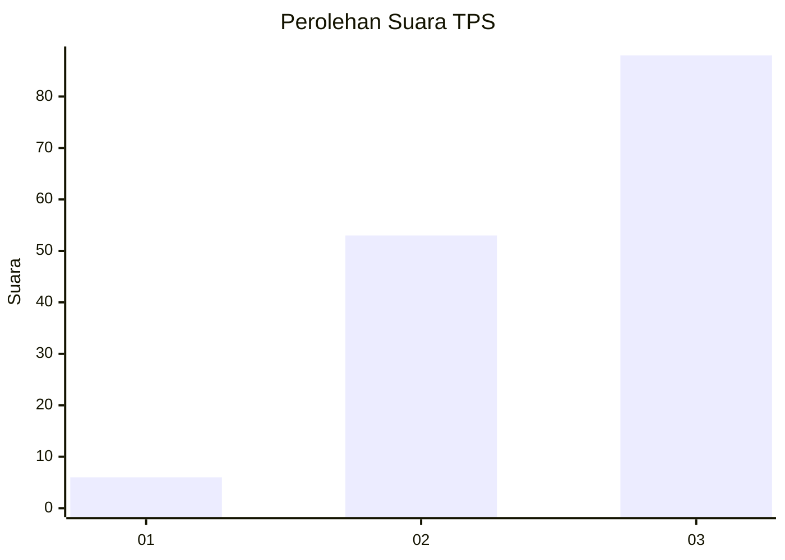
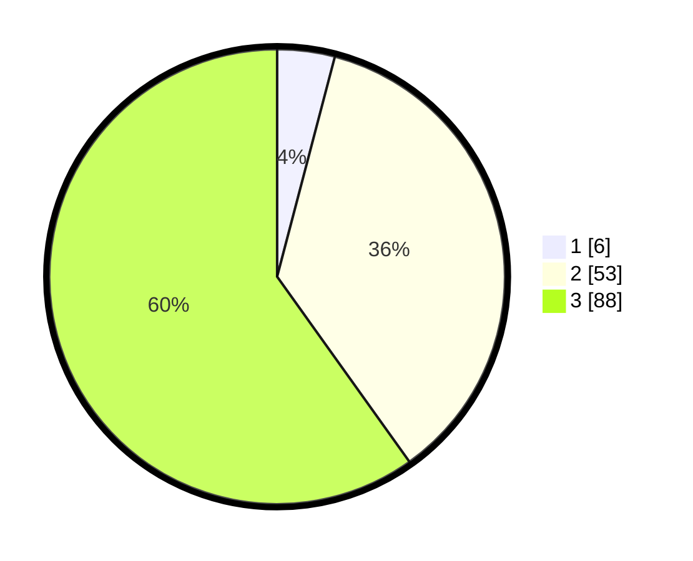

# Hasil

## Grafik

## Tabel

| No. | Nama Paslon    | Suara | Suara (raw) | Persentase |
|:--- |:-------------- | -----:| -----------:| ----------:|
| 1   | ANIES MUHAIMIN | 6     | [6][p-1]    | 4,08       |
| 2   | PRABOWO GIBRAN | 53    | [53][p-2]   | 36,05      |
| 3   | GANJAR MAHFUD  | 88    | [88][p-3]   | 59,86      |

[p-1]: https://github.com/gigit-pemilu/pemilu-2024-33-jawa-tengah/blob/main/pilpres/hitung-suara/sub/33-jawa-tengah/sub/04-banjarnegara/sub/03-mandiraja/sub/2006-salamerta/sub/004-tps/sub/paslon-1.txt
[p-2]: https://github.com/gigit-pemilu/pemilu-2024-33-jawa-tengah/blob/main/pilpres/hitung-suara/sub/33-jawa-tengah/sub/04-banjarnegara/sub/03-mandiraja/sub/2006-salamerta/sub/004-tps/sub/paslon-2.txt
[p-3]: https://github.com/gigit-pemilu/pemilu-2024-33-jawa-tengah/blob/main/pilpres/hitung-suara/sub/33-jawa-tengah/sub/04-banjarnegara/sub/03-mandiraja/sub/2006-salamerta/sub/004-tps/sub/paslon-3.txt

## Foto C Plano

https://sirekap-obj-formc.kpu.go.id/b6ae/pemilu/ppwp/33/04/03/20/06/3304032006004-20240215-004800--b69716ea-91cd-4850-accf-400cafb385d2.jpg

https://sirekap-obj-formc.kpu.go.id/b6ae/pemilu/ppwp/33/04/03/20/06/3304032006004-20240215-004850--40710398-d63a-49d0-b70d-fcd301e14fe8.jpg

https://sirekap-obj-formc.kpu.go.id/b6ae/pemilu/ppwp/33/04/03/20/06/3304032006004-20240215-004856--4d70317b-1a6d-4770-b5d4-9911b77960b0.jpg

## Metadata

| Key        | Value               |
| ---------- | ------------------- |
| Time Stamp | 2024-02-15 12:00:28 |

