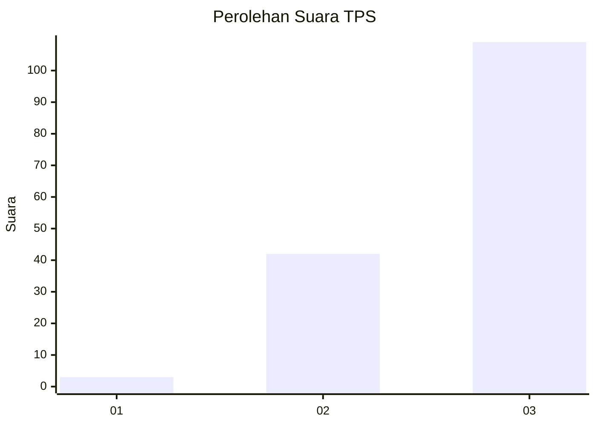
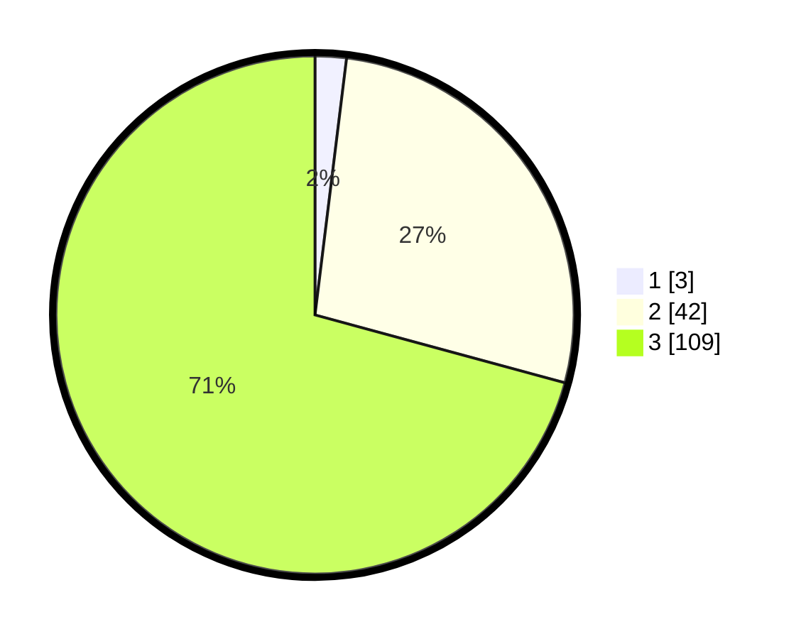

# Hasil

## Grafik

## Tabel

| No. | Nama Paslon    | Suara | Suara (raw) | Persentase |
|:--- |:-------------- | -----:| -----------:| ----------:|
| 1   | ANIES MUHAIMIN | 3     | [3][p-1]    | 1,95       |
| 2   | PRABOWO GIBRAN | 42    | [42][p-2]   | 27,27      |
| 3   | GANJAR MAHFUD  | 109   | [109][p-3]  | 70,78      |

[p-1]: https://github.com/gigit-pemilu/pemilu-2024/blob/main/pilpres/hitung-suara/sub/33-jawa-tengah/sub/04-banjarnegara/sub/03-mandiraja/sub/2006-salamerta/sub/014-tps/sub/paslon-1.txt
[p-2]: https://github.com/gigit-pemilu/pemilu-2024/blob/main/pilpres/hitung-suara/sub/33-jawa-tengah/sub/04-banjarnegara/sub/03-mandiraja/sub/2006-salamerta/sub/014-tps/sub/paslon-2.txt
[p-3]: https://github.com/gigit-pemilu/pemilu-2024/blob/main/pilpres/hitung-suara/sub/33-jawa-tengah/sub/04-banjarnegara/sub/03-mandiraja/sub/2006-salamerta/sub/014-tps/sub/paslon-3.txt

## Foto C Plano

https://sirekap-obj-formc.kpu.go.id/13a9/pemilu/ppwp/33/04/03/20/06/3304032006014-20240214-233903--f78fd1fc-3f2a-4064-b0f0-0c7ab3fa2415.jpg

https://sirekap-obj-formc.kpu.go.id/13a9/pemilu/ppwp/33/04/03/20/06/3304032006014-20240216-131815--85ecd863-db12-4c01-bfe0-ac479a949a6f.jpg

https://sirekap-obj-formc.kpu.go.id/13a9/pemilu/ppwp/33/04/03/20/06/3304032006014-20240216-131814--03200bb6-a1db-448c-996d-c8ce756486c2.jpg

## Metadata

| Key        | Value               |
| ---------- | ------------------- |
| Time Stamp | 2024-02-16 14:00:34 |

