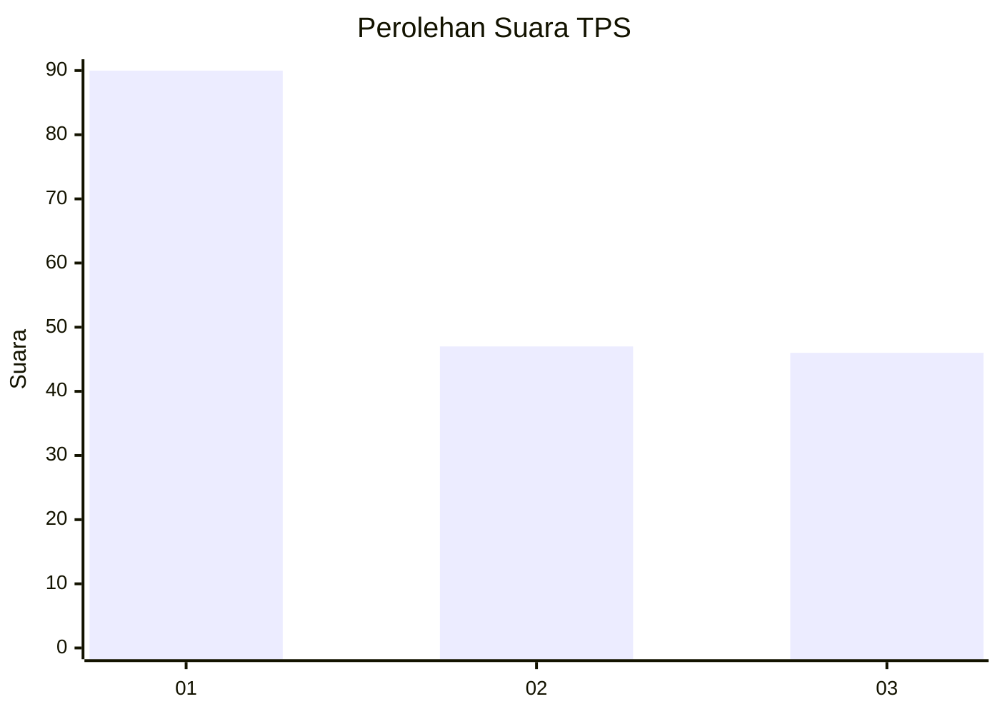
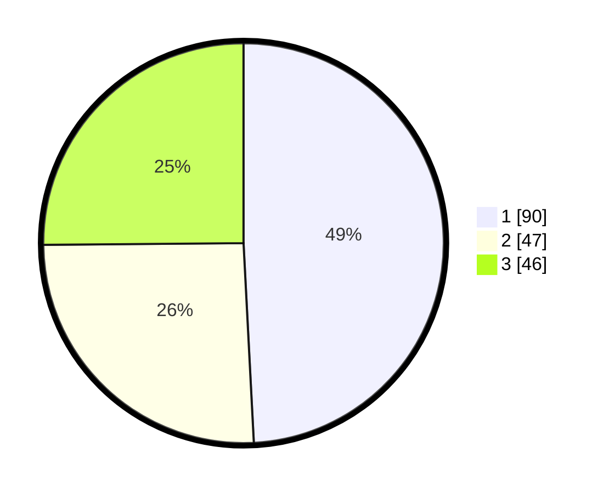

# Hasil

## Grafik

## Tabel

| No. | Nama Paslon    | Suara | Suara (raw) | Persentase |
|:--- |:-------------- | -----:| -----------:| ----------:|
| 1   | ANIES MUHAIMIN | 90    | [90][p-1]   | 49,18      |
| 2   | PRABOWO GIBRAN | 47    | [47][p-2]   | 25,68      |
| 3   | GANJAR MAHFUD  | 46    | [46][p-3]   | 25,14      |

[p-1]: https://github.com/gigit-pemilu/pemilu-2024-33-jawa-tengah/blob/main/pilpres/hitung-suara/sub/33-jawa-tengah/sub/04-banjarnegara/sub/04-purwanegara/sub/2003-karanganyar/sub/001-tps/sub/paslon-1.txt
[p-2]: https://github.com/gigit-pemilu/pemilu-2024-33-jawa-tengah/blob/main/pilpres/hitung-suara/sub/33-jawa-tengah/sub/04-banjarnegara/sub/04-purwanegara/sub/2003-karanganyar/sub/001-tps/sub/paslon-2.txt
[p-3]: https://github.com/gigit-pemilu/pemilu-2024-33-jawa-tengah/blob/main/pilpres/hitung-suara/sub/33-jawa-tengah/sub/04-banjarnegara/sub/04-purwanegara/sub/2003-karanganyar/sub/001-tps/sub/paslon-3.txt

## Foto C Plano

https://sirekap-obj-formc.kpu.go.id/4d66/pemilu/ppwp/33/04/04/20/03/3304042003001-20240214-221637--5b78b0f0-145a-4089-b4f4-907d29d70cf2.jpg

https://sirekap-obj-formc.kpu.go.id/4d66/pemilu/ppwp/33/04/04/20/03/3304042003001-20240214-222534--fcb2474e-d72a-4aa5-bfaa-c27e3c3646d7.jpg

https://sirekap-obj-formc.kpu.go.id/4d66/pemilu/ppwp/33/04/04/20/03/3304042003001-20240214-223110--b06ef2f9-ce5e-48e6-9c4e-8547be1dfa55.jpg

## Metadata

| Key        | Value               |
| ---------- | ------------------- |
| Time Stamp | 2024-02-15 17:00:25 |

