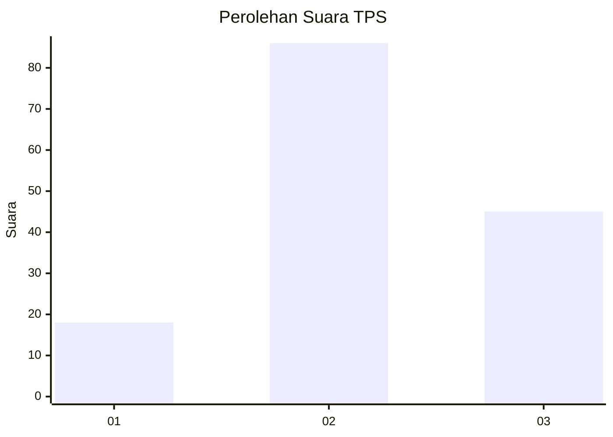
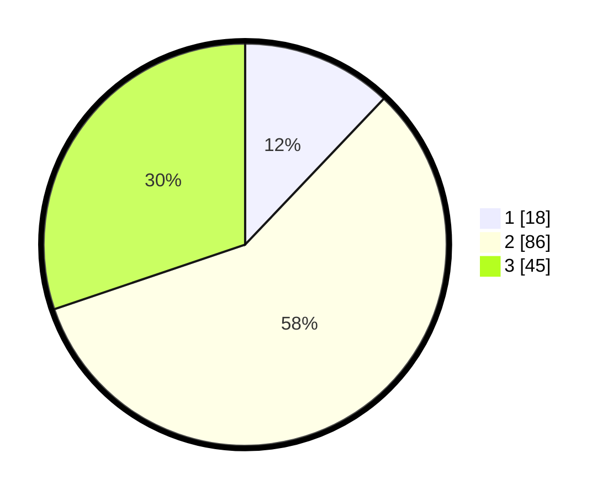

# Hasil

## Grafik

## Tabel

| No. | Nama Paslon    | Suara | Suara (raw) | Persentase |
|:--- |:-------------- | -----:| -----------:| ----------:|
| 1   | ANIES MUHAIMIN | 18    | [18][p-1]   | 12,08      |
| 2   | PRABOWO GIBRAN | 86    | [86][p-2]   | 57,72      |
| 3   | GANJAR MAHFUD  | 45    | [45][p-3]   | 30,20      |

[p-1]: https://github.com/gigit-pemilu/pemilu-2024-33-jawa-tengah/blob/main/pilpres/hitung-suara/sub/33-jawa-tengah/sub/04-banjarnegara/sub/04-purwanegara/sub/2003-karanganyar/sub/007-tps/sub/paslon-1.txt
[p-2]: https://github.com/gigit-pemilu/pemilu-2024-33-jawa-tengah/blob/main/pilpres/hitung-suara/sub/33-jawa-tengah/sub/04-banjarnegara/sub/04-purwanegara/sub/2003-karanganyar/sub/007-tps/sub/paslon-2.txt
[p-3]: https://github.com/gigit-pemilu/pemilu-2024-33-jawa-tengah/blob/main/pilpres/hitung-suara/sub/33-jawa-tengah/sub/04-banjarnegara/sub/04-purwanegara/sub/2003-karanganyar/sub/007-tps/sub/paslon-3.txt

## Foto C Plano

https://sirekap-obj-formc.kpu.go.id/4b98/pemilu/ppwp/33/04/04/20/03/3304042003007-20240215-000442--95a77968-75c9-4383-8242-d656209efd90.jpg

https://sirekap-obj-formc.kpu.go.id/4b98/pemilu/ppwp/33/04/04/20/03/3304042003007-20240215-000825--4d653f29-a51b-4413-ab2e-0e48df77a3ee.jpg

https://sirekap-obj-formc.kpu.go.id/4b98/pemilu/ppwp/33/04/04/20/03/3304042003007-20240215-010813--60a3461c-efeb-452c-8982-1143c69898ac.jpg

## Metadata

| Key        | Value               |
| ---------- | ------------------- |
| Time Stamp | 2024-02-15 17:00:25 |

