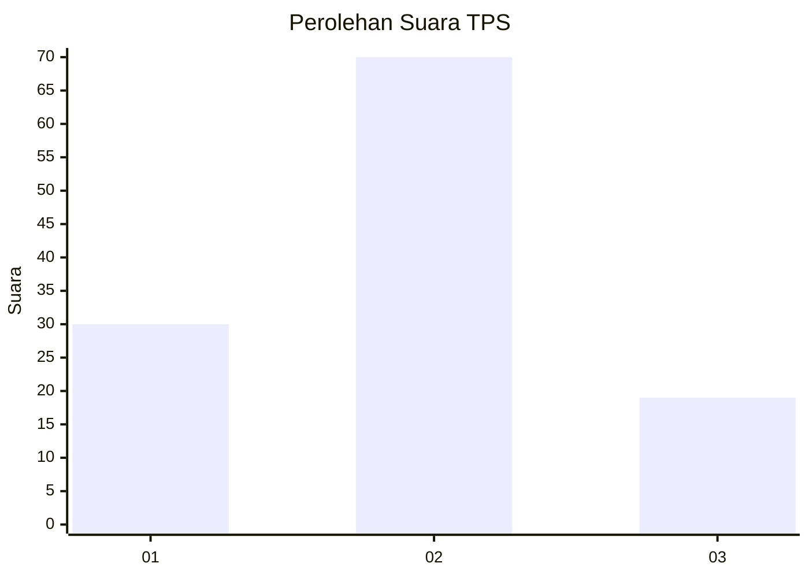
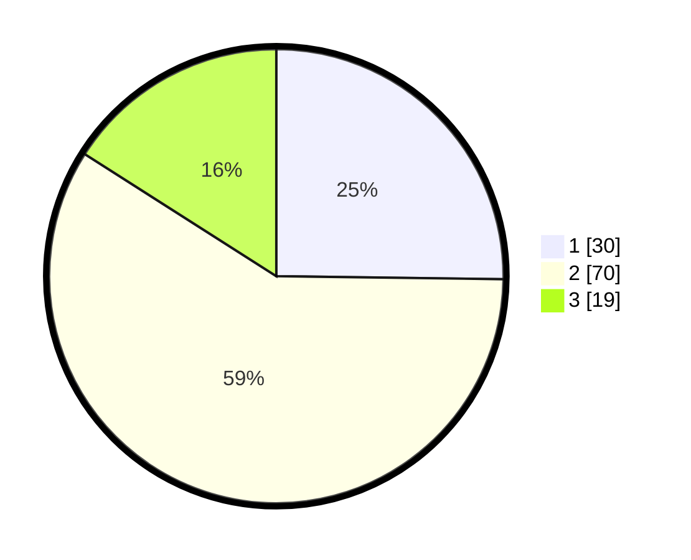

# Hasil

## Grafik

## Tabel

| No. | Nama Paslon    | Suara | Suara (raw) | Persentase |
|:--- |:-------------- | -----:| -----------:| ----------:|
| 1   | ANIES MUHAIMIN | 30    | [30][p-1]   | 25,21      |
| 2   | PRABOWO GIBRAN | 70    | [70][p-2]   | 58,82      |
| 3   | GANJAR MAHFUD  | 19    | [19][p-3]   | 15,97      |

[p-1]: https://github.com/gigit-pemilu/pemilu-2024/blob/main/pilpres/hitung-suara/sub/33-jawa-tengah/sub/04-banjarnegara/sub/04-purwanegara/sub/2003-karanganyar/sub/019-tps/sub/paslon-1.txt
[p-2]: https://github.com/gigit-pemilu/pemilu-2024/blob/main/pilpres/hitung-suara/sub/33-jawa-tengah/sub/04-banjarnegara/sub/04-purwanegara/sub/2003-karanganyar/sub/019-tps/sub/paslon-2.txt
[p-3]: https://github.com/gigit-pemilu/pemilu-2024/blob/main/pilpres/hitung-suara/sub/33-jawa-tengah/sub/04-banjarnegara/sub/04-purwanegara/sub/2003-karanganyar/sub/019-tps/sub/paslon-3.txt

## Foto C Plano

https://sirekap-obj-formc.kpu.go.id/fc12/pemilu/ppwp/33/04/04/20/03/3304042003019-20240214-202644--7bdedbe5-d616-4b8d-9a24-509003f9f94f.jpg

https://sirekap-obj-formc.kpu.go.id/fc12/pemilu/ppwp/33/04/04/20/03/3304042003019-20240216-113921--fc9d5d0f-fbc2-43a4-85b0-b5d8466282d9.jpg

https://sirekap-obj-formc.kpu.go.id/fc12/pemilu/ppwp/33/04/04/20/03/3304042003019-20240216-113920--d4afd3eb-dce1-4904-b01f-1eda3b7965ca.jpg

## Metadata

| Key        | Value               |
| ---------- | ------------------- |
| Time Stamp | 2024-02-16 12:51:22 |

