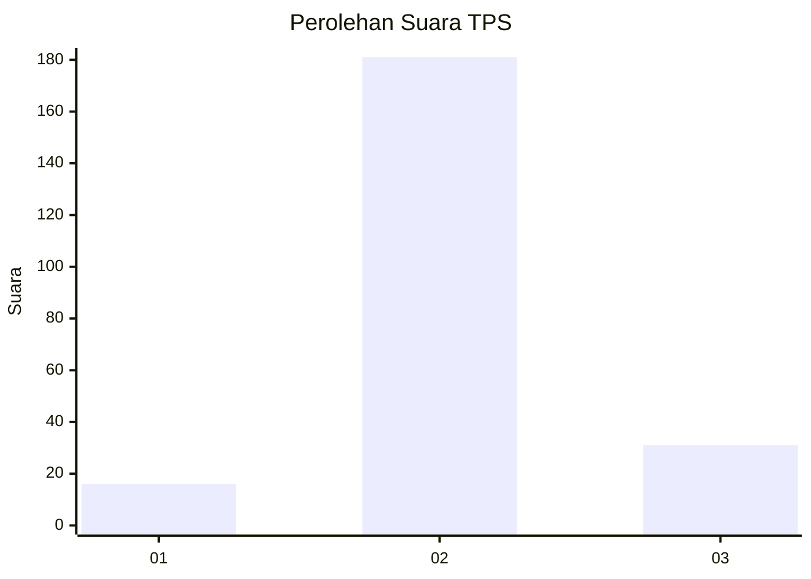
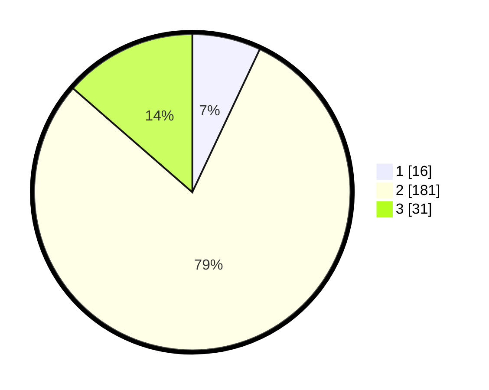

# Hasil

## Grafik

## Tabel

| No. | Nama Paslon    | Suara | Suara (raw) | Persentase |
|:--- |:-------------- | -----:| -----------:| ----------:|
| 1   | ANIES MUHAIMIN | 16    | [16][p-1]   | 7,02       |
| 2   | PRABOWO GIBRAN | 181   | [181][p-2]  | 79,39      |
| 3   | GANJAR MAHFUD  | 31    | [31][p-3]   | 13,60      |

[p-1]: https://github.com/gigit-pemilu/pemilu-2024/blob/main/pilpres/hitung-suara/sub/33-jawa-tengah/sub/04-banjarnegara/sub/04-purwanegara/sub/2006-pucungbedug/sub/006-tps/sub/paslon-1.txt
[p-2]: https://github.com/gigit-pemilu/pemilu-2024/blob/main/pilpres/hitung-suara/sub/33-jawa-tengah/sub/04-banjarnegara/sub/04-purwanegara/sub/2006-pucungbedug/sub/006-tps/sub/paslon-2.txt
[p-3]: https://github.com/gigit-pemilu/pemilu-2024/blob/main/pilpres/hitung-suara/sub/33-jawa-tengah/sub/04-banjarnegara/sub/04-purwanegara/sub/2006-pucungbedug/sub/006-tps/sub/paslon-3.txt

## Foto C Plano

https://sirekap-obj-formc.kpu.go.id/89a8/pemilu/ppwp/33/04/04/20/06/3304042006006-20240222-084812--a9f8287e-64b8-468e-adb1-7d0132515f7b.jpg

https://sirekap-obj-formc.kpu.go.id/89a8/pemilu/ppwp/33/04/04/20/06/3304042006006-20240222-084846--dbe177af-bea6-4bbf-b5db-2b8fee39ca0d.jpg

https://sirekap-obj-formc.kpu.go.id/89a8/pemilu/ppwp/33/04/04/20/06/3304042006006-20240222-084941--4ec71185-06f8-4a30-a0d4-08ead6f792e8.jpg

## Metadata

| Key        | Value               |
| ---------- | ------------------- |
| Time Stamp | 2024-02-24 22:31:28 |

