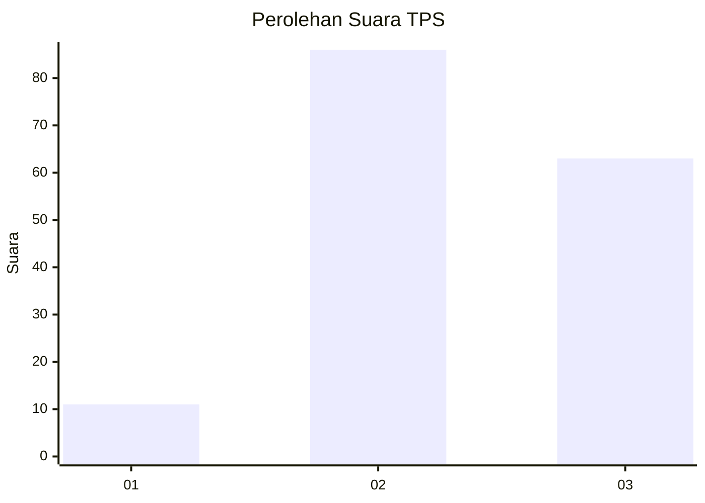
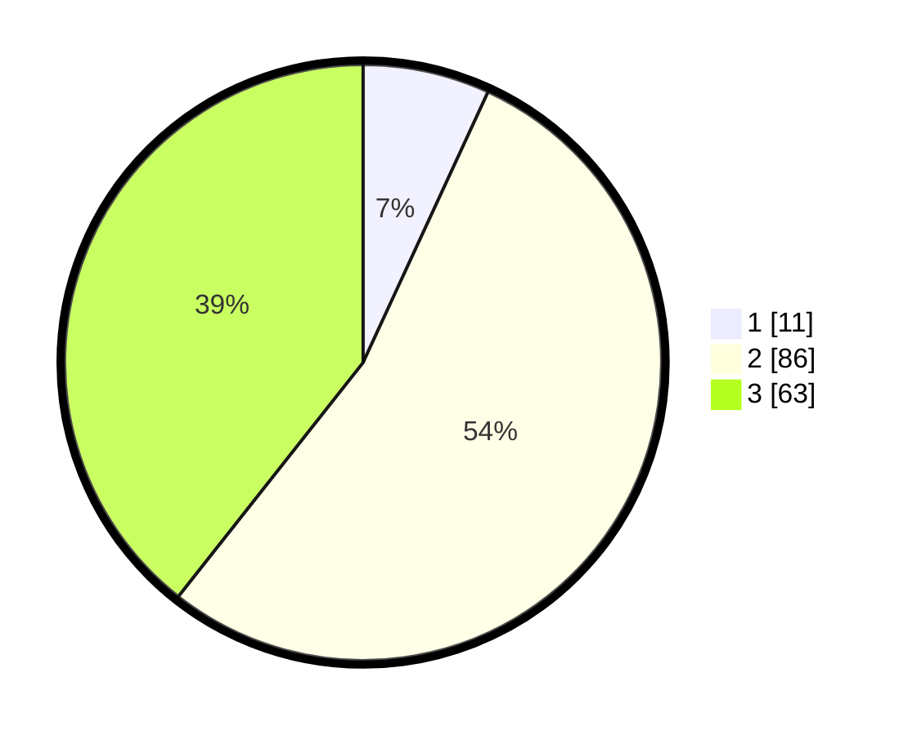

# Hasil

## Grafik

## Tabel

| No. | Nama Paslon    | Suara | Suara (raw) | Persentase |
|:--- |:-------------- | -----:| -----------:| ----------:|
| 1   | ANIES MUHAIMIN | 11    | [11][p-1]   | 6,88       |
| 2   | PRABOWO GIBRAN | 86    | [86][p-2]   | 53,75      |
| 3   | GANJAR MAHFUD  | 63    | [63][p-3]   | 39,38      |

[p-1]: https://github.com/gigit-pemilu/pemilu-2024/blob/main/pilpres/hitung-suara/sub/33-jawa-tengah/sub/04-banjarnegara/sub/04-purwanegara/sub/2007-parakan/sub/005-tps/sub/paslon-1.txt
[p-2]: https://github.com/gigit-pemilu/pemilu-2024/blob/main/pilpres/hitung-suara/sub/33-jawa-tengah/sub/04-banjarnegara/sub/04-purwanegara/sub/2007-parakan/sub/005-tps/sub/paslon-2.txt
[p-3]: https://github.com/gigit-pemilu/pemilu-2024/blob/main/pilpres/hitung-suara/sub/33-jawa-tengah/sub/04-banjarnegara/sub/04-purwanegara/sub/2007-parakan/sub/005-tps/sub/paslon-3.txt

## Foto C Plano

https://sirekap-obj-formc.kpu.go.id/9222/pemilu/ppwp/33/04/04/20/07/3304042007005-20240215-002408--27050f13-65e0-49a8-9cef-d676c61e5f47.jpg

https://sirekap-obj-formc.kpu.go.id/9222/pemilu/ppwp/33/04/04/20/07/3304042007005-20240215-003113--88fdb006-08c5-44db-b86c-55ea2344a71c.jpg

https://sirekap-obj-formc.kpu.go.id/9222/pemilu/ppwp/33/04/04/20/07/3304042007005-20240215-003214--8a3bacec-3015-4d70-809c-e300a52e2323.jpg

## Metadata

| Key        | Value               |
| ---------- | ------------------- |
| Time Stamp | 2024-02-15 17:00:25 |

