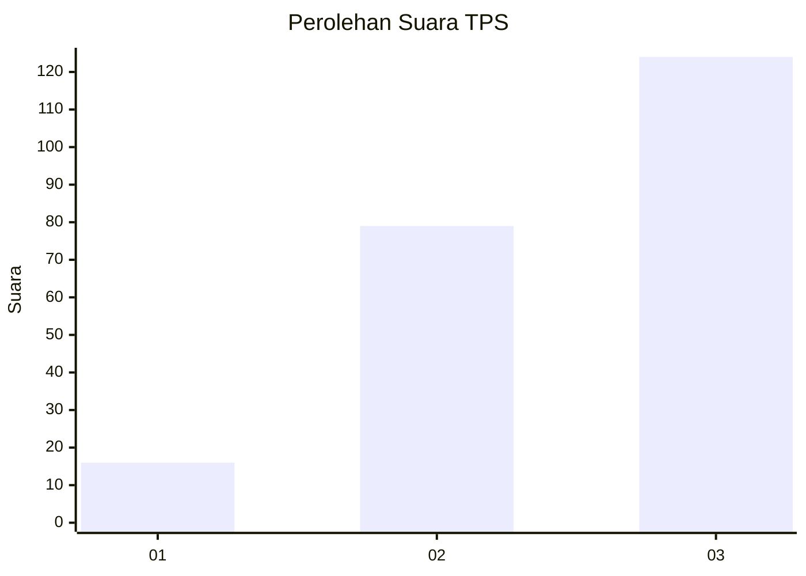
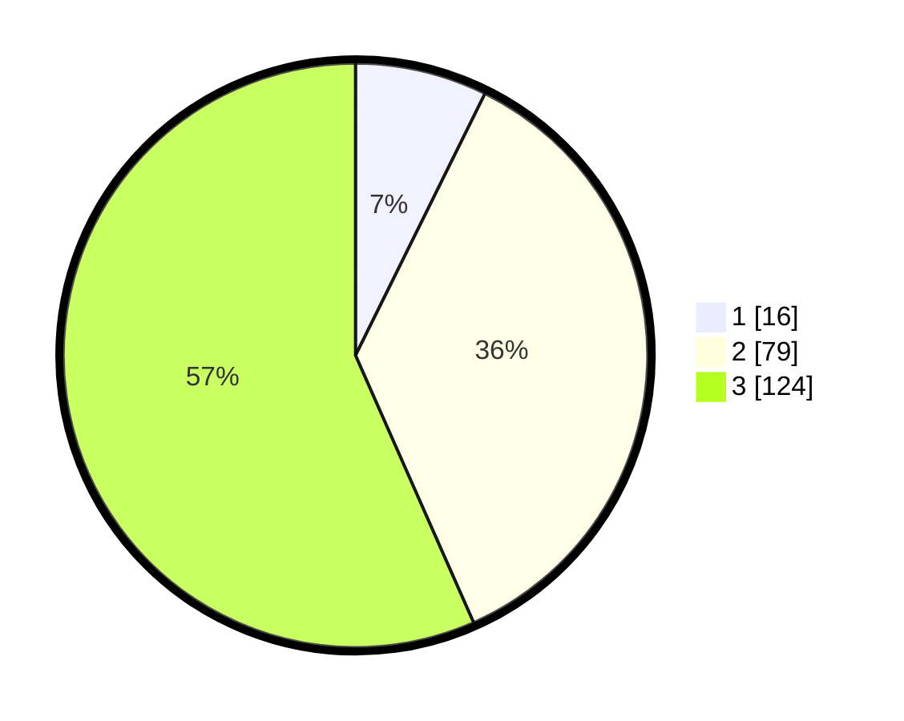

# Hasil

## Grafik

## Tabel

| No. | Nama Paslon    | Suara | Suara (raw) | Persentase |
|:--- |:-------------- | -----:| -----------:| ----------:|
| 1   | ANIES MUHAIMIN | 16    | [16][p-1]   | 7,31       |
| 2   | PRABOWO GIBRAN | 79    | [79][p-2]   | 36,07      |
| 3   | GANJAR MAHFUD  | 124   | [124][p-3]  | 56,62      |

[p-1]: https://github.com/gigit-pemilu/pemilu-2024/blob/main/pilpres/hitung-suara/sub/33-jawa-tengah/sub/04-banjarnegara/sub/04-purwanegara/sub/2008-mertasari/sub/011-tps/sub/paslon-1.txt
[p-2]: https://github.com/gigit-pemilu/pemilu-2024/blob/main/pilpres/hitung-suara/sub/33-jawa-tengah/sub/04-banjarnegara/sub/04-purwanegara/sub/2008-mertasari/sub/011-tps/sub/paslon-2.txt
[p-3]: https://github.com/gigit-pemilu/pemilu-2024/blob/main/pilpres/hitung-suara/sub/33-jawa-tengah/sub/04-banjarnegara/sub/04-purwanegara/sub/2008-mertasari/sub/011-tps/sub/paslon-3.txt

## Foto C Plano

https://sirekap-obj-formc.kpu.go.id/e17c/pemilu/ppwp/33/04/04/20/08/3304042008011-20240218-161207--5e7910f3-2131-4bbc-92fd-dd396b22988e.jpg

https://sirekap-obj-formc.kpu.go.id/e17c/pemilu/ppwp/33/04/04/20/08/3304042008011-20240218-161611--eaa567c2-f8f6-46fc-82ad-90915754828f.jpg

https://sirekap-obj-formc.kpu.go.id/e17c/pemilu/ppwp/33/04/04/20/08/3304042008011-20240218-161648--930794df-22b4-4188-a61c-38a73ffc1884.jpg

## Metadata

| Key        | Value               |
| ---------- | ------------------- |
| Time Stamp | 2024-02-25 11:00:00 |

