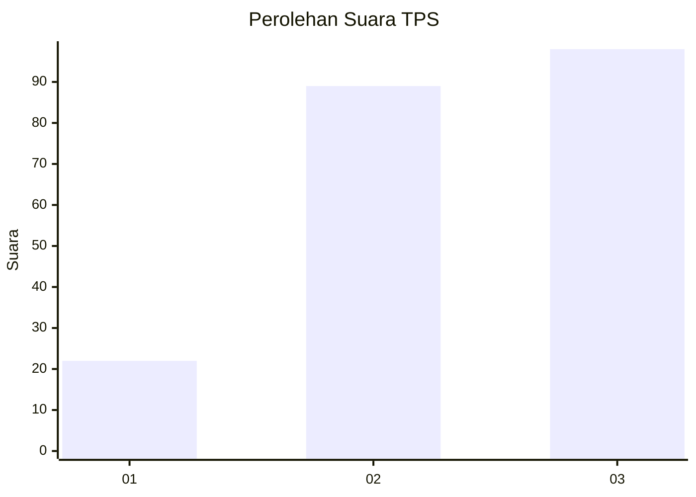
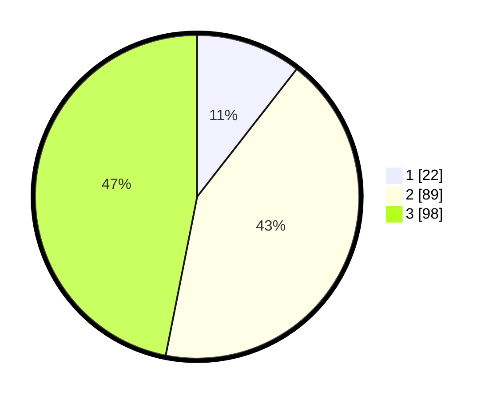

# Hasil

## Grafik

## Tabel

| No. | Nama Paslon    | Suara | Suara (raw) | Persentase |
|:--- |:-------------- | -----:| -----------:| ----------:|
| 1   | ANIES MUHAIMIN | 22    | [22][p-1]   | 10,53      |
| 2   | PRABOWO GIBRAN | 89    | [89][p-2]   | 42,58      |
| 3   | GANJAR MAHFUD  | 98    | [98][p-3]   | 46,89      |

[p-1]: https://github.com/gigit-pemilu/pemilu-2024/blob/main/pilpres/hitung-suara/sub/33-jawa-tengah/sub/04-banjarnegara/sub/04-purwanegara/sub/2008-mertasari/sub/013-tps/sub/paslon-1.txt
[p-2]: https://github.com/gigit-pemilu/pemilu-2024/blob/main/pilpres/hitung-suara/sub/33-jawa-tengah/sub/04-banjarnegara/sub/04-purwanegara/sub/2008-mertasari/sub/013-tps/sub/paslon-2.txt
[p-3]: https://github.com/gigit-pemilu/pemilu-2024/blob/main/pilpres/hitung-suara/sub/33-jawa-tengah/sub/04-banjarnegara/sub/04-purwanegara/sub/2008-mertasari/sub/013-tps/sub/paslon-3.txt

## Foto C Plano

https://sirekap-obj-formc.kpu.go.id/c3d1/pemilu/ppwp/33/04/04/20/08/3304042008013-20240218-155637--28c6b6c2-e530-4a48-aca0-34fa46b9685f.jpg

https://sirekap-obj-formc.kpu.go.id/c3d1/pemilu/ppwp/33/04/04/20/08/3304042008013-20240218-155515--39ae1100-6085-4869-b3cc-2243c58e84ec.jpg

https://sirekap-obj-formc.kpu.go.id/c3d1/pemilu/ppwp/33/04/04/20/08/3304042008013-20240218-164816--fccd80c6-8b0e-4c4d-a207-de9d522e503b.jpg

## Metadata

| Key        | Value               |
| ---------- | ------------------- |
| Time Stamp | 2024-02-25 14:00:00 |

