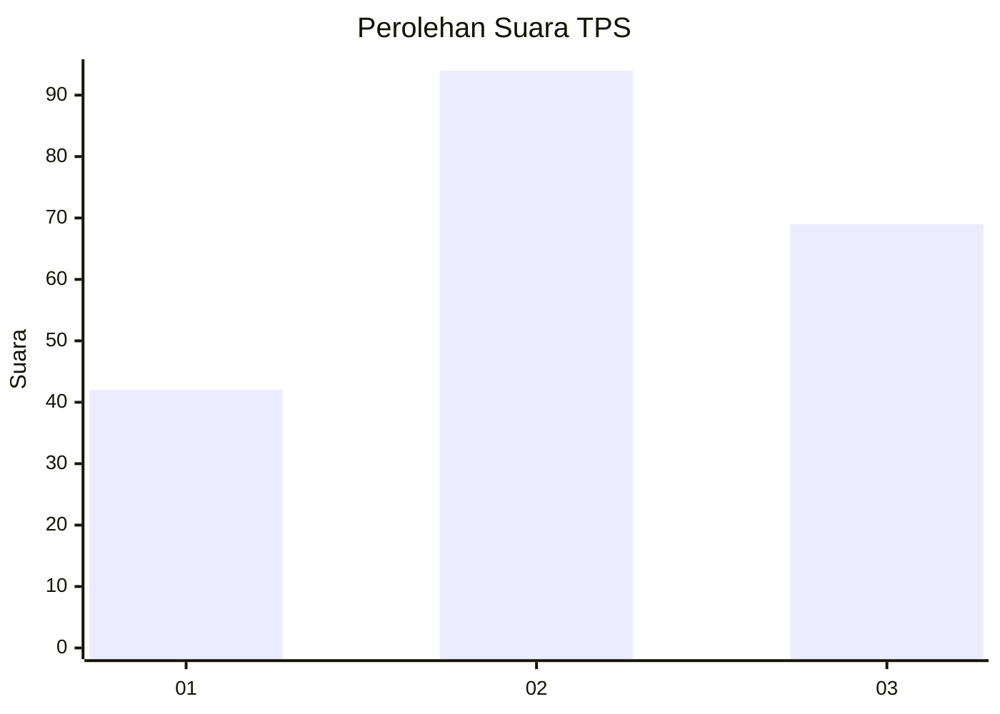
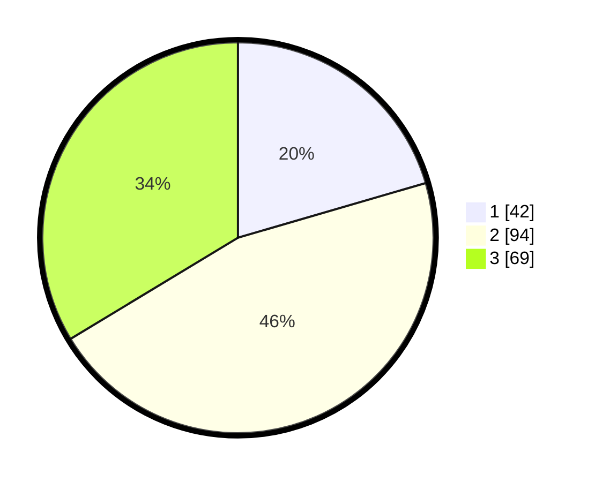

# Hasil

## Grafik

## Tabel

| No. | Nama Paslon    | Suara | Suara (raw) | Persentase |
|:--- |:-------------- | -----:| -----------:| ----------:|
| 1   | ANIES MUHAIMIN | 42    | [42][p-1]   | 20,49      |
| 2   | PRABOWO GIBRAN | 94    | [94][p-2]   | 45,85      |
| 3   | GANJAR MAHFUD  | 69    | [69][p-3]   | 33,66      |

[p-1]: https://github.com/gigit-pemilu/pemilu-2024-33-jawa-tengah/blob/main/pilpres/hitung-suara/sub/33-jawa-tengah/sub/04-banjarnegara/sub/04-purwanegara/sub/2010-purwonegoro/sub/002-tps/sub/paslon-1.txt
[p-2]: https://github.com/gigit-pemilu/pemilu-2024-33-jawa-tengah/blob/main/pilpres/hitung-suara/sub/33-jawa-tengah/sub/04-banjarnegara/sub/04-purwanegara/sub/2010-purwonegoro/sub/002-tps/sub/paslon-2.txt
[p-3]: https://github.com/gigit-pemilu/pemilu-2024-33-jawa-tengah/blob/main/pilpres/hitung-suara/sub/33-jawa-tengah/sub/04-banjarnegara/sub/04-purwanegara/sub/2010-purwonegoro/sub/002-tps/sub/paslon-3.txt

## Foto C Plano

https://sirekap-obj-formc.kpu.go.id/62aa/pemilu/ppwp/33/04/04/20/10/3304042010002-20240217-090603--0d88758e-6b21-4406-bec0-ec19fb24a7e7.jpg

https://sirekap-obj-formc.kpu.go.id/62aa/pemilu/ppwp/33/04/04/20/10/3304042010002-20240217-090644--ef18643e-e969-4000-adf9-d019053a7a06.jpg

https://sirekap-obj-formc.kpu.go.id/62aa/pemilu/ppwp/33/04/04/20/10/3304042010002-20240217-090714--a1e6c927-42b4-4cb1-97fd-e0e41cca877b.jpg

## Metadata

| Key        | Value               |
| ---------- | ------------------- |
| Time Stamp | 2024-02-24 22:31:28 |

