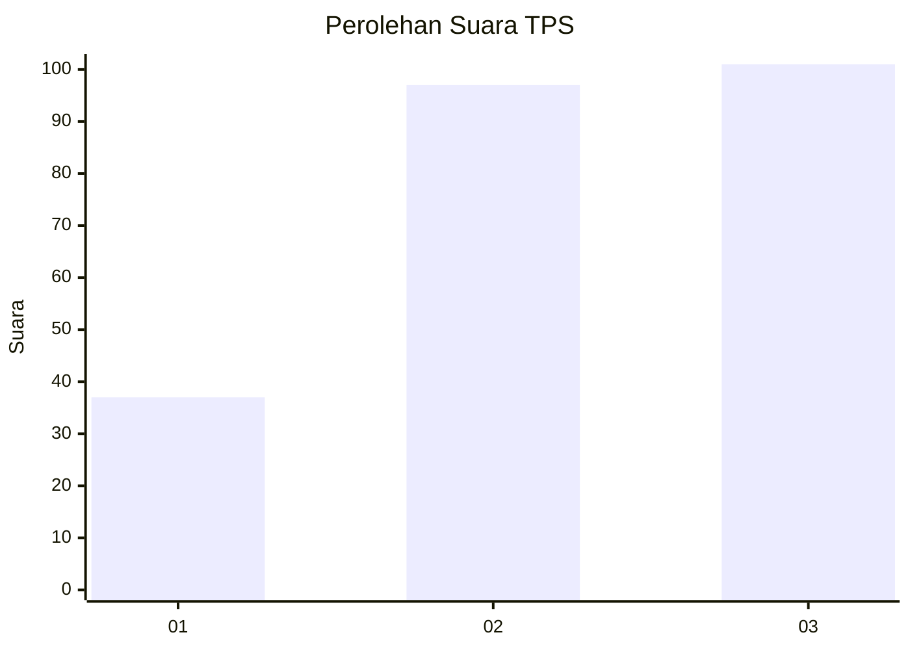
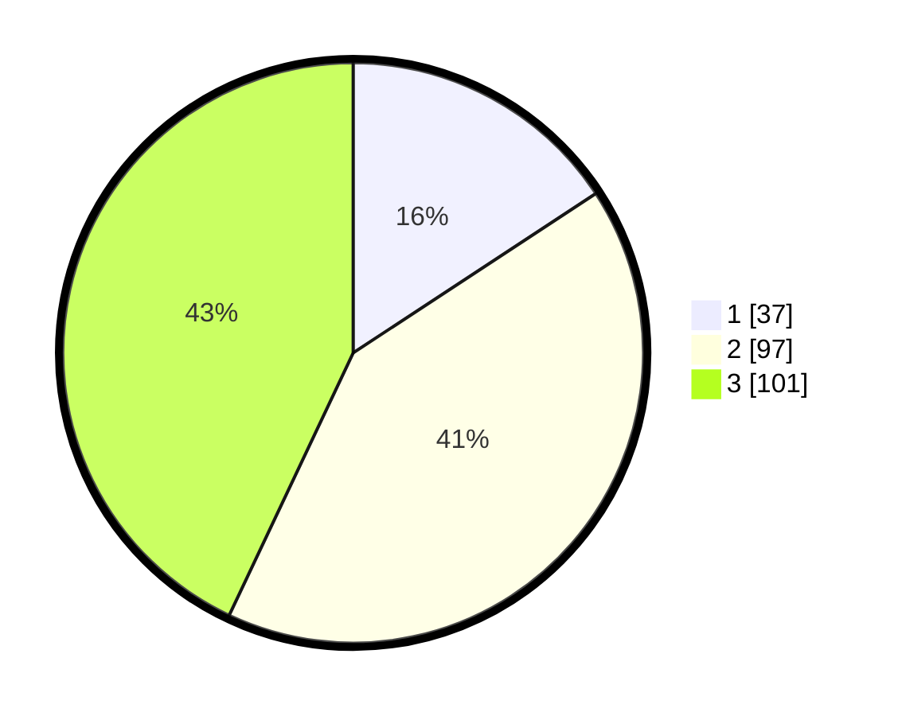

# Hasil

## Grafik

## Tabel

| No. | Nama Paslon    | Suara | Suara (raw) | Persentase |
|:--- |:-------------- | -----:| -----------:| ----------:|
| 1   | ANIES MUHAIMIN | 37    | [37][p-1]   | 15,74      |
| 2   | PRABOWO GIBRAN | 97    | [97][p-2]   | 41,28      |
| 3   | GANJAR MAHFUD  | 101   | [101][p-3]  | 42,98      |

[p-1]: https://github.com/gigit-pemilu/pemilu-2024-33-jawa-tengah/blob/main/pilpres/hitung-suara/sub/33-jawa-tengah/sub/04-banjarnegara/sub/04-purwanegara/sub/2010-purwonegoro/sub/009-tps/sub/paslon-1.txt
[p-2]: https://github.com/gigit-pemilu/pemilu-2024-33-jawa-tengah/blob/main/pilpres/hitung-suara/sub/33-jawa-tengah/sub/04-banjarnegara/sub/04-purwanegara/sub/2010-purwonegoro/sub/009-tps/sub/paslon-2.txt
[p-3]: https://github.com/gigit-pemilu/pemilu-2024-33-jawa-tengah/blob/main/pilpres/hitung-suara/sub/33-jawa-tengah/sub/04-banjarnegara/sub/04-purwanegara/sub/2010-purwonegoro/sub/009-tps/sub/paslon-3.txt

## Foto C Plano

https://sirekap-obj-formc.kpu.go.id/82e3/pemilu/ppwp/33/04/04/20/10/3304042010009-20240217-093223--68a08596-aa83-4403-a287-e30901f715ce.jpg

https://sirekap-obj-formc.kpu.go.id/82e3/pemilu/ppwp/33/04/04/20/10/3304042010009-20240217-093255--d12df64c-8157-4b92-a7eb-d8e12a3f7734.jpg

https://sirekap-obj-formc.kpu.go.id/82e3/pemilu/ppwp/33/04/04/20/10/3304042010009-20240217-093323--89c852ff-767e-456d-bd42-c601978d2e8d.jpg

## Metadata

| Key        | Value               |
| ---------- | ------------------- |
| Time Stamp | 2024-02-26 13:00:00 |

