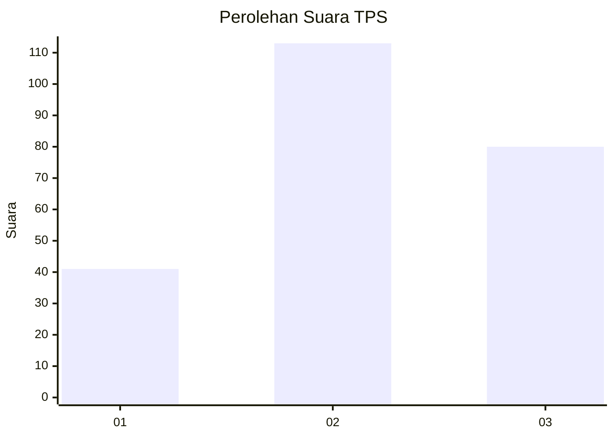
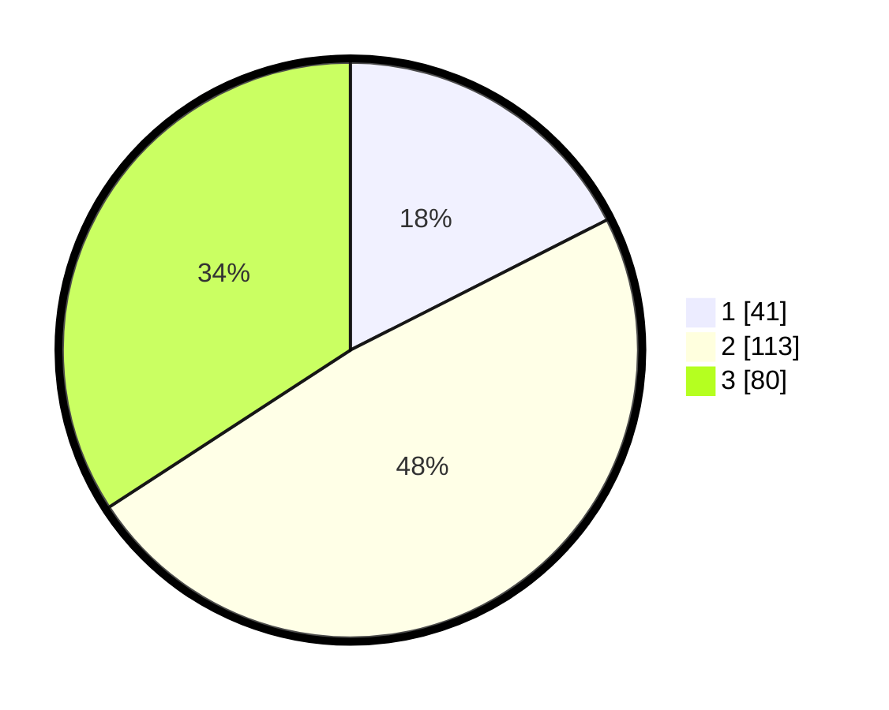

# Hasil

## Grafik

## Tabel

| No. | Nama Paslon    | Suara | Suara (raw) | Persentase |
|:--- |:-------------- | -----:| -----------:| ----------:|
| 1   | ANIES MUHAIMIN | 41    | [41][p-1]   | 17,52      |
| 2   | PRABOWO GIBRAN | 113   | [113][p-2]  | 48,29      |
| 3   | GANJAR MAHFUD  | 80    | [80][p-3]   | 34,19      |

[p-1]: https://github.com/gigit-pemilu/pemilu-2024/blob/main/pilpres/hitung-suara/sub/33-jawa-tengah/sub/04-banjarnegara/sub/04-purwanegara/sub/2010-purwonegoro/sub/010-tps/sub/paslon-1.txt
[p-2]: https://github.com/gigit-pemilu/pemilu-2024/blob/main/pilpres/hitung-suara/sub/33-jawa-tengah/sub/04-banjarnegara/sub/04-purwanegara/sub/2010-purwonegoro/sub/010-tps/sub/paslon-2.txt
[p-3]: https://github.com/gigit-pemilu/pemilu-2024/blob/main/pilpres/hitung-suara/sub/33-jawa-tengah/sub/04-banjarnegara/sub/04-purwanegara/sub/2010-purwonegoro/sub/010-tps/sub/paslon-3.txt

## Foto C Plano

https://sirekap-obj-formc.kpu.go.id/eb6e/pemilu/ppwp/33/04/04/20/10/3304042010010-20240217-093417--1f0db3f9-d055-4a75-9d05-50faca2ccdd2.jpg

https://sirekap-obj-formc.kpu.go.id/eb6e/pemilu/ppwp/33/04/04/20/10/3304042010010-20240217-093448--d63fd7c0-33b2-4ed5-8d34-7796f75d2ec2.jpg

https://sirekap-obj-formc.kpu.go.id/eb6e/pemilu/ppwp/33/04/04/20/10/3304042010010-20240217-093530--8e628652-61e4-402b-9073-9b93ec8d0c7b.jpg

## Metadata

| Key        | Value               |
| ---------- | ------------------- |
| Time Stamp | 2024-02-24 22:31:28 |

