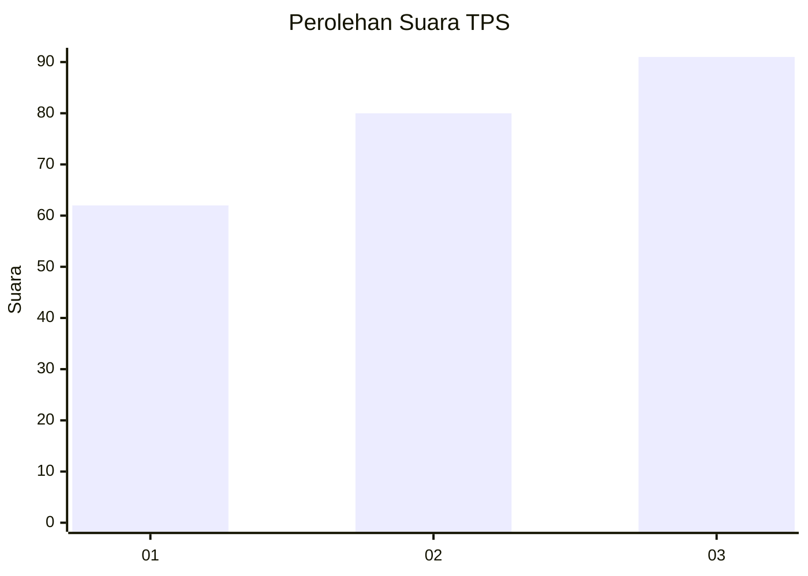
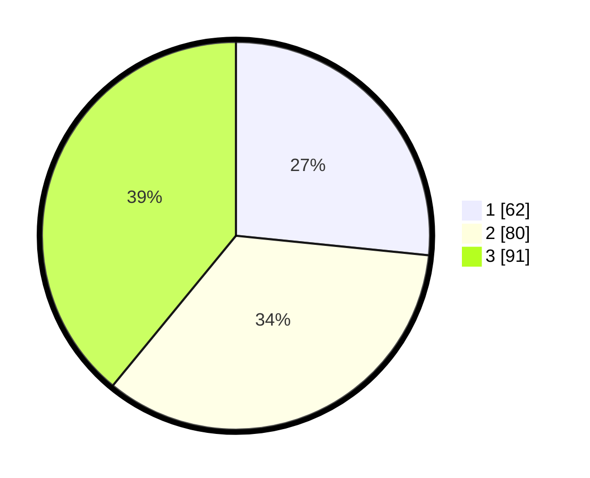

# Hasil

## Grafik

## Tabel

| No. | Nama Paslon    | Suara | Suara (raw) | Persentase |
|:--- |:-------------- | -----:| -----------:| ----------:|
| 1   | ANIES MUHAIMIN | 62    | [62][p-1]   | 26,61      |
| 2   | PRABOWO GIBRAN | 80    | [80][p-2]   | 34,33      |
| 3   | GANJAR MAHFUD  | 91    | [91][p-3]   | 39,06      |

[p-1]: https://github.com/gigit-pemilu/pemilu-2024/blob/main/pilpres/hitung-suara/sub/33-jawa-tengah/sub/04-banjarnegara/sub/04-purwanegara/sub/2010-purwonegoro/sub/011-tps/sub/paslon-1.txt
[p-2]: https://github.com/gigit-pemilu/pemilu-2024/blob/main/pilpres/hitung-suara/sub/33-jawa-tengah/sub/04-banjarnegara/sub/04-purwanegara/sub/2010-purwonegoro/sub/011-tps/sub/paslon-2.txt
[p-3]: https://github.com/gigit-pemilu/pemilu-2024/blob/main/pilpres/hitung-suara/sub/33-jawa-tengah/sub/04-banjarnegara/sub/04-purwanegara/sub/2010-purwonegoro/sub/011-tps/sub/paslon-3.txt

## Foto C Plano

https://sirekap-obj-formc.kpu.go.id/0942/pemilu/ppwp/33/04/04/20/10/3304042010011-20240217-095006--118d2fd7-6a5d-4c24-a33f-b9364fa56a2a.jpg

https://sirekap-obj-formc.kpu.go.id/0942/pemilu/ppwp/33/04/04/20/10/3304042010011-20240217-095053--5366db04-1e7d-4790-9ffc-969a8904f844.jpg

https://sirekap-obj-formc.kpu.go.id/0942/pemilu/ppwp/33/04/04/20/10/3304042010011-20240217-095140--a68fdf1f-b155-4ba2-bca0-7f812cb20da5.jpg

## Metadata

| Key        | Value               |
| ---------- | ------------------- |
| Time Stamp | 2024-02-24 22:31:28 |

