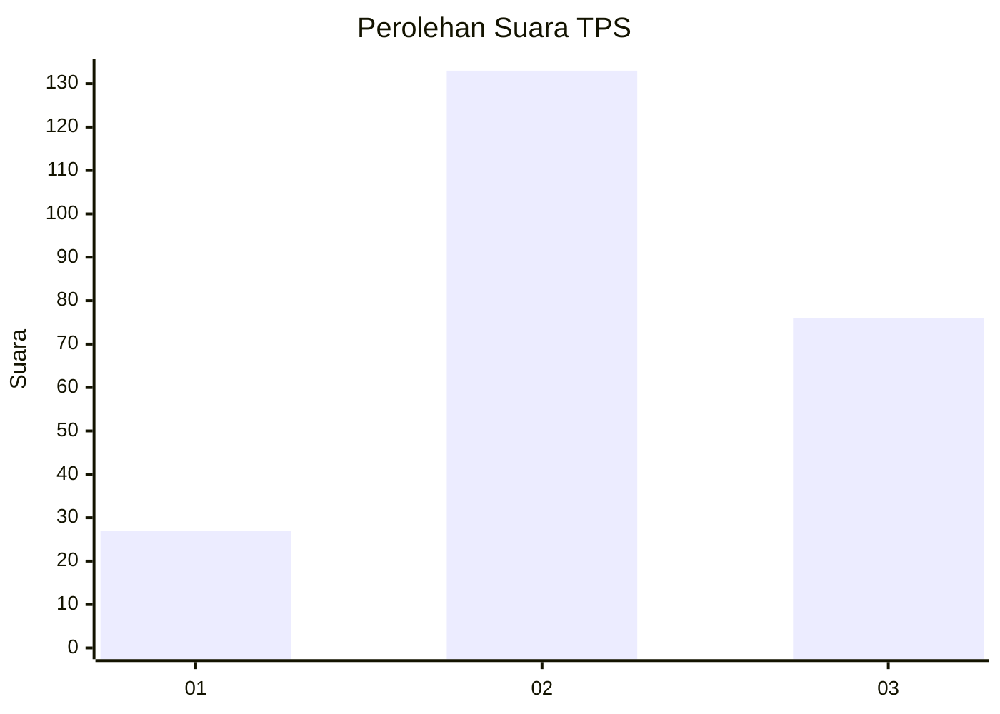
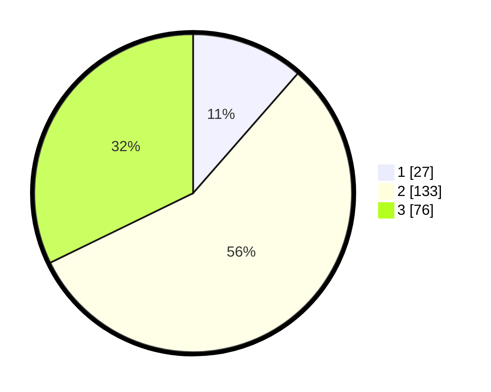

# Hasil

## Grafik

## Tabel

| No. | Nama Paslon    | Suara | Suara (raw) | Persentase |
|:--- |:-------------- | -----:| -----------:| ----------:|
| 1   | ANIES MUHAIMIN | 27    | [27][p-1]   | 11,44      |
| 2   | PRABOWO GIBRAN | 133   | [133][p-2]  | 56,36      |
| 3   | GANJAR MAHFUD  | 76    | [76][p-3]   | 32,20      |

[p-1]: https://github.com/gigit-pemilu/pemilu-2024/blob/main/pilpres/hitung-suara/sub/33-jawa-tengah/sub/04-banjarnegara/sub/04-purwanegara/sub/2011-kalipelus/sub/001-tps/sub/paslon-1.txt
[p-2]: https://github.com/gigit-pemilu/pemilu-2024/blob/main/pilpres/hitung-suara/sub/33-jawa-tengah/sub/04-banjarnegara/sub/04-purwanegara/sub/2011-kalipelus/sub/001-tps/sub/paslon-2.txt
[p-3]: https://github.com/gigit-pemilu/pemilu-2024/blob/main/pilpres/hitung-suara/sub/33-jawa-tengah/sub/04-banjarnegara/sub/04-purwanegara/sub/2011-kalipelus/sub/001-tps/sub/paslon-3.txt

## Foto C Plano

https://sirekap-obj-formc.kpu.go.id/3cec/pemilu/ppwp/33/04/04/20/11/3304042011001-20240221-163324--7d8d09cb-9fcc-4797-9e96-af1b2eeeb736.jpg

https://sirekap-obj-formc.kpu.go.id/3cec/pemilu/ppwp/33/04/04/20/11/3304042011001-20240214-230055--79b505d1-5bcc-4dca-9498-c22b9adf9b4d.jpg

https://sirekap-obj-formc.kpu.go.id/3cec/pemilu/ppwp/33/04/04/20/11/3304042011001-20240221-164239--257a31a1-26e9-4f7f-8a7e-288f28a94975.jpg

## Metadata

| Key        | Value               |
| ---------- | ------------------- |
| Time Stamp | 2024-02-21 19:00:00 |

