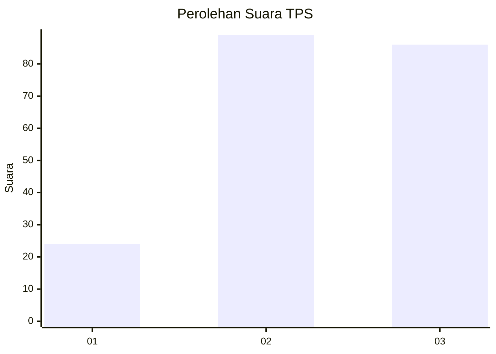
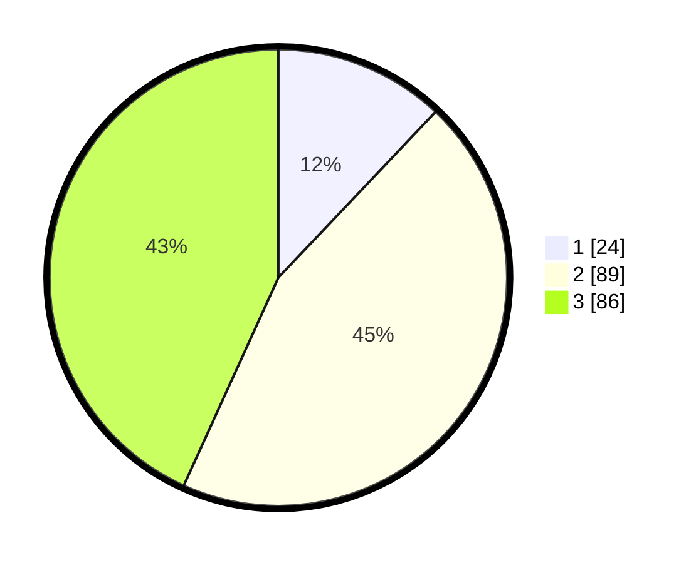

# Hasil

## Grafik

## Tabel

| No. | Nama Paslon    | Suara | Suara (raw) | Persentase |
|:--- |:-------------- | -----:| -----------:| ----------:|
| 1   | ANIES MUHAIMIN | 24    | [24][p-1]   | 12,06      |
| 2   | PRABOWO GIBRAN | 89    | [89][p-2]   | 44,72      |
| 3   | GANJAR MAHFUD  | 86    | [86][p-3]   | 43,22      |

[p-1]: https://github.com/gigit-pemilu/pemilu-2024-33-jawa-tengah/blob/main/pilpres/hitung-suara/sub/33-jawa-tengah/sub/04-banjarnegara/sub/04-purwanegara/sub/2011-kalipelus/sub/003-tps/sub/paslon-1.txt
[p-2]: https://github.com/gigit-pemilu/pemilu-2024-33-jawa-tengah/blob/main/pilpres/hitung-suara/sub/33-jawa-tengah/sub/04-banjarnegara/sub/04-purwanegara/sub/2011-kalipelus/sub/003-tps/sub/paslon-2.txt
[p-3]: https://github.com/gigit-pemilu/pemilu-2024-33-jawa-tengah/blob/main/pilpres/hitung-suara/sub/33-jawa-tengah/sub/04-banjarnegara/sub/04-purwanegara/sub/2011-kalipelus/sub/003-tps/sub/paslon-3.txt

## Foto C Plano

https://sirekap-obj-formc.kpu.go.id/4044/pemilu/ppwp/33/04/04/20/11/3304042011003-20240214-233141--867bc4cb-3bf2-4d21-84d6-c1a2f43756d1.jpg

https://sirekap-obj-formc.kpu.go.id/4044/pemilu/ppwp/33/04/04/20/11/3304042011003-20240214-233410--ffe1a46f-2402-47f8-8f73-52cd65e4a7da.jpg

https://sirekap-obj-formc.kpu.go.id/4044/pemilu/ppwp/33/04/04/20/11/3304042011003-20240214-233146--00783d50-e8c6-491e-a992-567d74594f1c.jpg

## Metadata

| Key        | Value               |
| ---------- | ------------------- |
| Time Stamp | 2024-02-15 23:29:50 |

