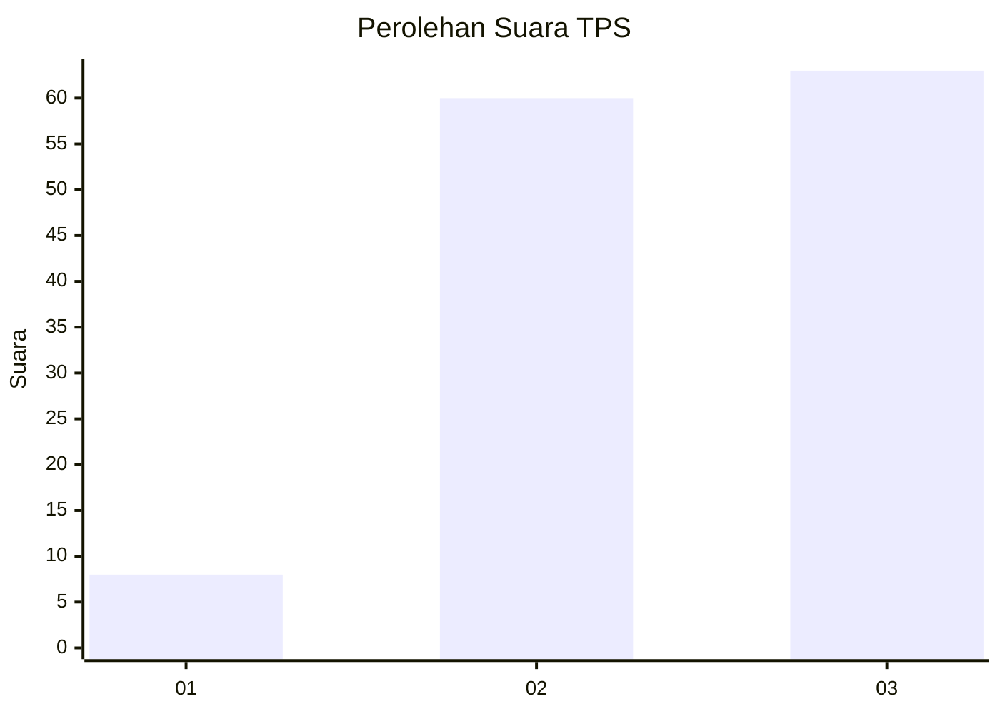
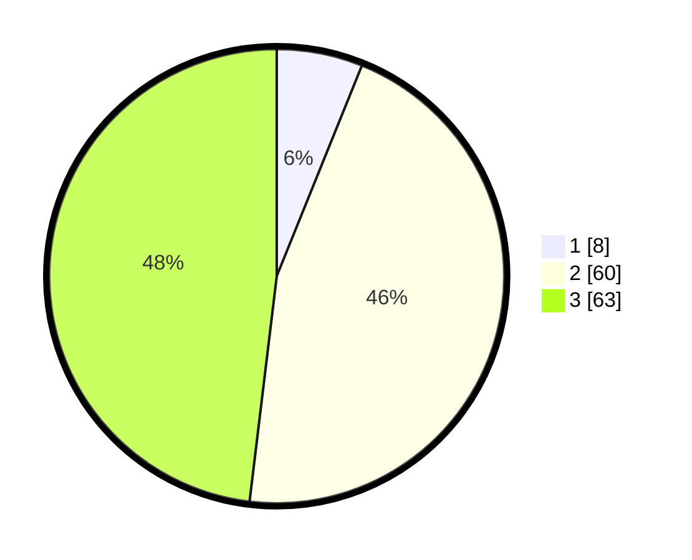

# Hasil

## Grafik

## Tabel

| No. | Nama Paslon    | Suara | Suara (raw) | Persentase |
|:--- |:-------------- | -----:| -----------:| ----------:|
| 1   | ANIES MUHAIMIN | 8     | [8][p-1]    | 6,11       |
| 2   | PRABOWO GIBRAN | 60    | [60][p-2]   | 45,80      |
| 3   | GANJAR MAHFUD  | 63    | [63][p-3]   | 48,09      |

[p-1]: https://github.com/gigit-pemilu/pemilu-2024/blob/main/pilpres/hitung-suara/sub/33-jawa-tengah/sub/04-banjarnegara/sub/05-bawang/sub/2002-kebondalem/sub/011-tps/sub/paslon-1.txt
[p-2]: https://github.com/gigit-pemilu/pemilu-2024/blob/main/pilpres/hitung-suara/sub/33-jawa-tengah/sub/04-banjarnegara/sub/05-bawang/sub/2002-kebondalem/sub/011-tps/sub/paslon-2.txt
[p-3]: https://github.com/gigit-pemilu/pemilu-2024/blob/main/pilpres/hitung-suara/sub/33-jawa-tengah/sub/04-banjarnegara/sub/05-bawang/sub/2002-kebondalem/sub/011-tps/sub/paslon-3.txt

## Foto C Plano

https://sirekap-obj-formc.kpu.go.id/c84d/pemilu/ppwp/33/04/05/20/02/3304052002011-20240215-031920--4dd06581-0571-4f8a-a9a8-0f176a168123.jpg

https://sirekap-obj-formc.kpu.go.id/c84d/pemilu/ppwp/33/04/05/20/02/3304052002011-20240215-054059--c8e3b262-6855-455a-8cec-6365783d1537.jpg

https://sirekap-obj-formc.kpu.go.id/c84d/pemilu/ppwp/33/04/05/20/02/3304052002011-20240215-032629--d2571d48-f326-4c39-a2d4-b63053cbed9d.jpg

## Metadata

| Key        | Value               |
| ---------- | ------------------- |
| Time Stamp | 2024-02-15 15:00:29 |

