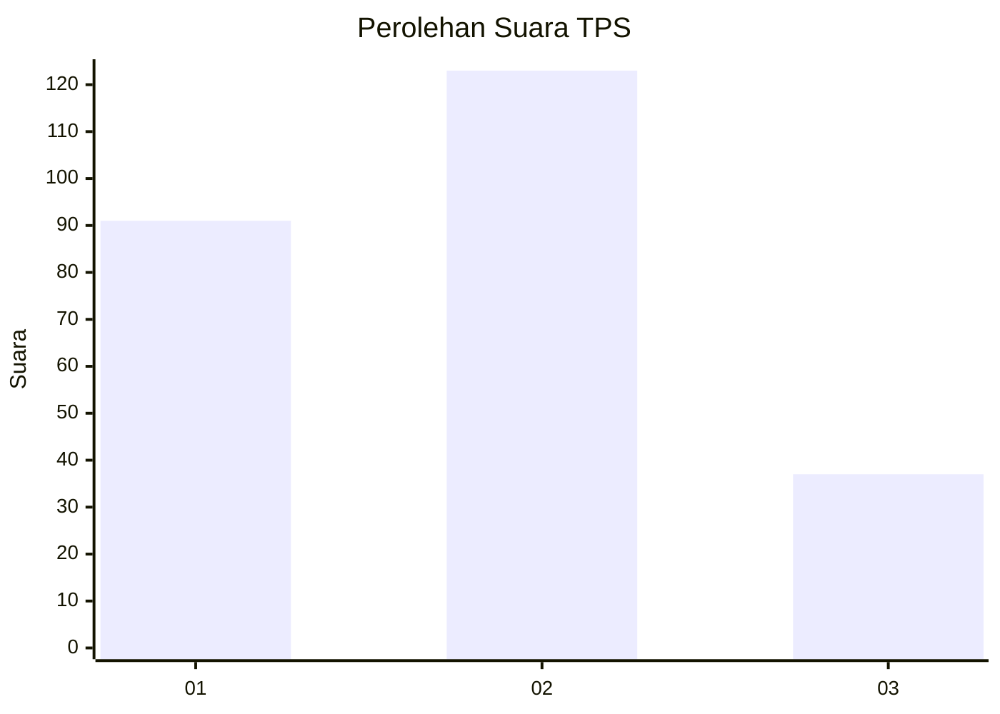
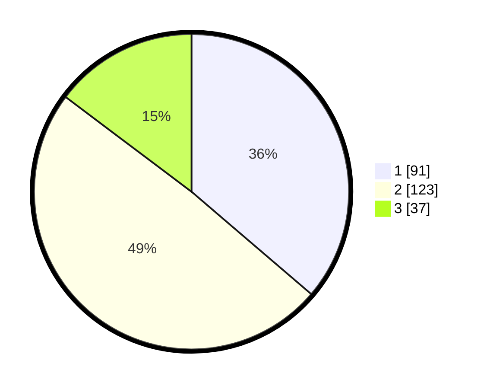

# Hasil

## Grafik

## Tabel

| No. | Nama Paslon    | Suara | Suara (raw) | Persentase |
|:--- |:-------------- | -----:| -----------:| ----------:|
| 1   | ANIES MUHAIMIN | 91    | [91][p-1]   | 36,25      |
| 2   | PRABOWO GIBRAN | 123   | [123][p-2]  | 49,00      |
| 3   | GANJAR MAHFUD  | 37    | [37][p-3]   | 14,74      |

[p-1]: https://github.com/gigit-pemilu/pemilu-2024/blob/main/pilpres/hitung-suara/sub/33-jawa-tengah/sub/04-banjarnegara/sub/05-bawang/sub/2012-binorong/sub/014-tps/sub/paslon-1.txt
[p-2]: https://github.com/gigit-pemilu/pemilu-2024/blob/main/pilpres/hitung-suara/sub/33-jawa-tengah/sub/04-banjarnegara/sub/05-bawang/sub/2012-binorong/sub/014-tps/sub/paslon-2.txt
[p-3]: https://github.com/gigit-pemilu/pemilu-2024/blob/main/pilpres/hitung-suara/sub/33-jawa-tengah/sub/04-banjarnegara/sub/05-bawang/sub/2012-binorong/sub/014-tps/sub/paslon-3.txt

## Foto C Plano

https://sirekap-obj-formc.kpu.go.id/e774/pemilu/ppwp/33/04/05/20/12/3304052012014-20240214-235224--eef472af-adc3-49b4-9b3a-fb288ee46976.jpg

https://sirekap-obj-formc.kpu.go.id/e774/pemilu/ppwp/33/04/05/20/12/3304052012014-20240214-235509--52dbaa94-8089-457b-a5c8-fd34a5d7c5ce.jpg

https://sirekap-obj-formc.kpu.go.id/e774/pemilu/ppwp/33/04/05/20/12/3304052012014-20240215-000323--71fde635-4855-4369-adff-a57d177e8905.jpg

## Metadata

| Key        | Value               |
| ---------- | ------------------- |
| Time Stamp | 2024-02-15 15:00:29 |

