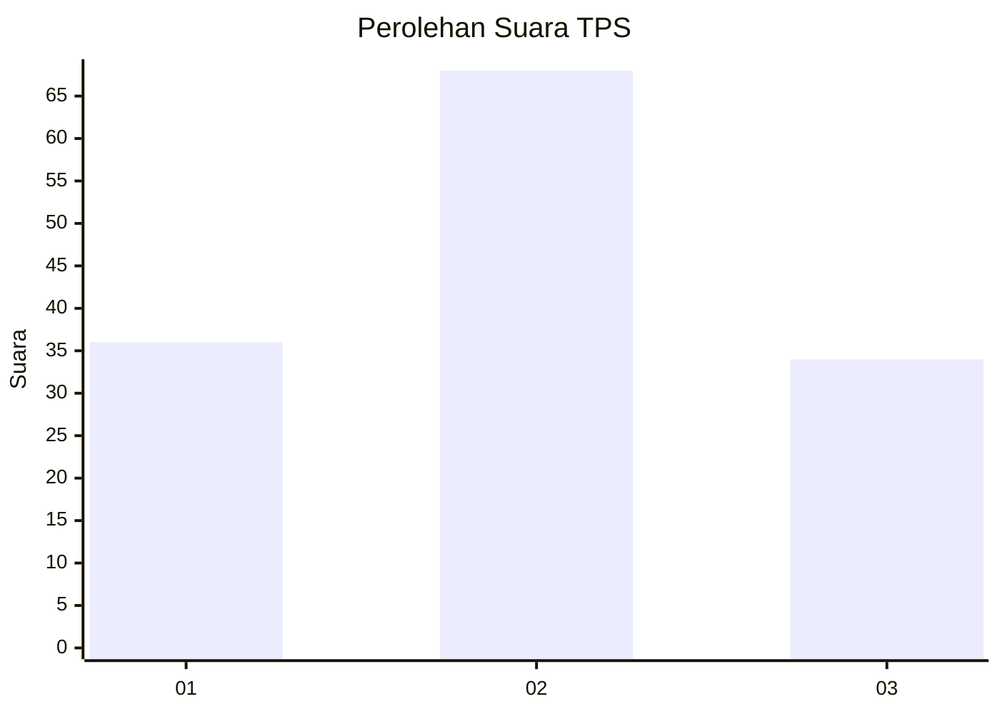
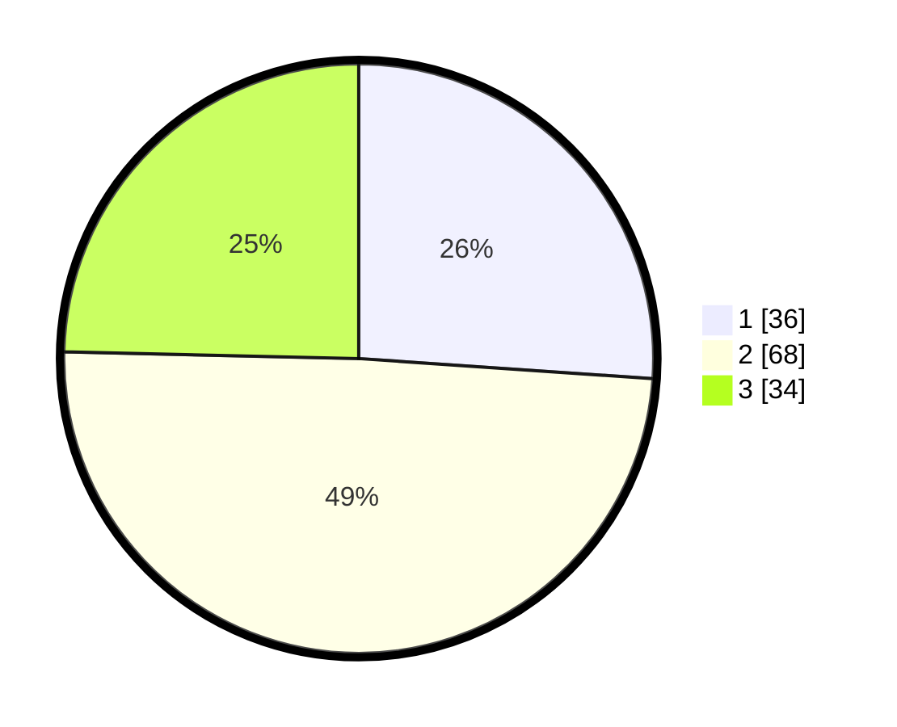

# Hasil

## Grafik

## Tabel

| No. | Nama Paslon    | Suara | Suara (raw) | Persentase |
|:--- |:-------------- | -----:| -----------:| ----------:|
| 1   | ANIES MUHAIMIN | 36    | [36][p-1]   | 26,09      |
| 2   | PRABOWO GIBRAN | 68    | [68][p-2]   | 49,28      |
| 3   | GANJAR MAHFUD  | 34    | [34][p-3]   | 24,64      |

[p-1]: https://github.com/gigit-pemilu/pemilu-2024/blob/main/pilpres/hitung-suara/sub/33-jawa-tengah/sub/04-banjarnegara/sub/06-banjarnegara/sub/1007-wangon/sub/001-tps/sub/paslon-1.txt
[p-2]: https://github.com/gigit-pemilu/pemilu-2024/blob/main/pilpres/hitung-suara/sub/33-jawa-tengah/sub/04-banjarnegara/sub/06-banjarnegara/sub/1007-wangon/sub/001-tps/sub/paslon-2.txt
[p-3]: https://github.com/gigit-pemilu/pemilu-2024/blob/main/pilpres/hitung-suara/sub/33-jawa-tengah/sub/04-banjarnegara/sub/06-banjarnegara/sub/1007-wangon/sub/001-tps/sub/paslon-3.txt

## Foto C Plano

https://sirekap-obj-formc.kpu.go.id/d013/pemilu/ppwp/33/04/06/10/07/3304061007001-20240214-233553--b7054399-dccc-4c73-b232-61dd5e051bb9.jpg

https://sirekap-obj-formc.kpu.go.id/d013/pemilu/ppwp/33/04/06/10/07/3304061007001-20240214-233635--4d172b2d-6f73-4846-a73d-2f1a2e0bf88f.jpg

https://sirekap-obj-formc.kpu.go.id/d013/pemilu/ppwp/33/04/06/10/07/3304061007001-20240214-233659--39252c26-47d6-4632-a8b6-b4c4eed3254c.jpg

## Metadata

| Key        | Value               |
| ---------- | ------------------- |
| Time Stamp | 2024-02-15 18:30:25 |

