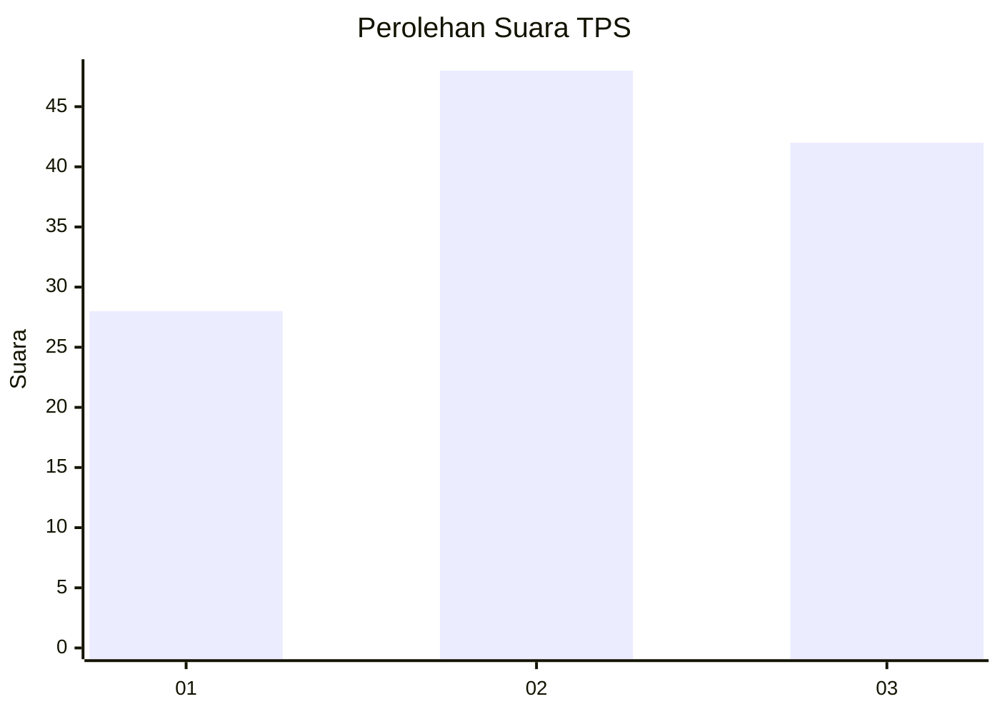
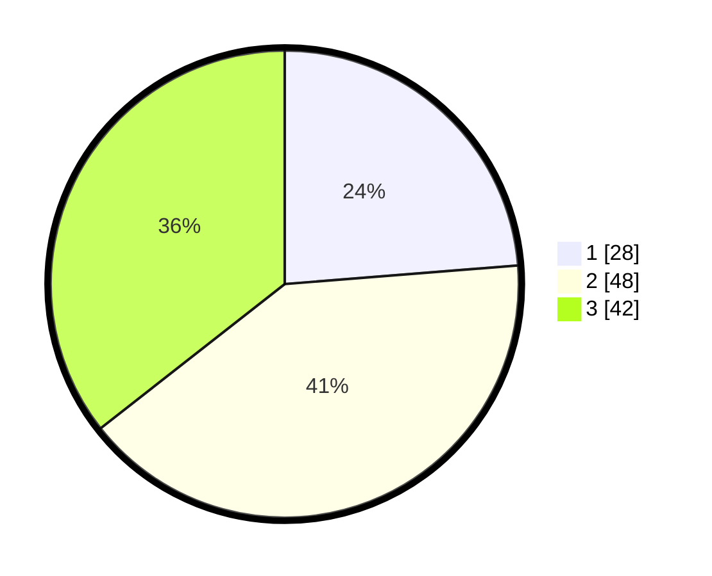

# Hasil

## Grafik

## Tabel

| No. | Nama Paslon    | Suara | Suara (raw) | Persentase |
|:--- |:-------------- | -----:| -----------:| ----------:|
| 1   | ANIES MUHAIMIN | 28    | [28][p-1]   | 23,73      |
| 2   | PRABOWO GIBRAN | 48    | [48][p-2]   | 40,68      |
| 3   | GANJAR MAHFUD  | 42    | [42][p-3]   | 35,59      |

[p-1]: https://github.com/gigit-pemilu/pemilu-2024-33-jawa-tengah/blob/main/pilpres/hitung-suara/sub/33-jawa-tengah/sub/04-banjarnegara/sub/06-banjarnegara/sub/1012-krandegan/sub/014-tps/sub/paslon-1.txt
[p-2]: https://github.com/gigit-pemilu/pemilu-2024-33-jawa-tengah/blob/main/pilpres/hitung-suara/sub/33-jawa-tengah/sub/04-banjarnegara/sub/06-banjarnegara/sub/1012-krandegan/sub/014-tps/sub/paslon-2.txt
[p-3]: https://github.com/gigit-pemilu/pemilu-2024-33-jawa-tengah/blob/main/pilpres/hitung-suara/sub/33-jawa-tengah/sub/04-banjarnegara/sub/06-banjarnegara/sub/1012-krandegan/sub/014-tps/sub/paslon-3.txt

## Foto C Plano

https://sirekap-obj-formc.kpu.go.id/bdb2/pemilu/ppwp/33/04/06/10/12/3304061012014-20240214-141609--791b7e63-9a27-4604-96e9-8d2ced4ea090.jpg

https://sirekap-obj-formc.kpu.go.id/bdb2/pemilu/ppwp/33/04/06/10/12/3304061012014-20240214-141753--ee8c72ca-59bc-4d82-aad8-637ef77c0581.jpg

https://sirekap-obj-formc.kpu.go.id/bdb2/pemilu/ppwp/33/04/06/10/12/3304061012014-20240214-141904--597533b4-5f03-4c2f-b228-3fe8b41e1b13.jpg

## Metadata

| Key        | Value               |
| ---------- | ------------------- |
| Time Stamp | 2024-02-15 18:30:25 |

