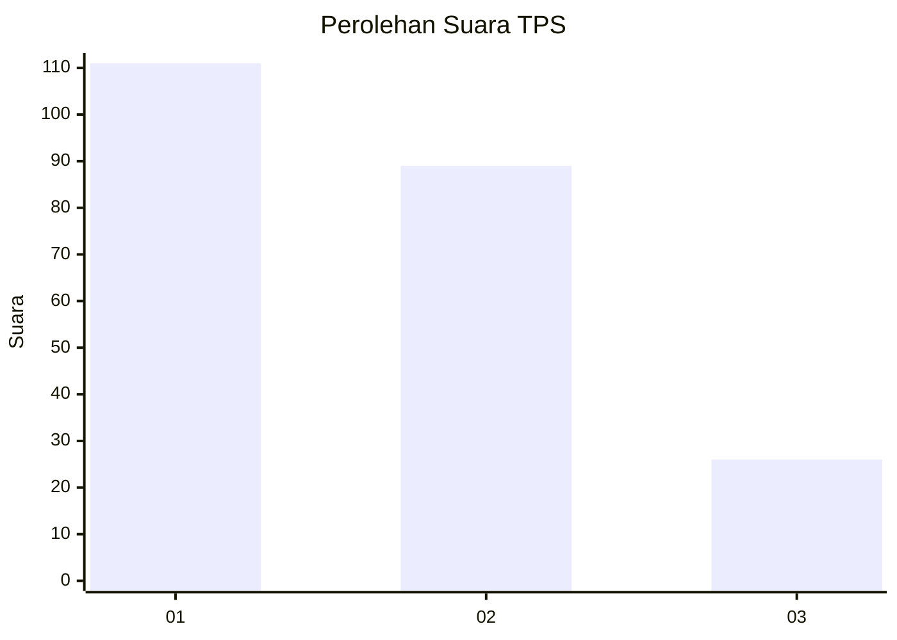
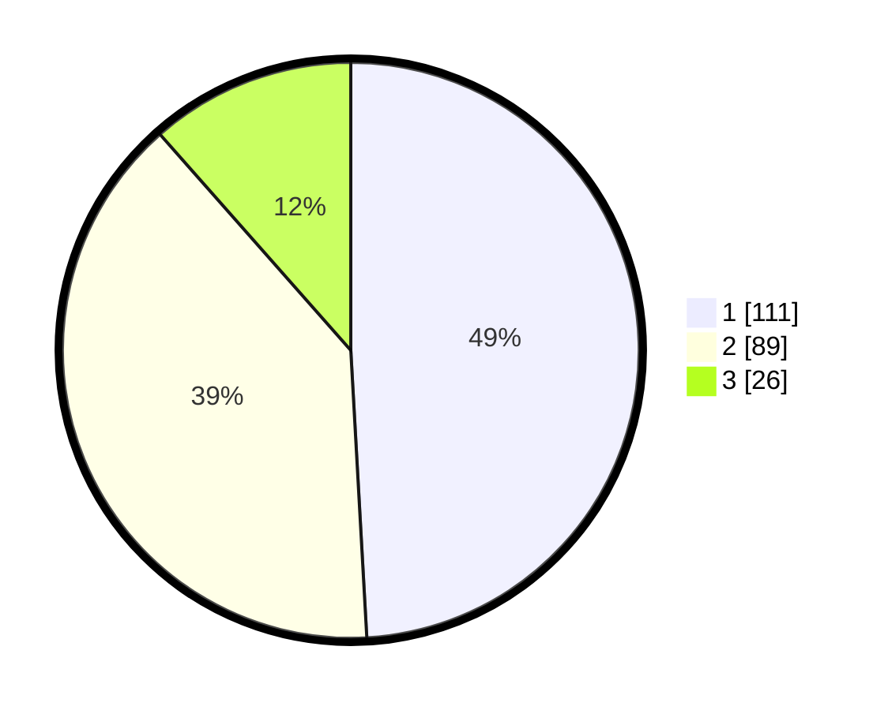

# Hasil

## Grafik

## Tabel

| No. | Nama Paslon    | Suara | Suara (raw) | Persentase |
|:--- |:-------------- | -----:| -----------:| ----------:|
| 1   | ANIES MUHAIMIN | 111   | [111][p-1]  | 49,12      |
| 2   | PRABOWO GIBRAN | 89    | [89][p-2]   | 39,38      |
| 3   | GANJAR MAHFUD  | 26    | [26][p-3]   | 11,50      |

[p-1]: https://github.com/gigit-pemilu/pemilu-2024/blob/main/pilpres/hitung-suara/sub/33-jawa-tengah/sub/04-banjarnegara/sub/06-banjarnegara/sub/1013-kutabanjarnegara/sub/005-tps/sub/paslon-1.txt
[p-2]: https://github.com/gigit-pemilu/pemilu-2024/blob/main/pilpres/hitung-suara/sub/33-jawa-tengah/sub/04-banjarnegara/sub/06-banjarnegara/sub/1013-kutabanjarnegara/sub/005-tps/sub/paslon-2.txt
[p-3]: https://github.com/gigit-pemilu/pemilu-2024/blob/main/pilpres/hitung-suara/sub/33-jawa-tengah/sub/04-banjarnegara/sub/06-banjarnegara/sub/1013-kutabanjarnegara/sub/005-tps/sub/paslon-3.txt

## Foto C Plano

https://sirekap-obj-formc.kpu.go.id/e099/pemilu/ppwp/33/04/06/10/13/3304061013005-20240218-112005--78c9bdd9-35c3-48a0-951a-c8c8632e26d3.jpg

https://sirekap-obj-formc.kpu.go.id/e099/pemilu/ppwp/33/04/06/10/13/3304061013005-20240217-152147--8d63858d-c846-4f07-8d74-94debdcfb176.jpg

https://sirekap-obj-formc.kpu.go.id/e099/pemilu/ppwp/33/04/06/10/13/3304061013005-20240216-181538--e49edcca-4f92-4490-9896-86ac4abee6a4.jpg

## Metadata

| Key        | Value               |
| ---------- | ------------------- |
| Time Stamp | 2024-02-19 06:16:00 |

