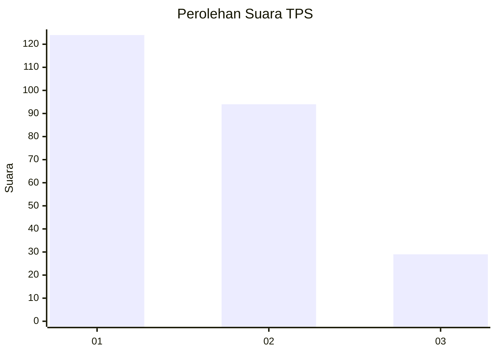
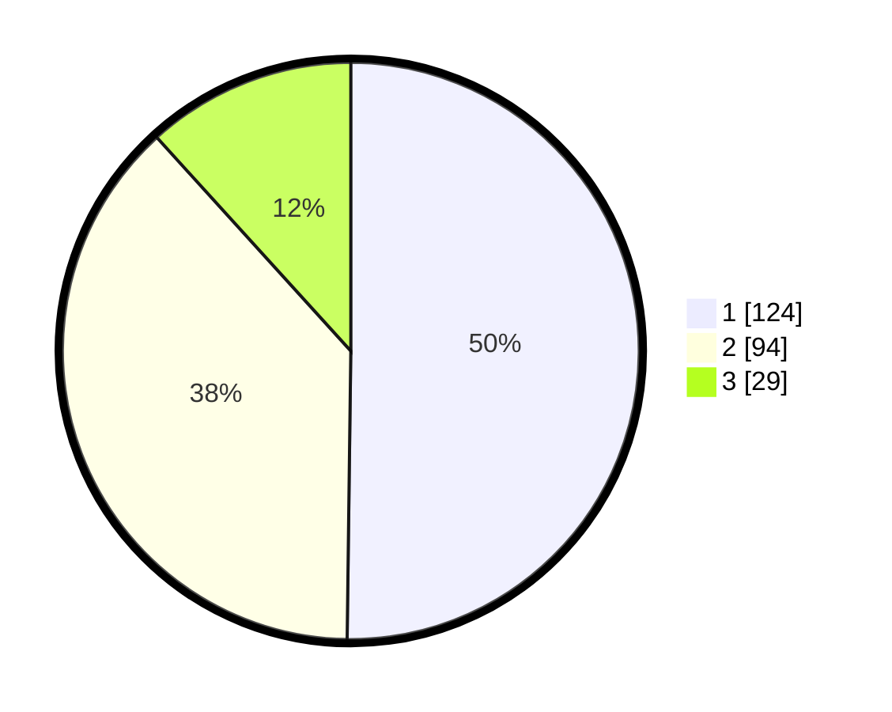

# Hasil

## Grafik

## Tabel

| No. | Nama Paslon    | Suara | Suara (raw) | Persentase |
|:--- |:-------------- | -----:| -----------:| ----------:|
| 1   | ANIES MUHAIMIN | 124   | [124][p-1]  | 50,20      |
| 2   | PRABOWO GIBRAN | 94    | [94][p-2]   | 38,06      |
| 3   | GANJAR MAHFUD  | 29    | [29][p-3]   | 11,74      |

[p-1]: https://github.com/gigit-pemilu/pemilu-2024/blob/main/pilpres/hitung-suara/sub/33-jawa-tengah/sub/04-banjarnegara/sub/06-banjarnegara/sub/1013-kutabanjarnegara/sub/010-tps/sub/paslon-1.txt
[p-2]: https://github.com/gigit-pemilu/pemilu-2024/blob/main/pilpres/hitung-suara/sub/33-jawa-tengah/sub/04-banjarnegara/sub/06-banjarnegara/sub/1013-kutabanjarnegara/sub/010-tps/sub/paslon-2.txt
[p-3]: https://github.com/gigit-pemilu/pemilu-2024/blob/main/pilpres/hitung-suara/sub/33-jawa-tengah/sub/04-banjarnegara/sub/06-banjarnegara/sub/1013-kutabanjarnegara/sub/010-tps/sub/paslon-3.txt

## Foto C Plano

https://sirekap-obj-formc.kpu.go.id/784a/pemilu/ppwp/33/04/06/10/13/3304061013010-20240214-182406--c75f3bd9-8284-453a-8aec-f9c8d8b9d574.jpg

https://sirekap-obj-formc.kpu.go.id/784a/pemilu/ppwp/33/04/06/10/13/3304061013010-20240214-184725--09790f98-2088-40d5-a33a-dfb12aa82444.jpg

https://sirekap-obj-formc.kpu.go.id/784a/pemilu/ppwp/33/04/06/10/13/3304061013010-20240214-184729--88b1b24c-c415-4ca1-ba08-19eca69fc06a.jpg

## Metadata

| Key        | Value               |
| ---------- | ------------------- |
| Time Stamp | 2024-02-15 18:30:25 |

