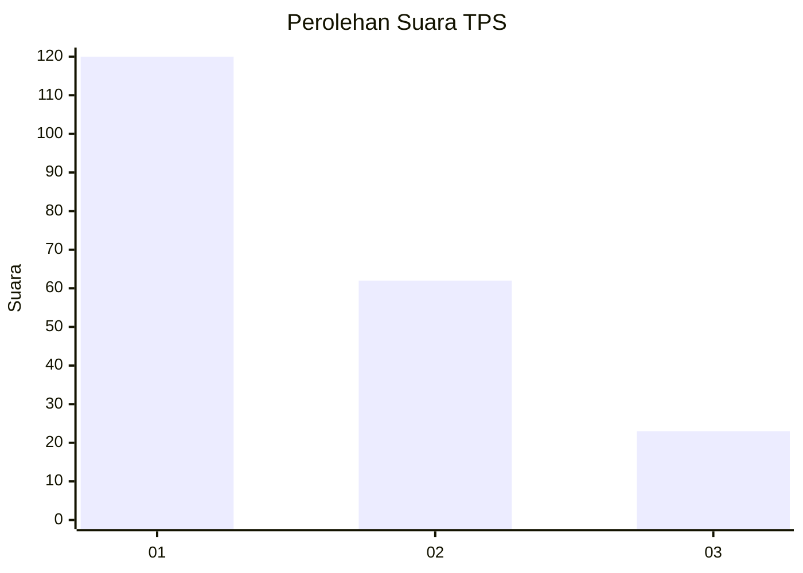
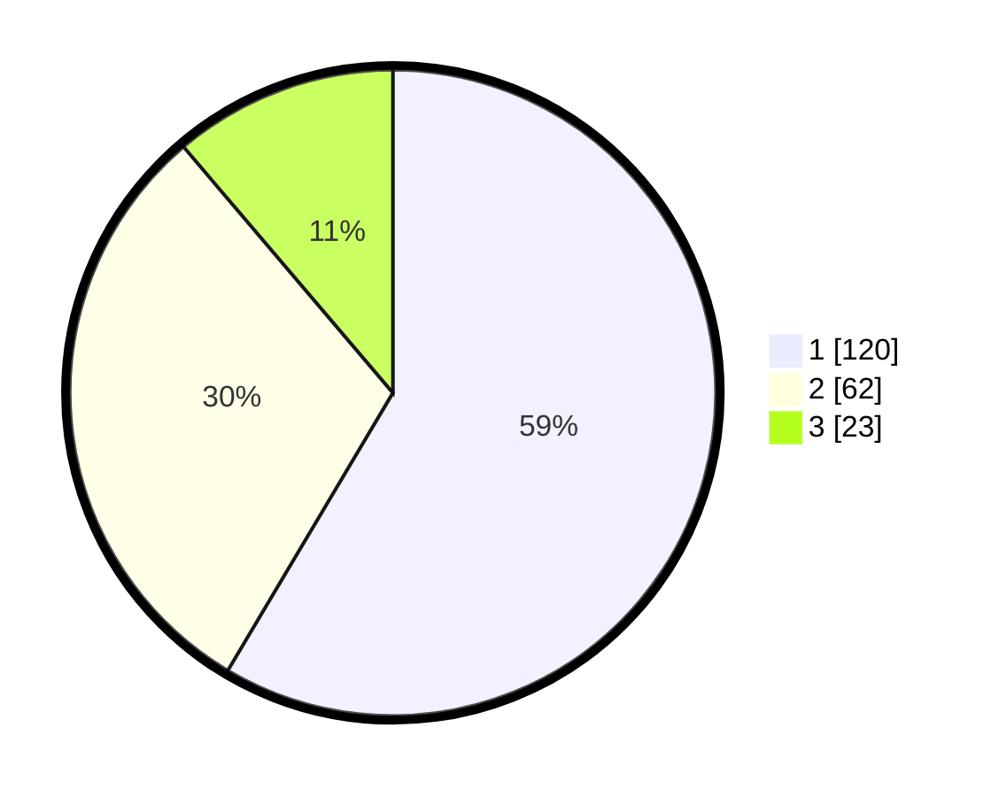

# Hasil

## Grafik

## Tabel

| No. | Nama Paslon    | Suara | Suara (raw) | Persentase |
|:--- |:-------------- | -----:| -----------:| ----------:|
| 1   | ANIES MUHAIMIN | 120   | [120][p-1]  | 58,54      |
| 2   | PRABOWO GIBRAN | 62    | [62][p-2]   | 30,24      |
| 3   | GANJAR MAHFUD  | 23    | [23][p-3]   | 11,22      |

[p-1]: https://github.com/gigit-pemilu/pemilu-2024-33-jawa-tengah/blob/main/pilpres/hitung-suara/sub/33-jawa-tengah/sub/04-banjarnegara/sub/06-banjarnegara/sub/1013-kutabanjarnegara/sub/014-tps/sub/paslon-1.txt
[p-2]: https://github.com/gigit-pemilu/pemilu-2024-33-jawa-tengah/blob/main/pilpres/hitung-suara/sub/33-jawa-tengah/sub/04-banjarnegara/sub/06-banjarnegara/sub/1013-kutabanjarnegara/sub/014-tps/sub/paslon-2.txt
[p-3]: https://github.com/gigit-pemilu/pemilu-2024-33-jawa-tengah/blob/main/pilpres/hitung-suara/sub/33-jawa-tengah/sub/04-banjarnegara/sub/06-banjarnegara/sub/1013-kutabanjarnegara/sub/014-tps/sub/paslon-3.txt

## Foto C Plano

https://sirekap-obj-formc.kpu.go.id/b7f6/pemilu/ppwp/33/04/06/10/13/3304061013014-20240215-000519--473c77d8-62b4-4470-8b28-04188de52c14.jpg

https://sirekap-obj-formc.kpu.go.id/b7f6/pemilu/ppwp/33/04/06/10/13/3304061013014-20240215-000606--2ec25773-4686-42bf-bfc6-2141fbb68d8a.jpg

https://sirekap-obj-formc.kpu.go.id/b7f6/pemilu/ppwp/33/04/06/10/13/3304061013014-20240215-000713--5629e119-083d-4a66-bbe0-3801e5c96ea9.jpg

## Metadata

| Key        | Value               |
| ---------- | ------------------- |
| Time Stamp | 2024-02-15 15:30:25 |

