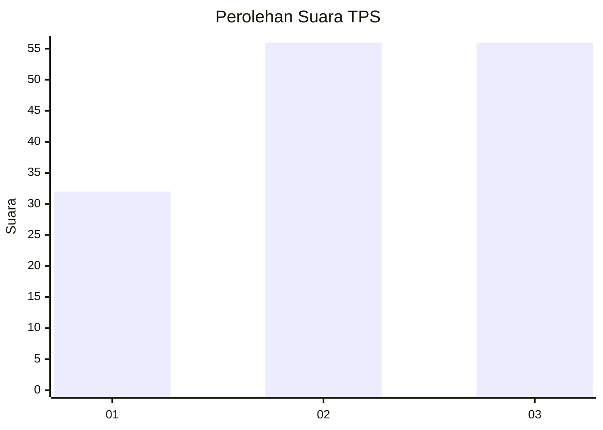
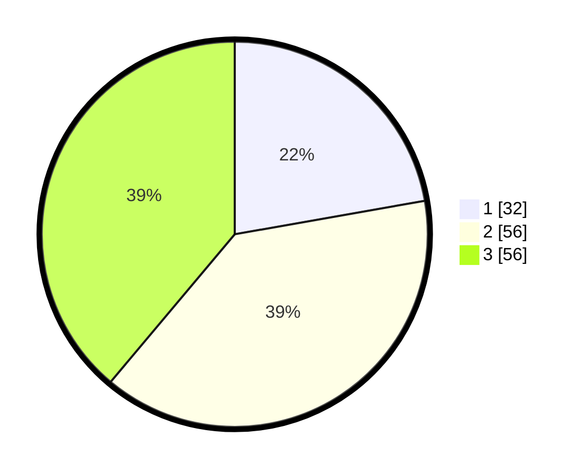

# Hasil

## Grafik

## Tabel

| No. | Nama Paslon    | Suara | Suara (raw) | Persentase |
|:--- |:-------------- | -----:| -----------:| ----------:|
| 1   | ANIES MUHAIMIN | 32    | [32][p-1]   | 22,22      |
| 2   | PRABOWO GIBRAN | 56    | [56][p-2]   | 38,89      |
| 3   | GANJAR MAHFUD  | 56    | [56][p-3]   | 38,89      |

[p-1]: https://github.com/gigit-pemilu/pemilu-2024/blob/main/pilpres/hitung-suara/sub/33-jawa-tengah/sub/04-banjarnegara/sub/07-sigaluh/sub/2008-prigi/sub/011-tps/sub/paslon-1.txt
[p-2]: https://github.com/gigit-pemilu/pemilu-2024/blob/main/pilpres/hitung-suara/sub/33-jawa-tengah/sub/04-banjarnegara/sub/07-sigaluh/sub/2008-prigi/sub/011-tps/sub/paslon-2.txt
[p-3]: https://github.com/gigit-pemilu/pemilu-2024/blob/main/pilpres/hitung-suara/sub/33-jawa-tengah/sub/04-banjarnegara/sub/07-sigaluh/sub/2008-prigi/sub/011-tps/sub/paslon-3.txt

## Foto C Plano

https://sirekap-obj-formc.kpu.go.id/9e70/pemilu/ppwp/33/04/07/20/08/3304072008011-20240215-013125--95baf50d-1cef-4a34-a0ac-5322f3979463.jpg

https://sirekap-obj-formc.kpu.go.id/9e70/pemilu/ppwp/33/04/07/20/08/3304072008011-20240214-215458--5bcb9f8f-6150-4625-8159-36a8a3367273.jpg

https://sirekap-obj-formc.kpu.go.id/9e70/pemilu/ppwp/33/04/07/20/08/3304072008011-20240217-154632--8d93689d-754b-42f2-bfce-92112b791337.jpg

## Metadata

| Key        | Value               |
| ---------- | ------------------- |
| Time Stamp | 2024-02-17 16:00:02 |

