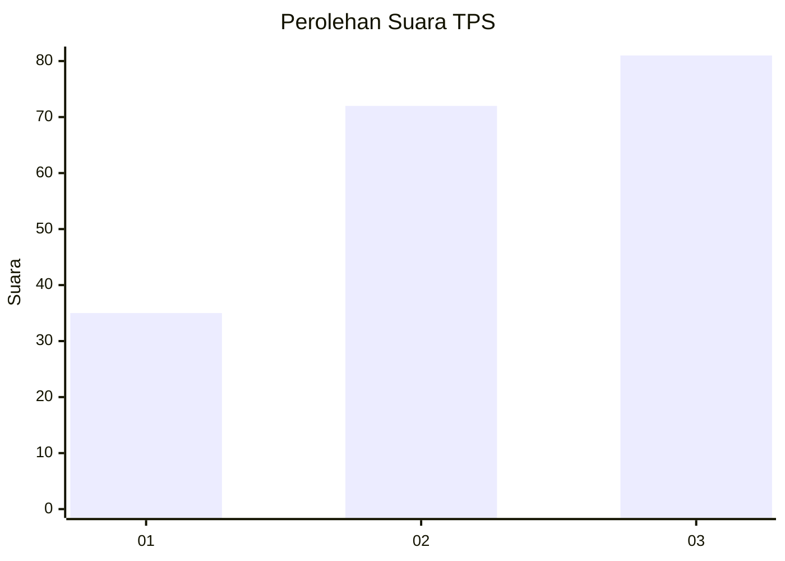
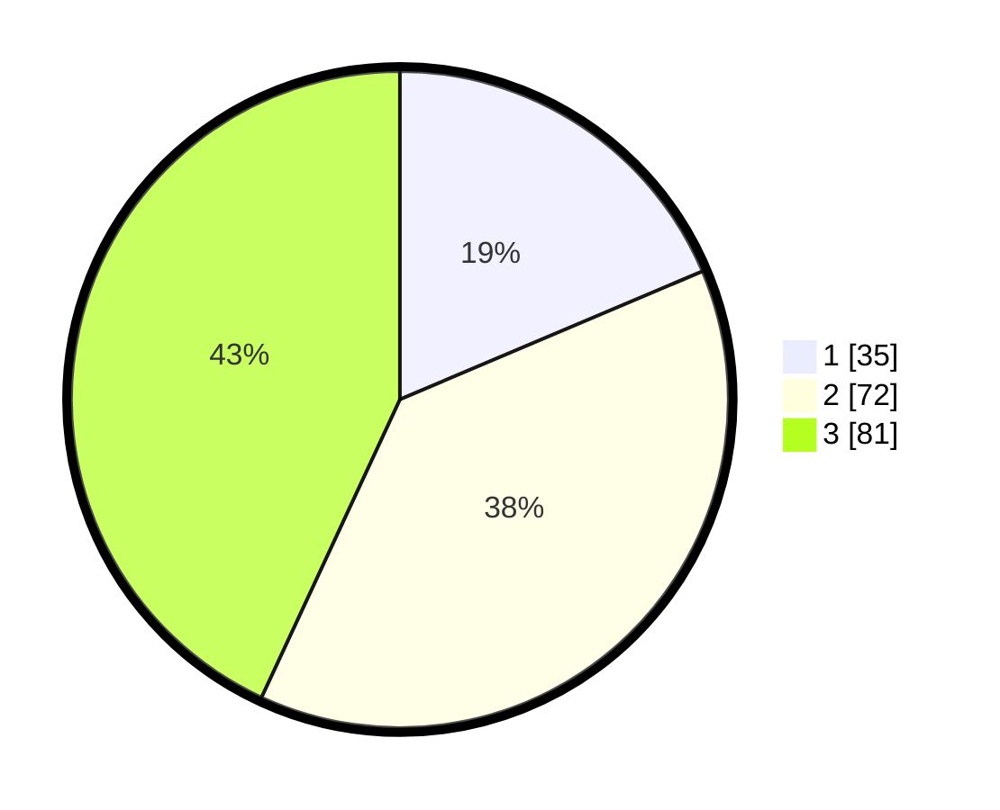

# Hasil

## Grafik

## Tabel

| No. | Nama Paslon    | Suara | Suara (raw) | Persentase |
|:--- |:-------------- | -----:| -----------:| ----------:|
| 1   | ANIES MUHAIMIN | 35    | [35][p-1]   | 18,62      |
| 2   | PRABOWO GIBRAN | 72    | [72][p-2]   | 38,30      |
| 3   | GANJAR MAHFUD  | 81    | [81][p-3]   | 43,09      |

[p-1]: https://github.com/gigit-pemilu/pemilu-2024-33-jawa-tengah/blob/main/pilpres/hitung-suara/sub/33-jawa-tengah/sub/04-banjarnegara/sub/07-sigaluh/sub/2009-gembongan/sub/004-tps/sub/paslon-1.txt
[p-2]: https://github.com/gigit-pemilu/pemilu-2024-33-jawa-tengah/blob/main/pilpres/hitung-suara/sub/33-jawa-tengah/sub/04-banjarnegara/sub/07-sigaluh/sub/2009-gembongan/sub/004-tps/sub/paslon-2.txt
[p-3]: https://github.com/gigit-pemilu/pemilu-2024-33-jawa-tengah/blob/main/pilpres/hitung-suara/sub/33-jawa-tengah/sub/04-banjarnegara/sub/07-sigaluh/sub/2009-gembongan/sub/004-tps/sub/paslon-3.txt

## Foto C Plano

https://sirekap-obj-formc.kpu.go.id/8032/pemilu/ppwp/33/04/07/20/09/3304072009004-20240214-221523--7ae29366-d8b8-40fa-8b30-0f1d71ee27de.jpg

https://sirekap-obj-formc.kpu.go.id/8032/pemilu/ppwp/33/04/07/20/09/3304072009004-20240216-151715--4c7ac1c4-a10d-4c1d-ab74-35a0ff0f2eb4.jpg

https://sirekap-obj-formc.kpu.go.id/8032/pemilu/ppwp/33/04/07/20/09/3304072009004-20240216-151714--6f9bb649-46c0-4571-898a-6a4b96eb4127.jpg

## Metadata

| Key        | Value               |
| ---------- | ------------------- |
| Time Stamp | 2024-02-16 21:01:00 |

