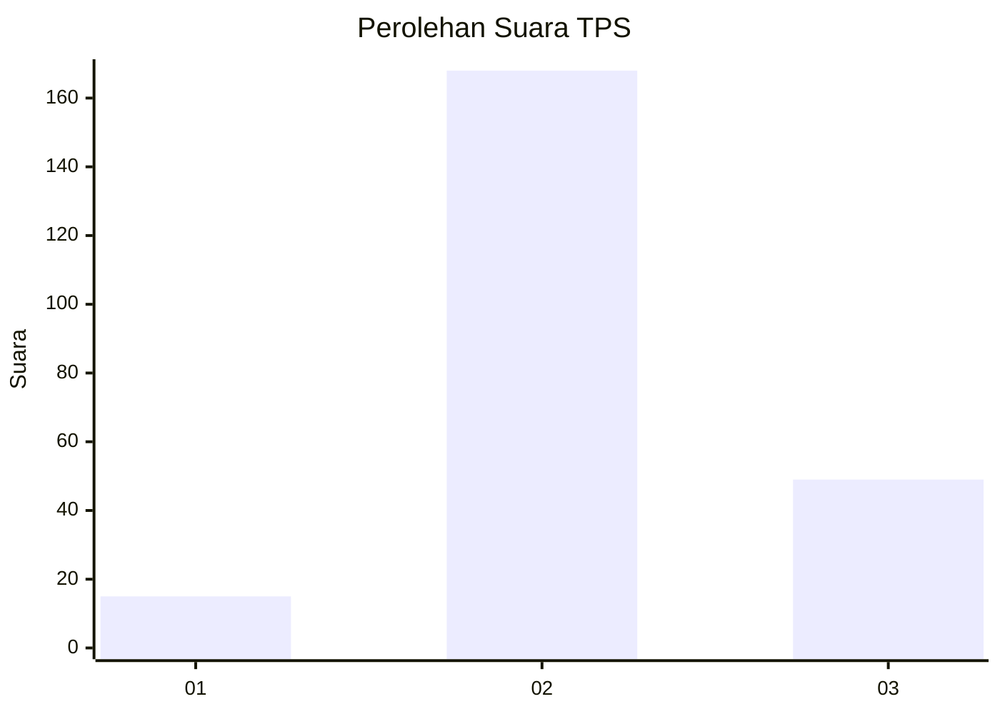

# Hasil

## Grafik

## Tabel

| No. | Nama Paslon    | Suara | Suara (raw) | Persentase |
|:--- |:-------------- | -----:| -----------:| ----------:|
| 1   | ANIES MUHAIMIN | 15    | [15][p-1]   | 6,47       |
| 2   | PRABOWO GIBRAN | 168   | [168][p-2]  | 72,41      |
| 3   | GANJAR MAHFUD  | 49    | [49][p-3]   | 21,12      |

[p-1]: https://github.com/gigit-pemilu/pemilu-2024/blob/main/pilpres/hitung-suara/sub/33-jawa-tengah/sub/04-banjarnegara/sub/08-madukara/sub/2007-pagelak/sub/004-tps/sub/paslon-1.txt
[p-2]: https://github.com/gigit-pemilu/pemilu-2024/blob/main/pilpres/hitung-suara/sub/33-jawa-tengah/sub/04-banjarnegara/sub/08-madukara/sub/2007-pagelak/sub/004-tps/sub/paslon-2.txt
[p-3]: https://github.com/gigit-pemilu/pemilu-2024/blob/main/pilpres/hitung-suara/sub/33-jawa-tengah/sub/04-banjarnegara/sub/08-madukara/sub/2007-pagelak/sub/004-tps/sub/paslon-3.txt

## Foto C Plano

https://sirekap-obj-formc.kpu.go.id/ab8c/pemilu/ppwp/33/04/08/20/07/3304082007004-20240215-074324--65606de6-e2ae-4f4b-aaf5-6b1bbdce2b8b.jpg

https://sirekap-obj-formc.kpu.go.id/ab8c/pemilu/ppwp/33/04/08/20/07/3304082007004-20240215-074442--3dcd3072-b1b2-478c-a2e7-6dd780d1c3f3.jpg

https://sirekap-obj-formc.kpu.go.id/ab8c/pemilu/ppwp/33/04/08/20/07/3304082007004-20240215-074529--576eaf2b-45ee-4b40-a2b4-b92ba72a2339.jpg

## Metadata

| Key        | Value               |
| ---------- | ------------------- |
| Time Stamp | 2024-02-15 19:00:26 |

