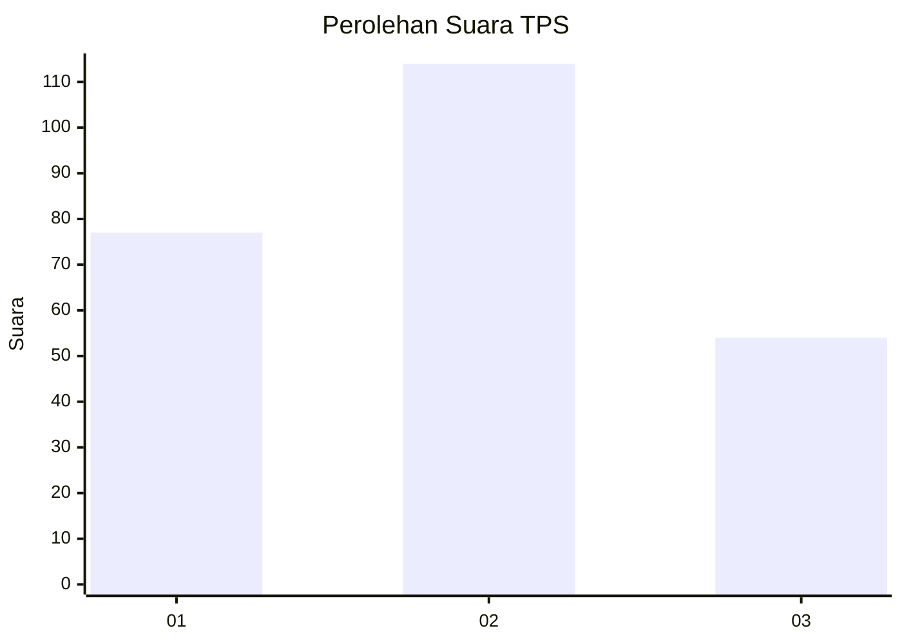
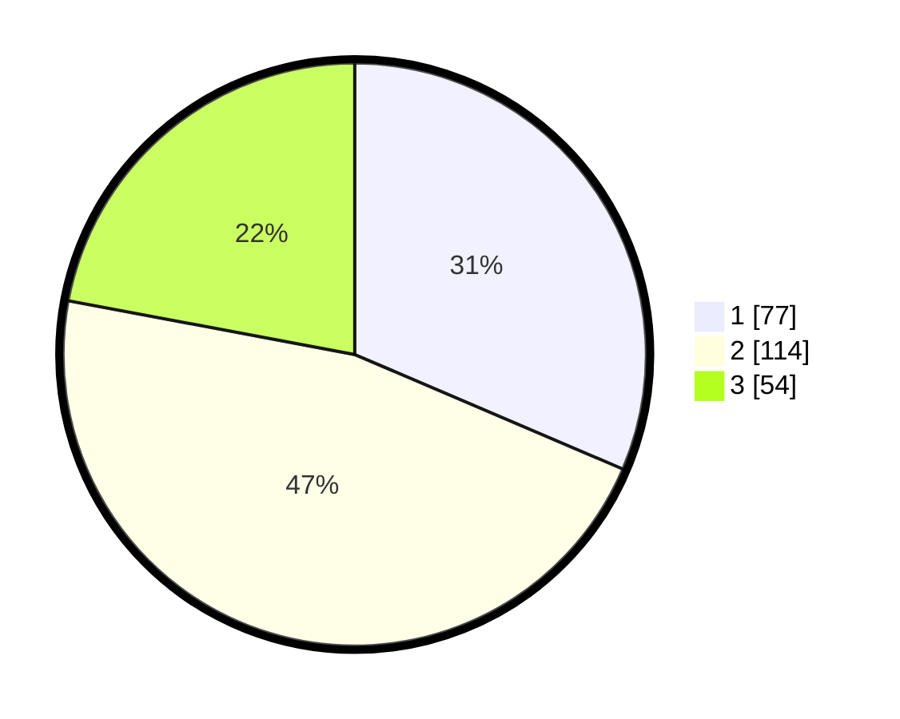

# Hasil

## Grafik

## Tabel

| No. | Nama Paslon    | Suara | Suara (raw) | Persentase |
|:--- |:-------------- | -----:| -----------:| ----------:|
| 1   | ANIES MUHAIMIN | 77    | [77][p-1]   | 31,43      |
| 2   | PRABOWO GIBRAN | 114   | [114][p-2]  | 46,53      |
| 3   | GANJAR MAHFUD  | 54    | [54][p-3]   | 22,04      |

[p-1]: https://github.com/gigit-pemilu/pemilu-2024-33-jawa-tengah/blob/main/pilpres/hitung-suara/sub/33-jawa-tengah/sub/04-banjarnegara/sub/08-madukara/sub/2013-petambakan/sub/007-tps/sub/paslon-1.txt
[p-2]: https://github.com/gigit-pemilu/pemilu-2024-33-jawa-tengah/blob/main/pilpres/hitung-suara/sub/33-jawa-tengah/sub/04-banjarnegara/sub/08-madukara/sub/2013-petambakan/sub/007-tps/sub/paslon-2.txt
[p-3]: https://github.com/gigit-pemilu/pemilu-2024-33-jawa-tengah/blob/main/pilpres/hitung-suara/sub/33-jawa-tengah/sub/04-banjarnegara/sub/08-madukara/sub/2013-petambakan/sub/007-tps/sub/paslon-3.txt

## Foto C Plano

https://sirekap-obj-formc.kpu.go.id/0f0a/pemilu/ppwp/33/04/08/20/13/3304082013007-20240215-024608--c10a3eca-4219-4fb3-871a-dc3c19809a60.jpg

https://sirekap-obj-formc.kpu.go.id/0f0a/pemilu/ppwp/33/04/08/20/13/3304082013007-20240216-132216--2dc405b9-bed3-433d-a5b3-ae4035be694f.jpg

https://sirekap-obj-formc.kpu.go.id/0f0a/pemilu/ppwp/33/04/08/20/13/3304082013007-20240216-132215--550c809c-3ddc-45dd-be03-41eebbe3a548.jpg

## Metadata

| Key        | Value               |
| ---------- | ------------------- |
| Time Stamp | 2024-02-16 14:00:34 |

