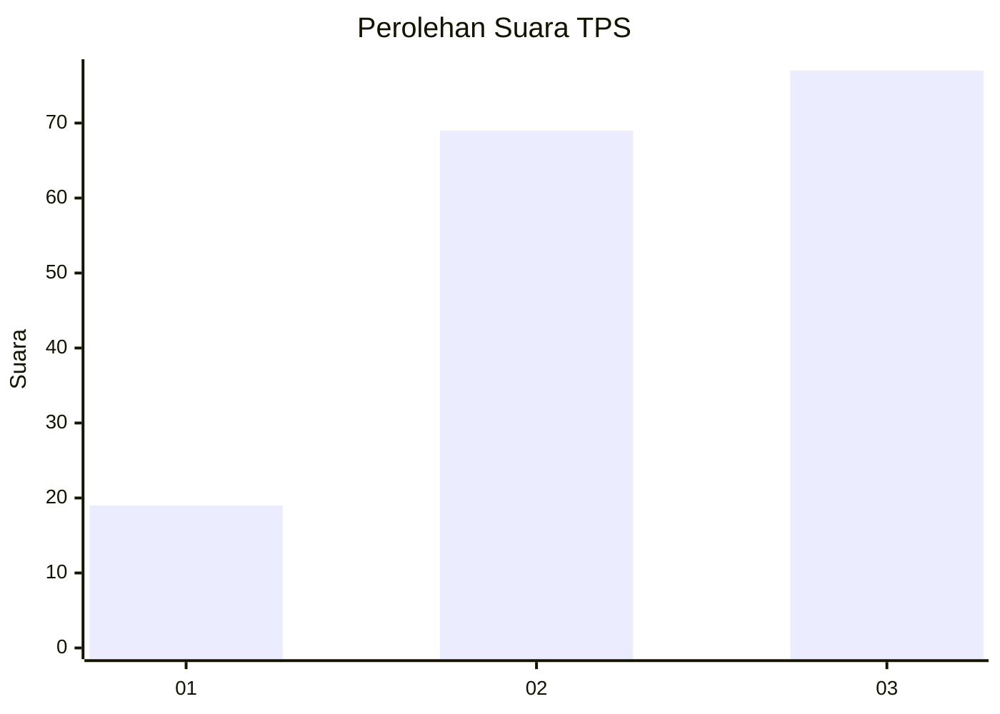
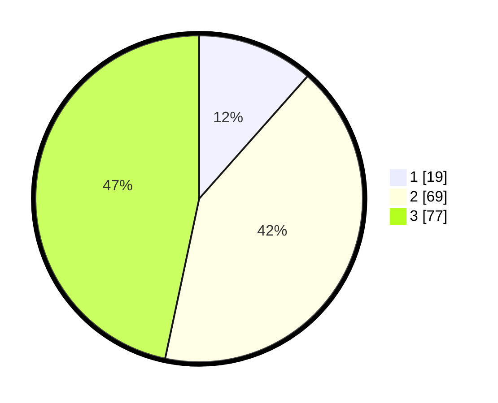

# Hasil

## Grafik

## Tabel

| No. | Nama Paslon    | Suara | Suara (raw) | Persentase |
|:--- |:-------------- | -----:| -----------:| ----------:|
| 1   | ANIES MUHAIMIN | 19    | [19][p-1]   | 11,52      |
| 2   | PRABOWO GIBRAN | 69    | [69][p-2]   | 41,82      |
| 3   | GANJAR MAHFUD  | 77    | [77][p-3]   | 46,67      |

[p-1]: https://github.com/gigit-pemilu/pemilu-2024/blob/main/pilpres/hitung-suara/sub/33-jawa-tengah/sub/04-banjarnegara/sub/08-madukara/sub/2014-rakitan/sub/008-tps/sub/paslon-1.txt
[p-2]: https://github.com/gigit-pemilu/pemilu-2024/blob/main/pilpres/hitung-suara/sub/33-jawa-tengah/sub/04-banjarnegara/sub/08-madukara/sub/2014-rakitan/sub/008-tps/sub/paslon-2.txt
[p-3]: https://github.com/gigit-pemilu/pemilu-2024/blob/main/pilpres/hitung-suara/sub/33-jawa-tengah/sub/04-banjarnegara/sub/08-madukara/sub/2014-rakitan/sub/008-tps/sub/paslon-3.txt

## Foto C Plano

https://sirekap-obj-formc.kpu.go.id/75aa/pemilu/ppwp/33/04/08/20/14/3304082014008-20240214-231802--4e953b36-96e9-4554-8eed-8398d7926630.jpg

https://sirekap-obj-formc.kpu.go.id/75aa/pemilu/ppwp/33/04/08/20/14/3304082014008-20240214-232019--7c6e1796-8144-49a9-b749-48e84a6f4d9d.jpg

https://sirekap-obj-formc.kpu.go.id/75aa/pemilu/ppwp/33/04/08/20/14/3304082014008-20240214-232144--e04fa80c-19ed-4858-87cd-ad461a0c018c.jpg

## Metadata

| Key        | Value               |
| ---------- | ------------------- |
| Time Stamp | 2024-02-15 12:00:28 |

