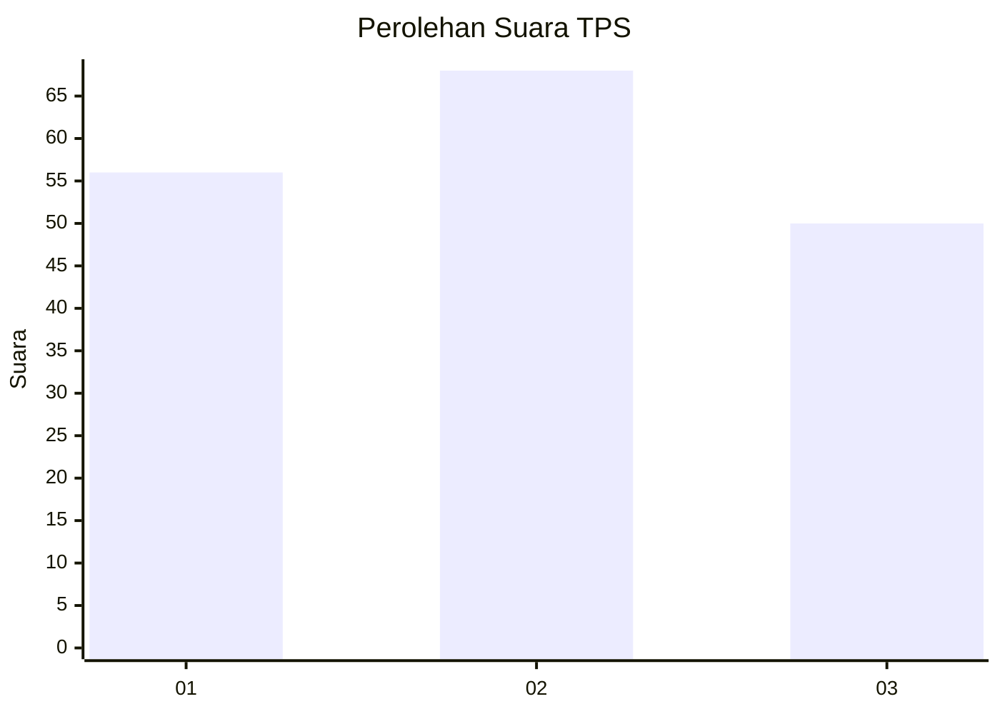
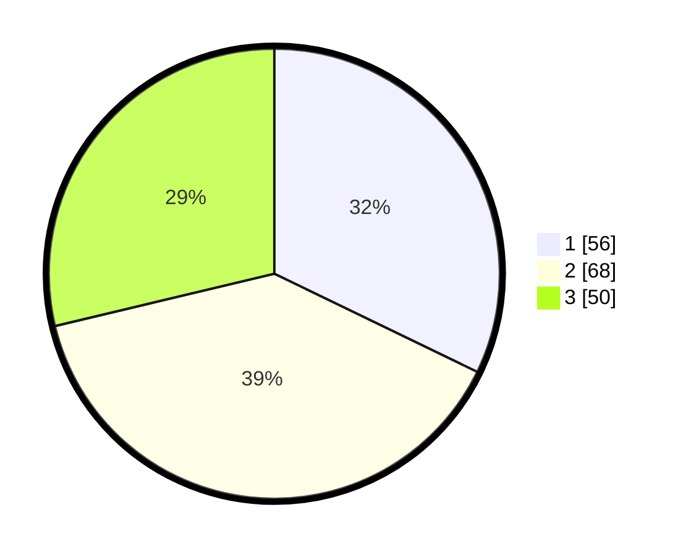

# Hasil

## Grafik

## Tabel

| No. | Nama Paslon    | Suara | Suara (raw) | Persentase |
|:--- |:-------------- | -----:| -----------:| ----------:|
| 1   | ANIES MUHAIMIN | 56    | [56][p-1]   | 32,18      |
| 2   | PRABOWO GIBRAN | 68    | [68][p-2]   | 39,08      |
| 3   | GANJAR MAHFUD  | 50    | [50][p-3]   | 28,74      |

[p-1]: https://github.com/gigit-pemilu/pemilu-2024-33-jawa-tengah/blob/main/pilpres/hitung-suara/sub/33-jawa-tengah/sub/04-banjarnegara/sub/10-wanadadi/sub/2001-kasilib/sub/006-tps/sub/paslon-1.txt
[p-2]: https://github.com/gigit-pemilu/pemilu-2024-33-jawa-tengah/blob/main/pilpres/hitung-suara/sub/33-jawa-tengah/sub/04-banjarnegara/sub/10-wanadadi/sub/2001-kasilib/sub/006-tps/sub/paslon-2.txt
[p-3]: https://github.com/gigit-pemilu/pemilu-2024-33-jawa-tengah/blob/main/pilpres/hitung-suara/sub/33-jawa-tengah/sub/04-banjarnegara/sub/10-wanadadi/sub/2001-kasilib/sub/006-tps/sub/paslon-3.txt

## Foto C Plano

https://sirekap-obj-formc.kpu.go.id/9868/pemilu/ppwp/33/04/10/20/01/3304102001006-20240214-225149--656257ee-9ca9-44e8-b8eb-6e9692590106.jpg

https://sirekap-obj-formc.kpu.go.id/9868/pemilu/ppwp/33/04/10/20/01/3304102001006-20240214-225436--93ce40ff-e0d4-4219-b0e5-f3fa1c80fbcc.jpg

https://sirekap-obj-formc.kpu.go.id/9868/pemilu/ppwp/33/04/10/20/01/3304102001006-20240214-215022--66d13dbb-b003-400d-b87e-e146ce145b3f.jpg

## Metadata

| Key        | Value               |
| ---------- | ------------------- |
| Time Stamp | 2024-02-15 20:00:44 |

